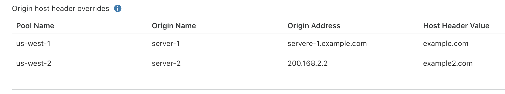

# Override HTTP Host headers

When your application needs specialized routing (CNAME setup or custom hosts like Heroku), change the `Host` header used in health checks.

You can set these headers on a [specific origin](/understand-basics/pools#per-origin-host-header-override) or a monitor. Headers set on an origin override headers set on a monitor.

### Host header prioritization

When a load balancer runs health checks, headers set on an origin override headers set on a monitor.

For example, you might have a load balancer for `www.example.com` with the following setup:

- Origin Pools:

  - Pool 1:

    - Origin 1 (`Host` header set to `lb-app-a.example.com`)
    - Origin 2
  
  - Pool 2:

    - Origin 3
    - Origin 4 (`Host` header set to `lb-app-b.example.com`)

- Monitor (`Host` header set to `www.example.com`)

In this scenario, health checks for **Origin 1** would use `lb-app-a.example.com`, health checks for **Origin 4** would use `lb-app-b.example.com`, and all other health checks would default to `www.example.com`. For more information on updating your custom host configuration to be compatible with Cloudflare, see [Configure Cloudflare and Heroku over HTTPS](https://support.cloudflare.com/hc/articles/205893698).

For a list of origins that override a monitor's `Host` header:

1. On a monitor, select **Edit**.
1. Select **Advanced health check settings**.
1. If you have origin overrides, you will see **Origin host header overrides**.

## Per origin Host header override

To balance traffic across multiple hosts, add `Host` headers to individual origins within the same pool.

For example, you might have a pool with origins hosted in multiple AppEngine projects or Amazon S3 buckets. You also might want to set up specific failover origins within a pool.

Since these examples require specific hostnames per origin, your load balancer could not properly route traffic _without_ a `Host` header override.

If you need an origin `Host` header override, add it when [creating](/create-load-balancer-ui#create-and-add-origin-pools) or editing a pool. For security reasons, this header must meet one of the following criteria:
- Is a subdomain of a zone associated with this account
- Matches the origin address
- Publicly resolves to the origin address

For details about how origin and monitor `Host` headers interact, see [Host header prioritization](/understand-basics/monitors#host-header-prioritization).