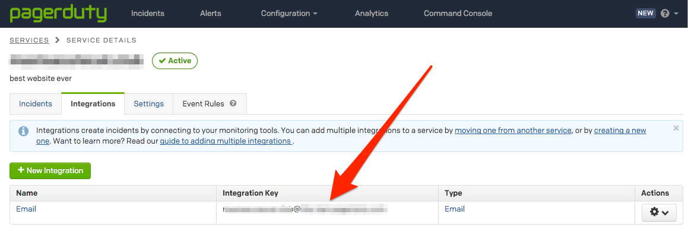

# Integrate with PagerDuty

To integrate Cloudflare Health Check notifications with PagerDuty, follow the steps outlined in PagerDuty’s [Email Integration Guide](https://www.pagerduty.com/docs/guides/email-integration-guide/). If you do not have a PagerDuty account, you will first need to set that up.

PagerDuty will generate an email address that will create incidents based on emails sent to that address.

If you already have email integration configured in PagerDuty, you can find the designated email address by going to **Configuration > Services > Email** (under **Integrations**).

When creating the Notifier object, configure the email to go to the PagerDuty integration email. Consequently, whenever a pool or origin goes down, an Incident will be created to capture it.