# Create a load balancer in the Cloudflare dashboard

## Overview

This walkthrough uses the Load Balancing interface in the **Traffic** app of the Cloudflare dashboard to create a load balancer in **active-passive failover** configuration.

An active-passive failover configuration sends traffic to the servers in your active pool until a failure threshold (configurable) is reached. At the point of failure, Cloudflare then redirects traffic to the passive pool.

In the event that all pools are marked down, Cloudflare uses the **fallback pool**, which is the option of last resort for successfully sending traffic to an origin. Since the fallback pool is a last resort, its health is not taken into account, and Cloudflare reports  its status as 'No Health'. You can nominate the fallback pool via the API or in the Cloudflare dashboard. For more on working with fallback pools, see [_Traffic steering_](/understand-basics/traffic-steering).

---

## Prerequisites

- **Access to Load Balancing:** Load Balancing requires one of the following:
  - A Cloudflare Enterprise plan with Load Balancing enabled.
  - An existing Free, Pro, or Business plan with a Load Balancing subscription.
- **Load balancer hostname:** The hostname for which the Cloudflare Load Balancer will manage traffic. The default hostname is the root hostname.
- **Origin servers (2):** This walkthrough requires at least two origin servers (_origin-server-1_ and _origin-server-2_, for example).
- **Location:** This walkthrough configures only a single geographic region.

---

## Workflow

When creating a load balancer in the Cloudflare dashboard, follow this workflow:

1. [Create a load balancer](#create-a-load-balancer)

1. [Create and add origin pools](#create-and-add-origin-pools)

1. [Create, attach, and configure health checks](#create-attach-and-configure-health-checks)

1. [Configure Geo Routing](#configure-geo-routing)

1. [Create custom Load Balancing rules](#create-custom-load-balancing-rules)

1. [Review your load balancer configuration](#review-your-load-balancer-configuration)

1. [Share your load balancer with other sites](#share-your-load-balancer-with-other-sites)

---

## Create a load balancer

To start, create a load balancer using the **Create a Load Balancer** wizard in the Cloudflare Traffic app:

1. Log in to your Cloudflare Account Home and click site for which you want to create a load balancer.

1. Open the **Traffic** app. If you see the **Enable Load Balancing** action instead of **Create a Load Balancer**, you need to add the Load Balancing service to your customer plan before you can proceed.

   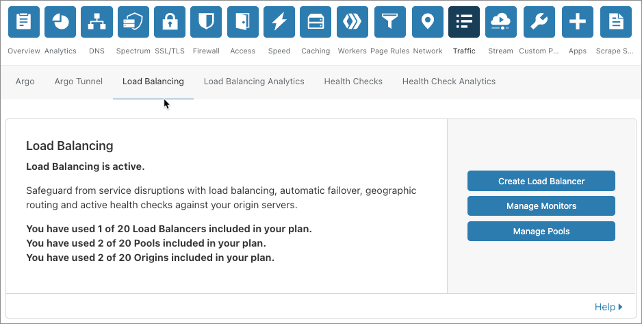

1. Click **Create a Load Balancer**.

1. In the **Hostname** page, enter the hostname for your load balancer—the DNS name at which the load balancer is available.

  <Aside type="note" header="Note">

  The orange cloud icon to the right of the hostname indicates that the load balancer will run in proxy mode. In proxy mode, Cloudflare announces Cloudflare IP addresses externally, but masks origin server IP addresses for security. See _[Proxy Modes](/understand-basics/proxy-modes/)_ for more detail.
  </Aside>
  
  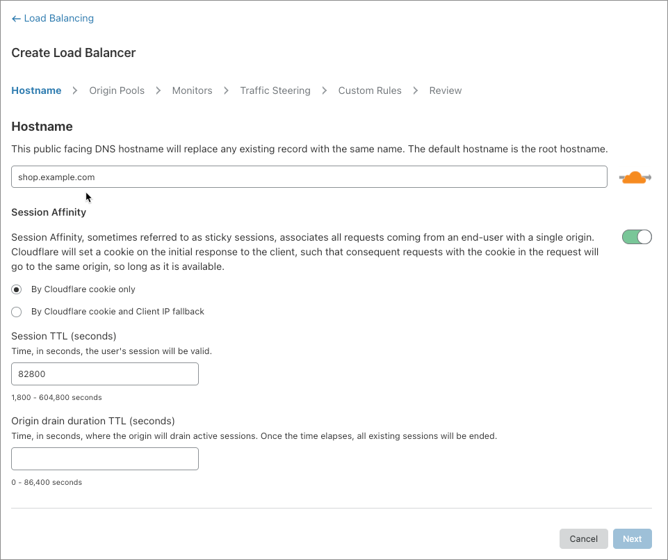

1. To enable session affinity, select the **By Cloudflare cookie only** radio button and toggle the **Session Affinity** switch.

1. Click **Next** to continue.

You are now ready to create and [add origin pools](#create-and-add-origin-pools) to your load balancer.

<Aside type="note" header="Note">

Deleting a Load Balancer does not delete associated pools and monitors.  To delete pools and monitors in the Cloudflare dashboard, use the **Manage Pools** and **Manage Monitors** buttons within the **Traffic** app, in the **Load Balancing** tab.

</Aside>

---

## Create and add origin pools

This example creates two origin pools—the primary pool and a secondary, backup pool that serves traffic when the primary fails. (To set up an **active-active failover** configuration, where all servers receive traffic at once, create only a single pool.)

1. In the **Add an Origin Pool** page, click **Create an origin pool**.
   
  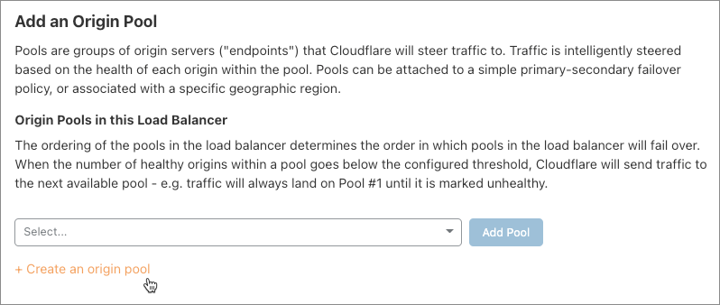

1. Enter a name and origin server address for the first pool (this must be unique). When the origin server has a hostname, you can enter that as well. To add existing origins, click **Add Origin**.
  
  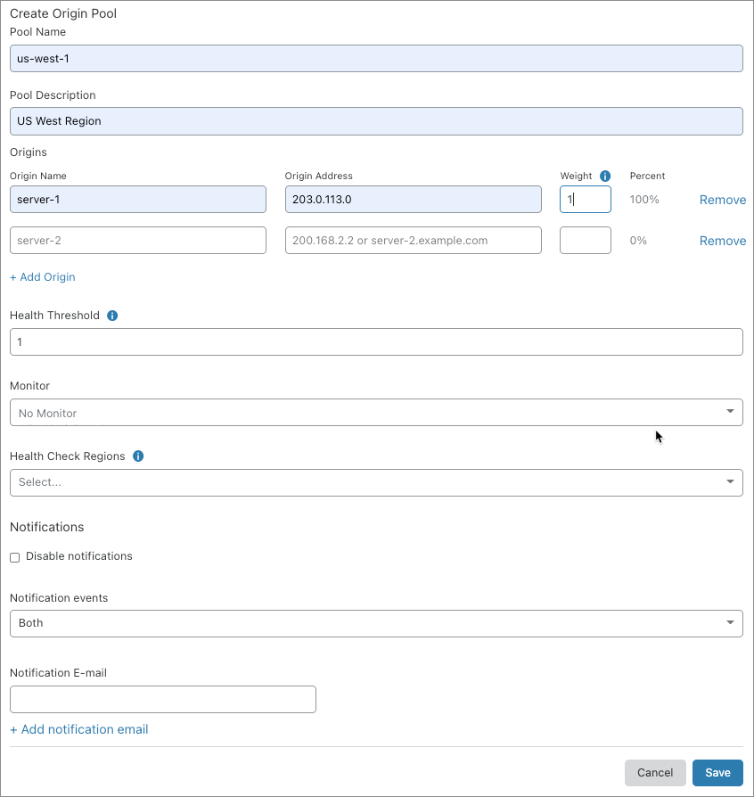

1. You must also enter a **Weight** for your origin. The weight of the origin (0.01–1.00) is relative to other origins in the same pool, so an origin with a weight of 1 will receive twice as much traffic as one with a weight of 0.5. A weight of 0 means traffic will not be sent to this origin, but health is still checked.

1. Leave the heath and notification settings at their defaults for now and click **Save**.

1. Add a second pool, similar to first, repeating the previous steps, and click **Save**.

  The list of pools displays. By default, pools are ordered by date created. You can reorder them by clicking the arrows next to the numerals in the **Order** column:

   
   
   For now, leave the order as it is.

1. Click **Next** to continue.

You are now ready to [configure health checks](#create-attack-and-configure-health-checks) for your load balancer.

---

## Create, attach, and configure monitors

Create [monitors](/understand-basics/monitors) to run health checks that track the status of your origin servers.

### Create a monitor to attach to an origin pool

1.  Select the pool to which you want to configure health checks, and click **Attach monitor**.

  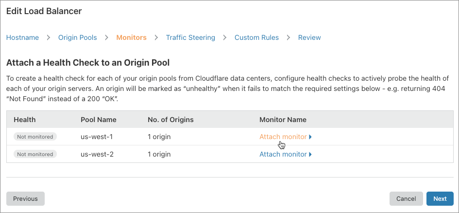

  The **Add Monitor** and **Create a Monitor** controls display.

  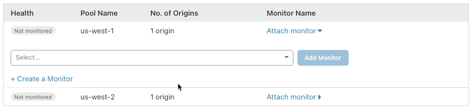

1. Click **Create a Monitor**.

1. Supply an informative name for your monitor in the **Name** input.

  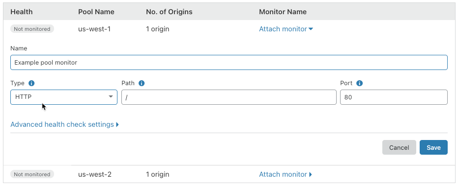

1. Supply settings for each of the following:

    * **Type:** The protocol to use for health checks. Click the drop-down list and choose _HTTP_, _HTTPS_, or _TCP_.

    * **Path:** The endpoint path to run health checks against.

    * **Port:** The destination port for health checks.

1. [Optional] For additional settings, click **Advanced health check settings**:

  <Aside type='note' header='Tip'>

  **Simulate Zone** allows you to emulate the specified zone while probing. It pushes a request from Cloudflare Health Monitors through the Cloudflare stack as if it were a real visitor request to help analyze behavior or validate a configuration.

  Monitors support authenticated origin pulls by entering the appropriate zone in the **Simulate Zone** field of the UI.
  </Aside>

  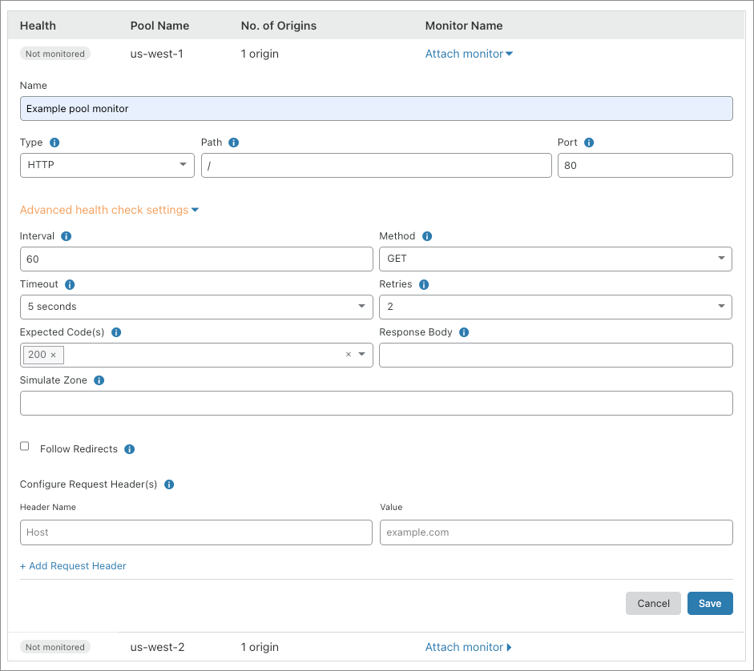

1. Click **Save**.

  The Configure Monitor page displays:

  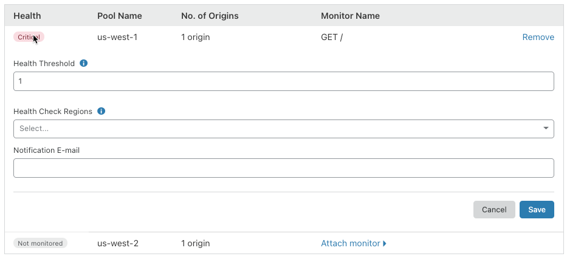  

### Configure the monitor

1.  To configure the monitor, supply these values:
    
    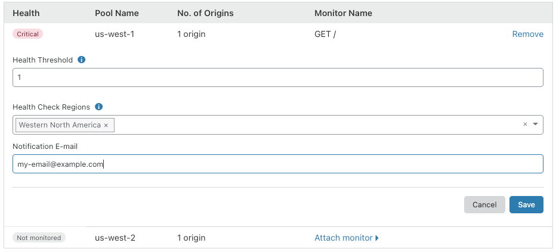

    * **Health Threshold:** Defines the number of healthy origin servers required to consider the pool healthy. When the number of healthy origin servers drops below the threshold, the pool will be marked unhealthy. There is only one origin server in this pool, so leave this value at 1.
    
    * **Health Check Regions:** Specify geographic regions from which Cloudflare should send health check requests. To select a region, use the drop-down list.

    * **Notification E-mail:** Enter an email address to receive notifications in the **Notifications E-mail** field. You can use a mailing list address or a PagerDuty address to share the notifications with a group.

1. To save your monitor and attach it to your pool, click **Save**.

  The configuration page closes and your monitor is displayed in the pools list:

  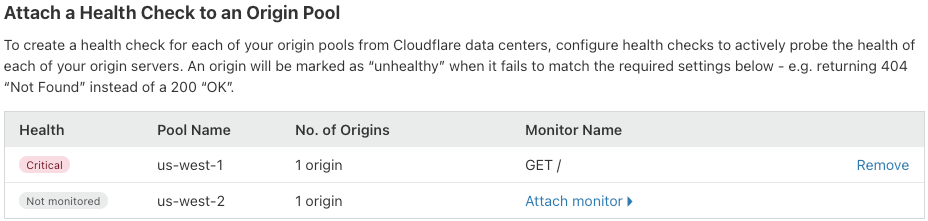
  
The status of your health check will be _unknown_ until the results of the first check are available.

### Attach a monitor to your secondary pool

To attach a monitor to your secondary pool, repeat the steps in [_Create a monitor to attach to an origin pool_](#create-a-monitor-to-attach-to-an-origin-pool) and [_Configure the monitor_](#configure-the-monitor)l:

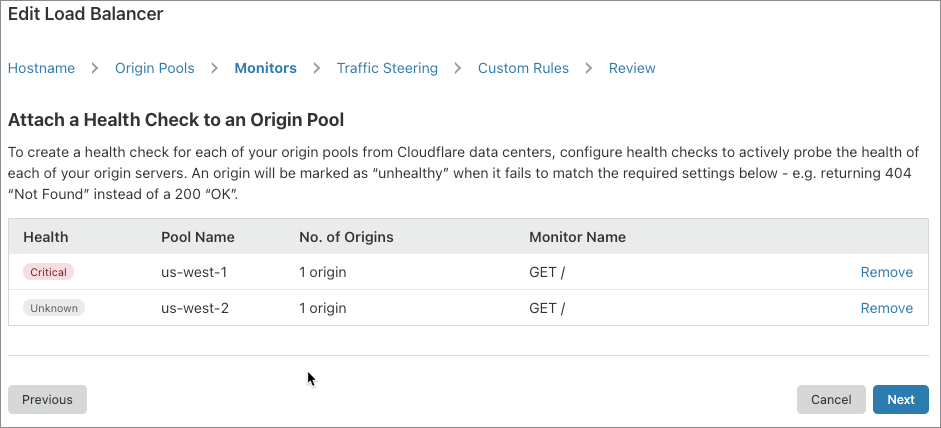

<Aside type='note' header='Note'>

Cloudflare polls for health status every 60 seconds. A green indicator represents a healthy status; red indicates a failed health check. Move the mouse over the indicator to display a tooltip with the reason for the failure (see [_Troubleshooting_](/troubleshooting/)).
</Aside>

Now that you have set up health checks for your load balancer, click **Next** to continue and [configure Traffic Steering](#configure-traffic-steering).

---

## Configure Traffic Steering

Use Geo Routing to configure traffic policies and failover priority by geographic region. This is extremely useful when you want site visitors to access the origin server closest to them, which improves page-loading performance.

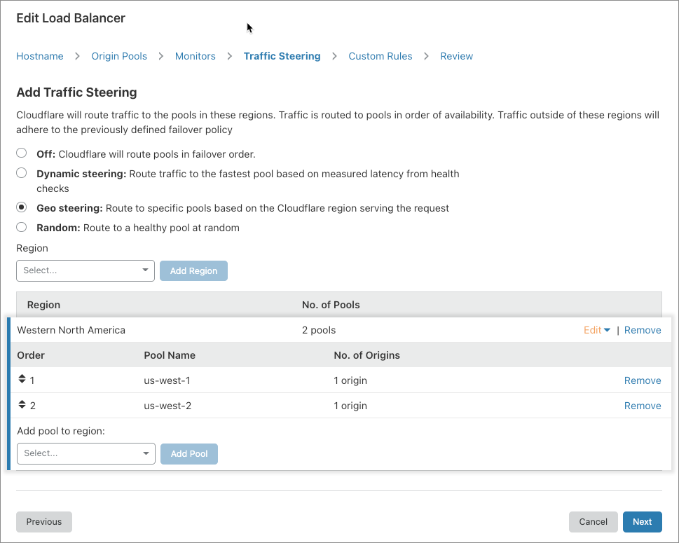

For this exercise, don’t add new regions. For more on Geo Routing, see _[Traffic steering](/understand-basics/traffic-steering/)_.

Click **Next** to continue and [create custom Load Balancing rules](#create-custom-load-balancing-rules).

---

## Create custom Load Balancing rules

Load Balancing rules allow you to customize the behavior of your Cloudflare [load balancer](/understand-basics/load-balancers). For example, use Load Balancing rules to select an [origin pool](/understand-basics/pools) based on the URI path of an HTTP request.

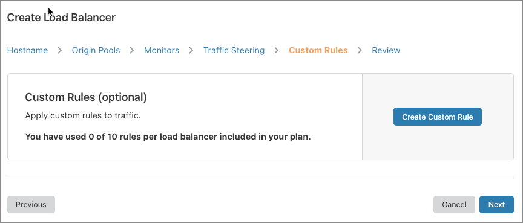

For a walkthrough, see [_Creating Load Balancing rules_](/understand-basics/load-balancing-rules/create-rules).

---

## Review your load balancer configuration

Before creating your load balancer, the creation wizard presents your a summary of your configuration so that you can review and make changes.

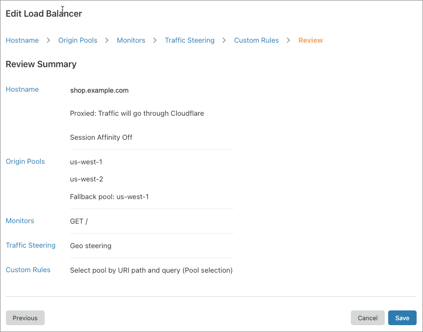

Once you approve the configuration, click **Save and Deploy** to commit the configuration and immediately start your load balancer. Clicking **Save as Draft** will commit your configuration without starting the load balancer.

Once you have saved your load balancer configuration, you will be returned to the **Load Balancing** card. The card provides quick access to common actions.

You can monitor your load balancers on the **Manage Load Balancers** card.

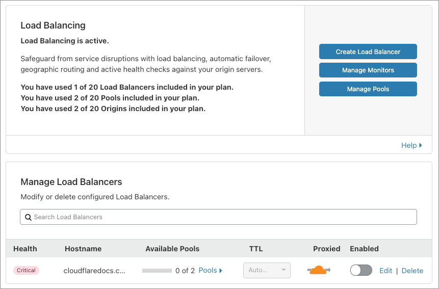

---

## Share your load balancer with other sites

You can share your load balancer with other sites in your account by creating a canonical name (CNAME) record in the Cloudflare **DNS** app. This is useful for sharing configurations with multiple other domains, and you do not have to create new load balancers for each site.

For more, see [_Configuring a CNAME setup_](https://support.cloudflare.com/hc/en-us/articles/360020615111-Configuring-a-CNAME-setup/#h_836723523521544131668686) in the Cloudflare Support knowledge base.

You can also configure separate load balancers for each domain and reuse monitors and pools. This is especially useful for changing the failover order for different domains, such as when your _example.co.uk_ server has a different failover priority from _example.com_ or _example.com.au_.
