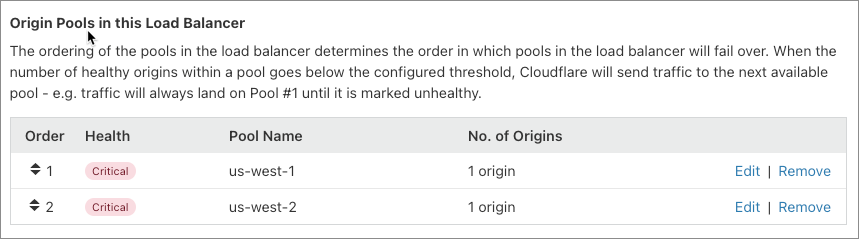

# Create a load balancer in the Cloudflare dashboard

## Overview

This tutorial provides a general overview of how to create a load balancer, origin pools, and monitors. For guidance on more advanced setups (active-active, active-passive), see [Load balancer configurations](/understand-basics/load-balancers#common-configurations).

---

## Prerequisites

- **Access to Load Balancing**:
  - A Cloudflare Enterprise plan with Load Balancing enabled
  - An existing Free, Pro, or Business plan with a Load Balancing subscription
- **Load balancer hostname**: The hostname for which the Cloudflare Load Balancer will manage traffic. The default hostname is the root hostname.
- **Location**: This walkthrough configures only a single geographic region.

---

## Workflow

---

### 1. Create a load balancer

1. Log in to your Cloudflare account and select a domain.

1. Go to **Traffic** > **Load Balancing**.

1. Select **Create a Load Balancer**.

1. In the **Hostname** page, enter a hostname (the DNS name at which the load balancer is available).

  <Aside type="note" header="Note">

  The orange cloud icon to the right of the hostname indicates that the load balancer will run in proxy mode. In proxy mode, Cloudflare announces Cloudflare IP addresses externally, but masks origin server IP addresses for security. See _[Proxy Modes](/understand-basics/proxy-modes/)_ for more detail.
  </Aside>

1. To enable [session affinity](/understand-basics/session-affinity), toggle the **Session Affinity** switch.

1. Select **Next**.

---

### 2. Create and add origin pools

For more on pool configurations (active-active, active-passive), see [Load balancer configurations](/understand-basics/load-balancers#common-configurations).

1. On the **Add an Origin Pool** page, select **Create an origin pool**.

1. Enter the following information for each origin:
    - A name (must be unique)
    - The origin server address 
    - A [**Weight**](/understand-basics/weighted-load-balancing)
    - A [hostname](/understand-basics/pools#per-origin-host-header-override) by selecting **Add host header** (optional)

1. On the origin pool, update the following information:
    - **Health Threshold**: Number of healthy origins for the pool as a whole to be considered *Healthy* and receive traffic based on pool order in a load balancer
    - **Notifications**: If you do or do not want to receive notifications when the pool's status changes

1. When finished, select **Save**.

1. Create additional pools as needed by repeating the previous steps.

1. If you need to [re-order pools](/understand-basics/pools#important-notes) in your load balancer, select the arrows in the **Order** column.

   

1. Update the [**Fallback Pool**](/understand-basics/traffic-steering), if needed.

1. Select **Next**.

---

### 3. Create, attach, and configure monitors

Create [monitors](/understand-basics/monitors) to run health checks that track the status of your origin servers.

#### A. Create a monitor to attach to an origin pool

1. On a pool, select **Attach monitor**.

1. Select **Create a Monitor**.

1. Add the following information:
    - **Type**: The protocol to use for health checks (_HTTP_, _HTTPS_, or _TCP_)

    - **Path**: The endpoint path to run health checks against

    - **Port**: The destination port for health checks

1. For additional settings, select **Advanced health check settings**:
    - **Simulate Zone**: 
        - Emulates the specified zone while probing
        - Pushes a request from Cloudflare Health Monitors through the Cloudflare stack as if it were a real visitor request to help analyze behavior or validate a configuration
        - Can support authenticated origin pulls by entering the appropriate zone in the **Simulate Zone** field of the UI

1. Select **Save**.

<Aside type='note' header='Tip'>
    An example monitor might be:
    <table style='table-layout:fixed; width:70%'>
      <thead>
      <tr>
        <th>Field</th>
        <th style='width:30%'>Value</th>
      </tr>
      </thead>
      <tbody>
        <tr>
          <td>Type</td>
          <td>HTTP</td>
        </tr>
        <tr>
          <td>Path</td>
          <td>/</td>
        </tr>
        <tr>
          <td>Port</td>
          <td>80</td>
        </tr>
        <tr>
          <td>Interval</td>
          <td>60</td>
        </tr>
        <tr>
          <td>Method</td>
          <td>GET</td>
        </tr>
        <tr>
          <td>Timeout</td>
          <td>5 seconds</td>
        </tr>
        <tr>
          <td>Retries</td>
          <td>2</td>
        </tr>
        <tr>
          <td>Expected Code(s)</td>
          <td>200</td>
        </tr>
      </tbody>
    </table>
  </Aside>

#### B. Configure the monitor

1. To configure the monitor, enter the following information:

    - **Health Threshold:** Defines the number of healthy origin servers required to consider the pool healthy. When the number of healthy origin servers drops below this threshold, the pool will be marked unhealthy.
    
    - **Health Check Regions:** Specifies geographic regions from which Cloudflare should send health check requests.

    - **Notification E-mail:** Contains email addresses that receive notifications (individual, mailing list address, PagerDuty address).

1. Select **Save**. The status of your health check will be _unknown_ until the results of the first check are available.

<Aside type='note' header='Note'>

Cloudflare checks health status every 60 seconds.
</Aside>

---

### 4. Configure Traffic Steering

Choose an option for [Traffic steering](/understand-basics/traffic-steering/).

Select **Next** to continue.

---

### 5. Create custom Load Balancing rules

Customize the behavior of load balancer using load balancing rules. For example, select an [origin pool](/understand-basics/pools) based on the URI path of an HTTP request.

For a walkthrough, see [Create Load Balancing rules](/understand-basics/load-balancing-rules/create-rules).

---

### 6. Review your load balancer configuration

Before creating your load balancer, check the **Review Summary** and make changes as needed.

Then, choose how you want to save your changes:
- **Save and Deploy** commits the configuration and immediately starts your load balancer
- **Save as Draft** commits your configuration without starting the load balancer

---

### 7. Share your load balancer with other sites (optional)

You can share your load balancer with other sites in your account by creating a canonical name (CNAME) record in the Cloudflare **DNS** app. This is useful for sharing configurations with multiple other domains, and you do not have to create new load balancers for each site.

For more, see [_Configuring a CNAME setup_](https://support.cloudflare.com/hc/articles/360020615111#h_836723523521544131668686).

You can also configure separate load balancers for each domain and reuse monitors and pools. This is especially useful for changing the failover order for different domains, such as when your _example.co.uk_ server has a different failover priority from _example.com_ or _example.com.au_.

## Deleting load balancers, pools, and monitors

To delete a load balancer, select **Delete** on the associated balancer.

However, deleting a Load Balancer does not delete associated pools and monitors. To delete pools and monitors in the Cloudflare dashboard, use the **Manage Pools** and **Manage Monitors** buttons within the **Traffic** app, in the **Load Balancing** tab.