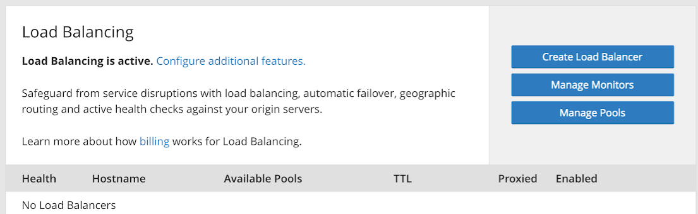
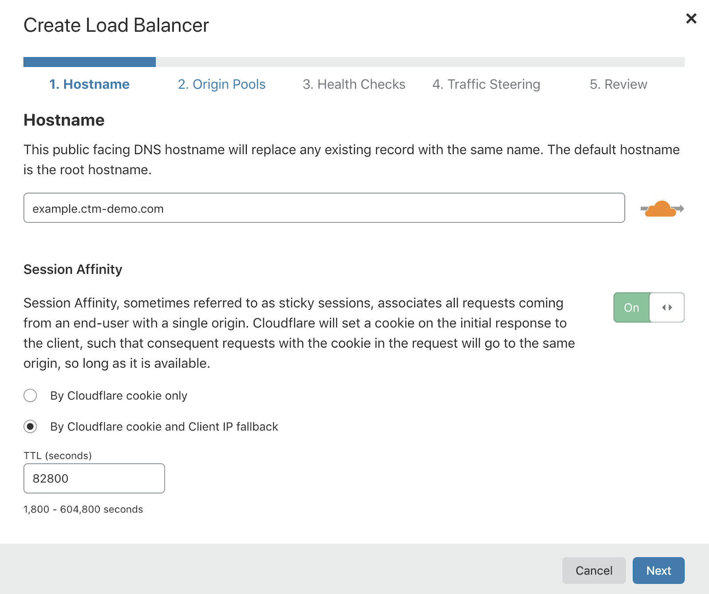
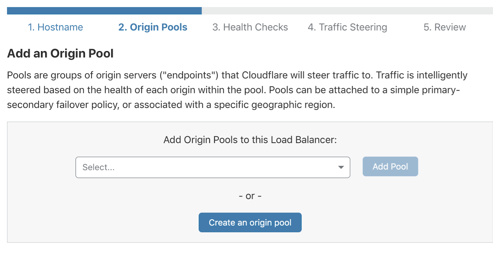
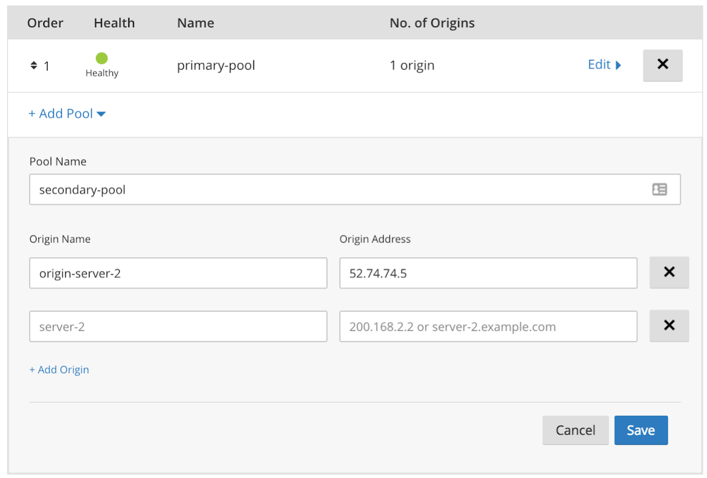
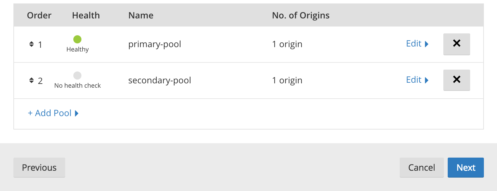
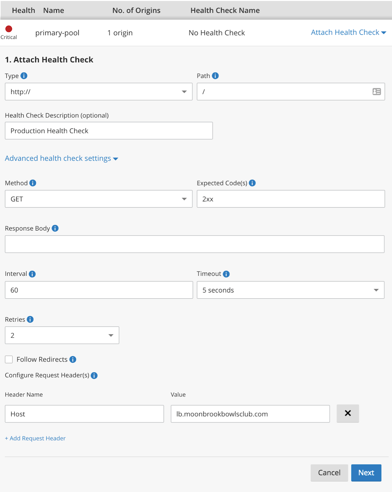
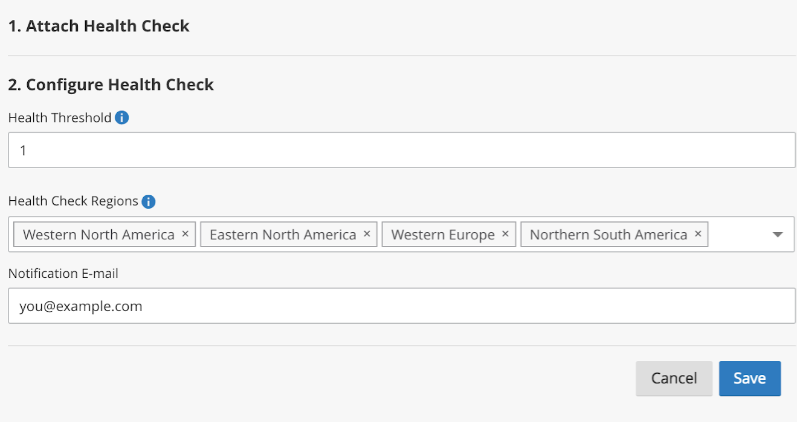
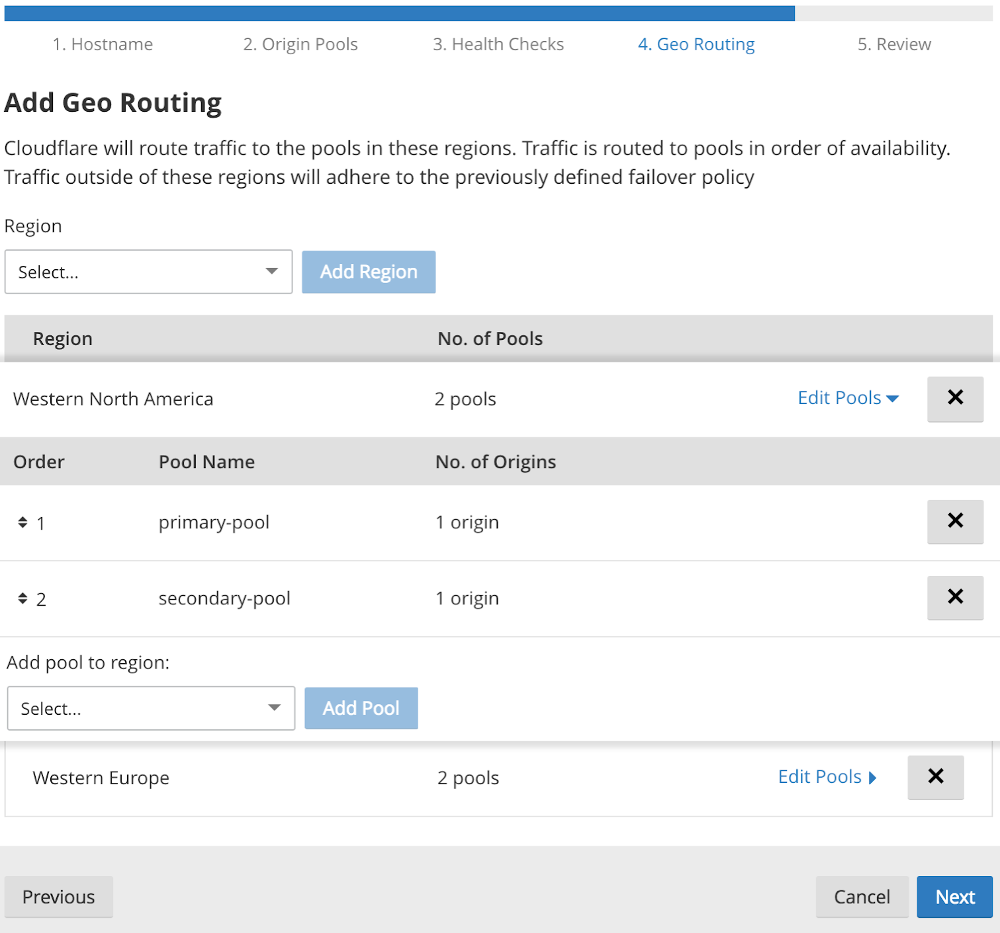
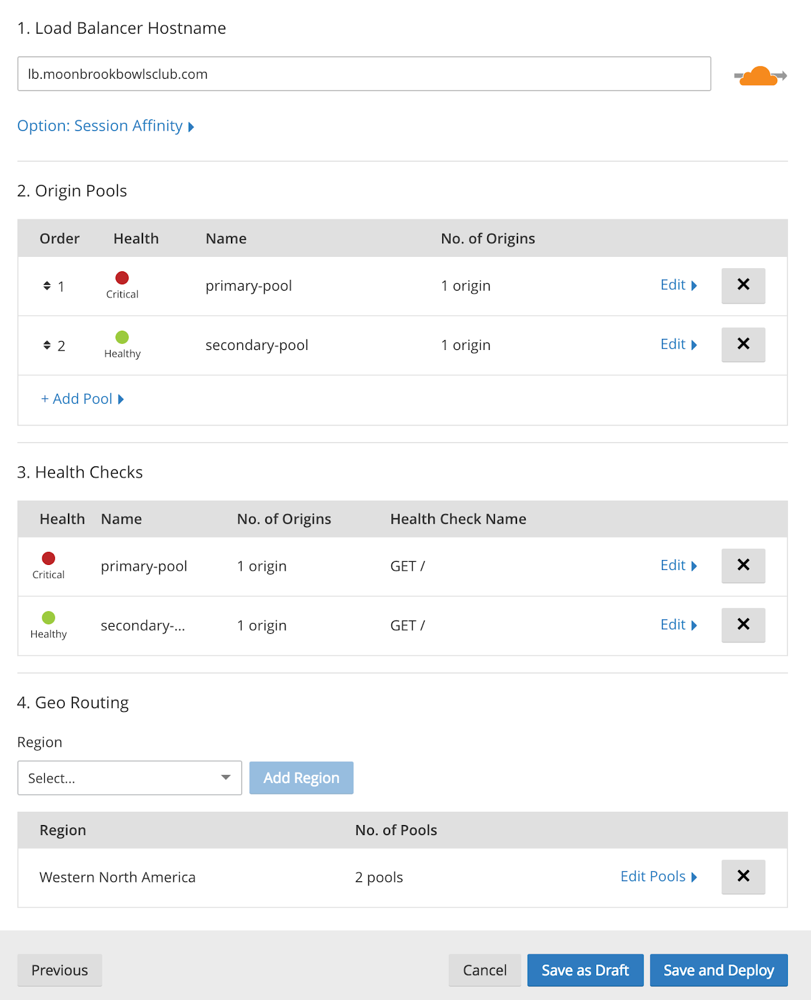
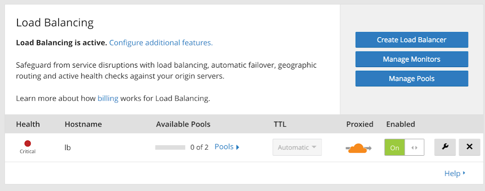

# Create a load balancer in the Cloudflare dashboard

## Overview

This walkthrough uses the Load Balancing interface in the **Traffic** app of the Cloudflare dashboard to create a load balancer in **active-passive failover** configuration.

An active-passive failover configuration sends traffic to the servers in your active pool until a failure threshold (configurable) is reached. At the point of failure, Cloudflare then redirects traffic to the passive pool.

In the event that all pools are marked down, Cloudflare uses the **fallback pool**, which is the option of last resort for successfully sending traffic to an origin. Since the fallback pool is a last resort, its health is not taken into account, and Cloudflare reports  its status as 'No Health'. You can nominate the fallback pool via the API or in the Cloudflare dashboard. For more on working with fallback pools, see [_Traffic steering_](/understand-basics/traffic-steering).

---

## Requirements

- **Access to Load Balancing:** Load Balancing requires one of the following:
  - A Cloudflare Enterprise plan with Load Balancing enabled.
  - An existing Free, Pro, or Business plan with a Load Balancing subscription.
- **Load balancer hostname:** The hostname for which the Cloudflare Load Balancer will manage traffic. The default hostname is the root hostname.
- **Origin servers (2):** This walkthrough requires at least two origin servers (_origin-server-1_ and _origin-server-2_, for example).
- **Location:** This walkthrough configures only a single geographic region.

---

## Create a load balancer

To start, we’ll create a load balancer using the **Create a Load Balancer** wizard in the Cloudflare Traffic app:

1. Log in to the Cloudflare web application and select the site for which you want to create a load balancer.

1. Open the **Traffic** app. If you see the **Enable Load Balancing** action instead of **Create a Load Balancer**, you will need to add the Load Balancing service to your customer plan in order to proceed.
   

1. Click **Create a Load Balancer** and provide the hostname for your load balancer—the DNS name at which the load balancer will be available.

   - To enable **Session Affinity**, select the **By Cloudflare cookie only** radio button and set the toggle switch to the _On_ position.
     

     <Aside type="note">

     The orange cloud icon to the right of the hostname indicates that the load balancer will run in proxy mode. In proxy mode, Cloudflare announces Cloudflare IP addresses externally, but masks origin server IP addresses for security. See _[Proxy Modes](/understand-basics/proxy-modes/)_ for more detail.
     </Aside>

1. Click **Next** to continue.

<Aside type="note">

Deleting a Load Balancer does not delete associated pools and monitors.  Delete pools and monitors via the respective **Manage Pools** and **Manage Monitors** buttons within the **Load Balancing** tab under the **Traffic** app of the Cloudflare dashboard.

</Aside>

---

## Create and add origin pools

In this example, we are going to create two pools: The primary pool, and a secondary, backup pool that will serve traffic if the primary fails. (To set up an **active-active failover** configuration, where all servers receive traffic at once, we would create only a single pool.)

1. Click **Create an origin pool**.
   

1. Enter a name and origin server address for the first pool (this must be unique). This example uses an IP address, but if the origin server has a hostname, you can enter that instead. If you have configured pools already, you can select and add those here as well.
   

1. Click **Save** to continue.

1. Add a second pool, similar to our first, by clicking **Add Pool**. Name the pool and provide an origin server name and address. Click **Save**.
   
   By default, pools are ordered by date created. You can reorder them by clicking the arrows next to the numerals in the **Order** column.
   
   For now, leave the order as it is.

1. Click **Next** to continue.

---

## Create, attach, and configure health checks

Now you will create monitors to run health checks that track the status of your origin servers.

1.  Click **Attach Health Check** and then **Create a Health Check**.
    

1.  Click **Next** to attach the new health check to your primary pool.
    

1.  Configure the health check:

    - The **Health Threshold** defines the number of healthy origin servers required to consider the pool healthy. If the number of healthy origin servers drops below the threshold, the pool will be marked unhealthy. There is only one origin server in this pool, so leave this value at 1.
    - Use the **Health Check Regions** field to specify geographic regions from which Cloudflare should send health check requests.
    - Enter an email address to receive notifications in the **Notifications E-mail** field. You can use a mailing list address or a PagerDuty address to share the notifications with a group.
      

**Simulate Zone** pushes a request from Cloudflare Health Monitors through the Cloudflare stack as if it were a real visitor request to help analyze behavior or validate a configuration.  It allows you to emulate the specified zone while probing.
Monitors support authenticated origin pulls by entering the appropriate zone in the **Simulate Zone** field of the UI.

1.  Click **Save**.

1.  Repeat Steps 1–4 to attach a health check to your secondary pool. The status of your health check will be _unknown_ until the results of the first check are available.

    Cloudflare polls for health status every 60 seconds. A green indicator represents a healthy status; red indicates a failed health check. Move the mouse over the indicator to display a tooltip with the reason for the failure (see _[Troubleshooting](/troubleshooting/)_).

1.  Click **Next** to configure **Geo Routing**.

Monitors are highly configurable. For more detail and a complete list of properties, see _[Monitors](/understand-basics/monitors)_.

---

## Configure Geo Routing

Use Geo Routing to configure traffic policies and failover priority by geographic region. This is extremely useful when you want site visitors to access the origin server closest to them, which improves page-loading performance.

For this exercise, don’t add new regions. For more on Geo Routing, see _[Traffic steering](/understand-basics/traffic-steering/)_.

Click **Next** to continue to the final step, **Reviewing the Load Balancing configuration**.

---

## Review you load balancing configuration

Before creating your load balancer, the creation wizard presents your a summary of your configuration so that you can review and make changes.

Once you approve the configuration, click **Save and Deploy** to commit the configuration and immediately start your load balancer. Clicking **Save as Draft** will commit your configuration without starting the load balancer.

Once you have saved your load balancer configuration, you will be returned to the **Load Balancing** dashboard.

You can monitor your load balancers on the **Load Balancing** dashboard. The dashboard also provides quick access to common actions, such as creating new load balancers, managing monitors (health checks), and managing pools.

---

## Share you load balancer with other sites

You can share your load balancer with other sites in your account by creating a canonical name (CNAME) record in the Cloudflare DNS app. This is useful for sharing configurations with multiple other domains, and you don’t have to create new load balancers for each site.

You can also configure separate load balancers for each domain and reuse monitors and pools. This is especially useful for changing the failover order for different domains, such as when your _example.co.uk_ server has a different failover priority from _example.com_ or _example.com.au_.
