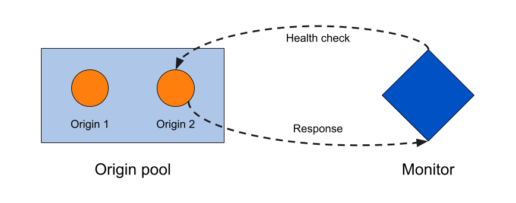
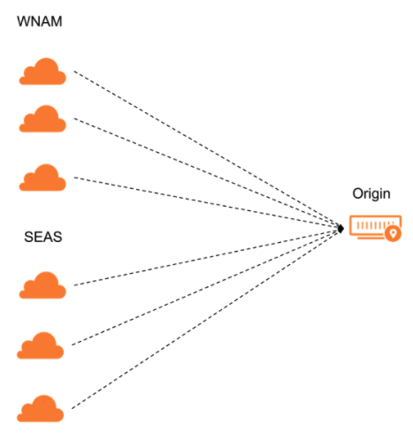

# How origins and pools become unhealthy

When we talk about dynamic load balancing, that means your load balancer only directs requests to servers that can handle the traffic. 

But how does your load balancer *know* which servers can handle the traffic? We determine that through a system of monitors, health checks, and origin pools.

---

## Components

Dynamic load balancing happens through a combination of:

- [**Origin pools**](/understand-basics/pools): Contain one or more origin servers.
- [**Monitors**](/understand-basics/monitors): Are attached to individual origin servers and issue health checks at regular intervals.
- **Health checks**: Are issued by a monitor at regular interval and — depending on the monitor settings — return a **pass** or **fail** value to make sure an origin is still able to receive traffic.

---

## How an origin becomes unhealthy

The purpose of each **health check** is to determine whether an origin has changed status from the previous health check.

A health check will fail if one of the following conditions are met:

- The health check exceeds the duration specified in the monitor's **Timeout** field (and does so more than the specified number of **Retries**).
- The origin does not return the **Expected codes** or **Response body** specified in the monitor's configuration.

Because we want our health checks to be as accurate as possible, we send them from three separate data centers for each of the options in a pool's **Health Check Regions**. 

If the majority of data centers for that region pass the health checks, that region is considered healthy. If the majority of regions is healthy, then the origin itself will be considered healthy.

<Aside type="note">

If **Health Check Regions** for a pool is set to **All Data Centers (Enterprise)**, pool health is determined by a majority of data centers.

</Aside>

For greater accuracy and consistency when changing origin health status, you can also set the `consecutive_up` and `consecutive_down` parameters via the [Create Monitor API endpoint](https://api.cloudflare.com/#account-load-balancer-monitors-create-monitor). To change from healthy to unhealthy, an origin will have to be marked healthy a consecutive number of times (specified by `consecutive_down`). The same applies — from unhealthy to healthy — for `consecutive_up`.

---

## How a pool becomes unhealthy

When an [individual origin becomes unhealthy](#how-an-origin-becomes-unhealthy), that may affect the health status of any associated origin pools (visible in the dashboard):

- **Healthy**: All origins are healthy.
- **Degraded**: At least one origin is unhealthy, but the pool is still considered healthy and could be receiving traffic.
- **Critical**: The pool has fallen below the number of available origins specified in its **Health Threshold** and will not receive traffic from your load balancer (unless other pools are also unhealthy and this pool is marked as the [**Fallback Pool**](#fallback-pools)).
- **Health unknown**: There are either no monitors attached to pool origins or the monitors have not yet determined origin health.
- **No health**: Reserved for your load balancer's [**Fallback Pool**](#fallback-pools).

### Traffic distribution

When a pool reaches **Critical** health, your load balancer will begin diverting traffic according to its [Steering Policy](/understand-basics/traffic-steering):

- **Off**: 

    - If the active pool becomes unhealthy, traffic goes to the next pool in order. 
    - If an inactive pool becomes unhealthy, traffic continues to go to the active pool (but would skip over the unhealthy pool in the failover order).

- **All other methods**: Traffic is distributed across all remaining pools according to the steering policy.

### Fallback pools

Because a load balancer **Fallback Pool** is meant to be a pool of last resort, it's health is not taken into account when directing traffic.

If all pools in a Load Balancer are manually disabled or unhealthy, traffic will always go to the fallback pool.

---

## How a load balancer becomes unhealthy

When one or more pools become unhealthy, your load balancer might also show a different status in the dashboard:

- **Healthy**: All pools are healthy.
- **Degraded**: At least one pool is unhealthy, but traffic is not yet going to the [Fallback Pool](#fallback-pools).
- **Critical**: All pools are unhealthy and traffic is going to the [Fallback Pool](#fallback-pools).

If a load balancer reaches **Critical** health and the pool serving as your fallback pool is also disabled:

- If Cloudflare proxies your hostname, you will see a 530 HTTP/1016 Origin DNS failure.
- If Cloudflare does not proxy your hostname, you will see the SOA record.