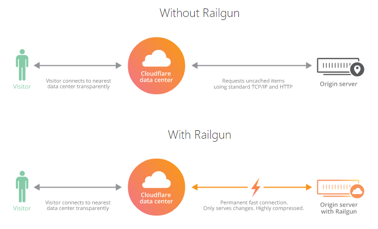

# Load balancers

## Overview

A Cloudflare load balancer is identified by the DNS hostname whose traffic you want to balance (www.example.com, for example). The load balancer defines which origin server pools to use, the order in which they should be used, and how to geographically distribute traffic among pools.

---

## Common configurations

### Active - Passive Failover

An **active-passive failover** sends traffic to the servers in your active pool until a failure threshold (configurable) is reached. At the point of failure, your load balancer then re-directs traffic to the passive pool.

This setup ensures uninterrupted service and helps with planned outtages, but it might lead to slower traffic overall.

To set up a load balancer with **active-passive failover**:
1. Create a load balancer with two origin pools (`primary` and `secondary`).
1. In the list of origin pools, set the following order:
    1. `primary`
    1. `secondary`

With this setup, your load balancer will direct all traffic to `primary` until `primary` has fewer available origins than specified in its **Health Threshold**. Only then will your load balancer direct traffic to `secondary`.

In the event that all pools are marked down, Cloudflare uses the **fallback pool**, which is the option of last resort for successfully sending traffic to an origin. Since the fallback pool is a last resort, its health is not taken into account, and Cloudflare reports  its status as **No Health**. You can select the fallback pool via the API or in the Cloudflare dashboard. For more on working with fallback pools, see [_Traffic steering_](/understand-basics/traffic-steering).

### Active - Active Failover

An **active-active failover** distributes traffic to servers in the same pool until the pool reaches its failure threshold (configurable). At the point of failure, your load balancer would then re-direct traffic to the **fallback pool**.

This setup speeds up overall requests, but is more vulnerable to planned or unplanned outtages.

To set up a load balancer with **active-active failover**:
1. Create a load balancer with a single origin pool (`primary`) with multiple origins (`origin-1` and `origin-2`).
1. For equal traffic, choose the same **Weight** for each origin. For guidance on other configurations, see [Weighted load balancers](../weighted-load-balancing).

With this setup, your load balancer will direct all traffic to `primary`, which then directs traffic to `origin-1` and `origin-2` according to their respective weights. If enough origins become so unhealthy that `primary` falls below its **Health Threshold**, traffic would then go to the **fallback pool**.

## Important notes

### Load balancing and existing DNS records

**Adding a Load Balancer does not create a DNS record or SSL certificate.**  To generate an SSL certificate, create a proxied DNS record for the Load Balancer. The Load Balancer record takes precedence over a DNS record for the same host name.

**When you create a load balancer on Cloudflare**, you can either:

- Use a unique hostname with no existing DNS record, or
- Use a hostname that has an existing DNS record, either as an A, AAAA, or CNAME record.

**If a chosen hostname has an existing DNS record**, the load balancer will supersede the DNS record if the DNS record is an A, AAAA, or canonical name (CNAME) record. It will not supersede other record types.

**If the load balancer is disabled**, preexisting DNS records will be served.

**If there is no preexisting DNS record with the same name**, disabling the load balancer will prevent clients from resolving the host, and requests will fail.

**If a Load Balancer is manually disabled**, traffic is not served to the associated origins or the fallback. If all pools in a Load Balancer are manually disabled or unhealthy, traffic goes to the fallback pool. No health checks run on the fallback pool and it will return the same HTTP status as your origin.

If the pool serving as your fallback pool is also disabled:
- If Cloudflare proxies your hostname, you will see a 530 HTTP/1016 Origin DNS failure.
- If Cloudflare does not proxy your hostname, you will see the SOA record.

## HTTP keep-alive (persistent HTTP connection)

Cloudflare maintains keep-alive connections to improve performance and reduce cost of recurring TCP connects in the request transaction as Cloudflare proxies customer traffic from its edge network to the site's origin.

Ensure HTTP Keep-Alive connections are enabled on your origin. Cloudflare reuses open TCP connections for up to 15 minutes (900 seconds) after the last HTTP request. Origin web servers close TCP connections if too many are open. HTTP Keep-Alive helps avoid premature reset of connections for requests proxied by Cloudflare.

### Session cookies

**When using HTTP cookies to track and bind user sessions to a specific server**, configure [Session Affinity](../session-affinity) to parse HTTP requests by cookie header. Doing so directs each request to the correct application server even when HTTP requests share the same TCP connection due to keep-alive.

**For example, F5 BIG-IP load balancers set a session cookie at the beginning of a TCP connection** (if none exists) and then ignore all cookies from subsequent HTTP requests on the same TCP connection. This tends to break session affinity because Cloudflare sends multiple HTTP sessions on the same TCP connection. Configuring the load balancer to parse HTTP requests by cookie headers avoids this issue.

### Railgun (wide area network optimization)

**Railgun is a web proxy system built for Cloudflare**, that allows dynamic content for a website to be cached while also allowing changes to the site to take effect almost instantly. Railgun is currently available to customers with a Business or Enterprise plan, or via one of Cloudflare’s Optimised Partners.

**Railgun compresses web objects, even rapidly changing pages like news sites or personalized content**. Using Railgun in conjunction with Cloudflare Load Balancing speeds up connections between Cloudflare datacenters and DNS origin servers so that uncacheable requests have minimal latency.



**Set up a Railgun listener in front of the load balancer** so that the load balancer can handle HTTP connections normally. Load balancing long-lived TLS connections between the sender and listener is very difficult.

**Use the same load balancer settings as if Railgun were not in place** — for example, HTTP keep-alive connections should be enabled and set to a 90-second timeout, since Railgun is working as an HTTP reverse proxy.

**If Railgun is placed behind the load balancer**, observe the following guidelines to avoid interruptions with site traffic:

1. Use the `railgun-nat.conf` configuration file to set the **internal** addresses of the hosts Railgun will be optimizing (`localhost:8080`, for example). This is important to avoid looping the request outbound to the internet and back to the load balancer only to be forwarded to the origin.
1. Ensure no firewall rules are in place that will interfere with traffic between the listener and the origin server.
1. Ensure port 2408 is open and passed through the load balancer so that it does not interfere with the TLS connection between the listener and sender.

---

## Properties

Cloudflare Load Balancer objects have the following properties:

<TableWrap>

<table>
  <thead>
  <tr>
   <th><strong>Name / type</strong>
   </th>
   <th><strong>Description / example</strong>
   </th>
   <th><strong>Constraints</strong>
   </th>
  </tr>
  </thead>
  <tbody>
  <tr>
   <td valign="top"><strong>created_on</strong><br/><Type>string</Type> <PropMeta>(date-time)</PropMeta>
   </td>
   <td>The creation timestamp for the load balancer.<br/><br/><Code>"2014-01-01T05:20:00.12345Z"</Code></td>
   <td valign="top">Read-only</td>
  </tr>
  <tr>
   <td valign="top"><strong>default_pools</strong>
<br/>
<Type>array</Type>
   </td>
   <td>A list of Pool IDs ordered by failover priority. Cloudflare steers traffic to the first pool in the list, failing over to the next healthy pool and so on down the list.
<br/><br/>
Pools defined here are used by default, or when <Code>region_pools</Code> is not configured for a given region.
<br/><br/>
<div>

```json
[
  "17b5962d775c646f3f9725cbc7a53df4",
  "9290f38c5d07c2e2f4df57b1f61d4196",
  "00920f38ce07c2e2f4df50b1f61d4194"
]
```

</div>
   </td>
   <td>
   </td>
  </tr>
  <tr>
   <td valign="top"><strong>description</strong>
<br/>
<Type>string</Type>
   </td>
   <td>A user-supplied description of the load balancer
<br/>
<Code>"Load Balancer for www.example.com"</Code>
   </td>
   <td>
   </td>
  </tr>
  <tr>
   <td valign="top"><strong>enabled</strong>
<br/>
<Type>boolean</Type>
   </td>
   <td>Enables the load balancer when set to
<br/>
<Code>true</Code>
   </td>
   <td>Default value: <Code>true</Code>
<br/>
Valid values: (<Code>true,false</Code>)
   </td>
  </tr>
  <tr>
   <td valign="top"><strong>fallback_pool</strong>
<br/>
<Type>string</Type>
   </td>
   <td>The Pool ID for the “pool of last resort,” the pool the load balancer should direct traffic to if all other pools are unhealthy. In most configurations, this is the secondary/passive pool.
<br/>
<Code>"17b5962d775c646f3f9725cbc7a53df4"</Code>
   </td>
   <td valign="top">Max. length: <Code>32</Code>
<br/>
Read-only
   </td>
  </tr>
  <tr>
   <td valign="top"><strong>id</strong>
<br/>
<Type>string</Type>
   </td>
   <td>The load balancer ID
<br/>
<Code>"699d98642c564d2e855e9661899b7252"</Code>
   </td>
   <td>Max. length: <Code>32</Code>
<br/>
Read-only
   </td>
  </tr>
  <tr>
   <td valign="top"><strong>modified_on</strong>
<br/>
<Type>string</Type> <PropMeta>(date-time)</PropMeta>
   </td>
   <td>Timestamp of the last modification to the load balancer configuration
<br/>
<Code>"2014-01-01T05:20:00.12345Z"</Code>
   </td>
   <td valign="top">Read-only
   </td>
  </tr>
  <tr>
   <td valign="top"><strong>name</strong>
<br/>
<Type>string</Type>
   </td>
   <td>The public DNS hostname of your Cloudflare load balancer.
<br/><br/>
If you have an existing DNS record with the same name as your load balancer, the load balancer will have precedence. The pre-existing DNS record is not used unless you delete the Cloudflare load balancer.
<br/><br/>
<Code>"www.example.com"</Code>
   </td>
   <td>
   </td>
  </tr>
  <tr>
   <td valign="top"><strong>pop_pools</strong>
<br/>
<Type>object</Type>
   </td>
   <td>A mapping of Cloudflare PoP identifiers to a list of pool IDs (ordered by their failover priority) for the PoP (datacenter). Any PoPs not explicitly defined will fall back to using <Code>default_pools</Code>.
<br/><br/>
<div>

```json
{
  "LAX": [
    "de90f38ced07c2e2f4df50b1f61d4194",
    "9290f38c5d07c2e2f4df57b1f61d4196"
  ],
  "LHR": [
    "abd90f38ced07c2e2f4df50b1f61d4194",
    "f9138c5d07c2e2f4df57b1f61d4196"
  ],
  "SJC": [
    "00920f38ce07c2e2f4df50b1f61d4194"
  ]
}
```

</div>
   </td>
   <td>
   </td>
  </tr>
  <tr>
   <td valign="top"><strong>proxied</strong>
<br/>
<Type>boolean</Type>
   </td>
   <td>When set to true, HTTP Proxy mode is enabled; when false, DNS-only mode.
<br/>
<Code>true</Code>
   </td>
   <td>Default value: <Code>false</Code>
<br/>
Valid values: (<Code>true,false</Code>)
   </td>
  </tr>
  <tr>
   <td valign="top"><strong>region_pools</strong>
<br/>
<Type>object</Type>
   </td>
   <td>A mapping of region/country codes to a list of Pool IDs (ordered by their failover priority) for the given region. Any regions not explicitly defined will fall back to using <Code>default_pools</Code>.
<br/><br/>
<div>

```json
{
  "WNAM": [
    "de90f38ced07c2e2f4df50b1f61d4194",
    "9290f38c5d07c2e2f4df57b1f61d4196"
  ],
  "ENAM": [
    "00920f38ce07c2e2f4df50b1f61d4194"
  ]
}
```

</div>
   </td>
   <td>
   </td>
  </tr>
  <tr>
   <td valign="top"><strong>session_affinity</strong>
<br/>
<Type>string</Type>
   </td>
   <td>Specifies the type of session affinity the load balancer should use. The default value is <Code>""</Code>, which disables session affinity (as does <Code>"none"</Code>).
<br/>The supported session affinity types are <Code>"cookie"</Code> and <Code>"ip_cookie"</Code>.
<br/><br/>
When set to <Code>"cookie"</Code>, the first request to a proxied load balancer generates a cookie encoding the origin to which the request will be forwarded.
<br/><br/>
Subsequent requests by the same client to the same load balancer will be sent to the origin server encoded by the cookie.
<br/><br/>
If the cookie has expired or the origin server is unhealthy, a new origin server is identified and a new cookie generated. The <Code>"ip_cookie"</Code> option behaves the same as <Code>"cookie",</Code> except the initial origin selection is stable and based on the client’s IP address.

   </td>
   <td valign="top">Default value: <Code>""</Code>
<br/>
Valid values: <Code>none</Code>, <Code>cookie</Code>, <Code>ip_cookie</Code>, <Code>""</Code>
   </td>
  </tr>
  <tr>
   <td valign="top"><strong>session_affinity_ttl</strong>
<br/>
<Type>number</Type>
   </td>
   <td>Sets the time to live for this load balancer’s session affinity cookies.
<br/><br/>
This parameter is ignored unless a supported session affinity policy is set.
<br/><br/>
The current default of 23 hours will be used unless <Code>session_affinity_ttl</Code> is explicitly set.
<br/><br/>
The accepted range of values is between 1800 and 604800. Once the expiry time has been reached, subsequent requests may get sent to a different origin server.
   </td>
   <td>
   </td>
  </tr>
  <tr>
   <td valign="top"><strong>steering_policy</strong><br/><Type>string</Type></td>
   <td>The traffic steering policy for this load balancer
<br/>
The constraint values have the following effect on traffic steering:
<ul>
<li><Code>"off"</Code>: enables standard failover</li>
<li><Code>"geo"</Code>: enables Geo Steering</li>
<li><Code>"random"</Code>: selects an available pool at random on failover</li>
<li><Code>"dynamic_latency"</Code>: enables Dynamic Steering</li>
<li><Code>""</Code>: enables Geo Steering if <Code>region_pools</Code> and/or <Code>pop_pools</Code> is configured; otherwise uses standard failover
</li>
</ul>
   </td>
   <td valign="top">Default value: <Code>""</Code>
<br/>
Valid values: <Code>off</Code>,<Code> geo</Code>,<Code> random</Code>,<Code> dynamic_latency</Code>,<Code> ""</Code>
   </td>
  </tr>
  <tr>
   <td valign="top"><strong>ttl</strong>
<br/>
<Type>number</Type>
   </td>
   <td>The time to live (TTL) of the DNS entry for the IP address returned by this load balancer. This only applies to load balancers where the proxy mode is DNS-only.
<br/><br/>
<Code>30</Code>
   </td>
   <td>
   </td>
  </tr>
  </tbody>
</table>

</TableWrap>

---

## Managing load balancers via the Cloudflare API

### Endpoint

The endpoint for managing load balancers is

```txt
zones/:identifier/load_balancers
```

### Commands

The Cloudflare API supports the following commands for load balancers. (Examples are given for the user-level endpoint but apply to the account-level endpoint as well.) For detailed instruction, see _[Cloudflare API v4: Load Balancers](https://api.cloudflare.com/#load-balancers-properties)_.

<TableWrap>

<table>
  <thead>
  <tr>
   <th><strong>Command</strong>
   </th>
   <th><strong>Method</strong>
   </th>
   <th><strong>Endpoint</strong>
   </th>
  </tr>
  </thead>
  <tbody>
  <tr>
   <td>Create Load Balancer
   </td>
   <td><Code>GET</Code>
   </td>
   <td><Code>/zones/:identifier/load_balancers</Code>
   </td>
  </tr>
  <tr>
   <td>Delete Load Balancer
   </td>
   <td><Code>DELETE</Code>
   </td>
   <td><Code>/zones/:identifier/load_balancers/:identifier</Code>
   </td>
  </tr>
  <tr>
   <td>List Load Balancers
   </td>
   <td><Code>GET</Code>
   </td>
   <td><Code>/zones/:identifier/load_balancers</Code>
   </td>
  </tr>
  <tr>
   <td>Load Balancer Details
   </td>
   <td><Code>POST</Code>
   </td>
   <td><Code>/zones/:identifier/load_balancers/:identifier</Code>
   </td>
  </tr>
  <tr>
   <td>Update Load Balancer
   </td>
   <td><Code>PUT</Code>
   </td>
   <td><Code>/zones/:identifier/load_balancers/:identifier</Code>
   </td>
  </tr>
  </tbody>
</table>

</TableWrap>
