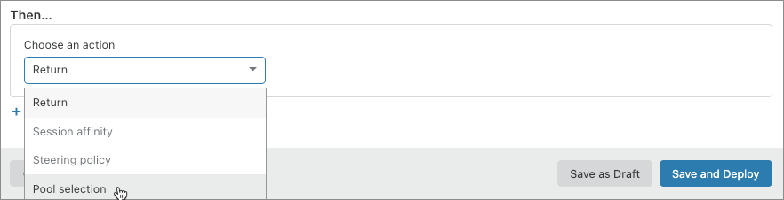
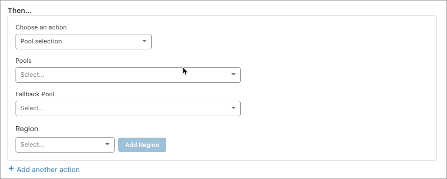

# Creating Load Balancing rules

## Overview

You create and manage [Load Balancing rules](/understand-basics/load-balancing-rules) in the **Custom Rules** page, which is part of the Create/Edit Load Balancer workflow in the **Traffic** app.

To create a Load Balancing rule in the Cloudflare dashboard, follow this workflow:

1. [Create a new rule](#create-a-new-load-balancing-rule)
1. [Build an expression for the rule](#build-a-load-balancing-expression)
1. [Configure an action](#configure-the-action)
1. [Save the rule and the load balancer configuration](#save-a-load-balancing-rule-and-configuration)

---

## Create a new Load Balancing rule

1. Log in to your Cloudflare Account Home and click the site you want to manage in the dashboard.

1. In the Cloudflare dashboard, click the **Traffic** app, then select the **Load Balancing** tab.

  

1. To add a rule to an existing load balancer, click the **Edit** link associated with the load balancer you want to manage. Otherwise, click **Create Load Balancer** and follow the workflow in [_Create a load balancer in the Cloudflare dashboard_](/create-load-balancer-ui).
  
  The **Edit Load Balancer** page displays:

  

1. In the breadcrumb links for the Edit Load Balancer workflow, click **Custom Rules**.

  The **Custom Rules** card displays:
  

1. Click **Create Custom Rule**.

1. In the **Create Custom Rule** dialog that displays, use the **Rule name** input to supply a descriptive name. This example uses "Select pool by URI path and query."

  

Now that you have created a rule and named it, continue to the next section and [build a Load Balancing expression](#build-a-load-balancing-expression) that defines when to trigger your rule.

---

## Build a Load Balancing expression

1. In the Expression builder in the **Create Custom Rule** dialog, under **When incoming requests match…**, use the **Field** drop-down list to choose an HTTP property. This example uses _URI path_. For more, see [_Supported fields and operators_](/understand-basics/load-balancing-rules/reference).

  

1. To select a comparison operator, use the **Operator** drop-down list. This example uses the `contains` operator.

1. Enter the value to match. When the field represents an enumeration, the **Value** control will be a drop-down list. Otherwise, it will be a text input. This example matches requests where the URI path contains `/content`:

  

1. [Optional] To create a compound expression using logical operators, click the **And** or **Or** button.

  A new expression displays. Edit the expression. This example uses the `and` operator and adds the requirement that the URI query string contain `webserver`:

  

1. Continue editing your expression until satisfied.

Now that you have built an expression, continue to the next section and [configure a Load Balancing action](#configure-a-load-balancing-action) for your rule.

---

## Configure a Load Balancing action

1. To set an action for your rule, use the **Action** drop-down list. This example selects the _Pool selection_ action:

  

  The configuration options for the selected action display:

    

1. [Optional] Click **Add another action**.

Now that you have configured a Load Balancing action, continue to the next section and [save the Load Balancing rule and configuration](#save-a-load-balancing-rule-and-configurationa).

---

## Save a Load Balancing rule and configuration

<Aside type='warning' header='Warning'>

Unless you follow these steps and save **not only** the new rule **but also** the load balancer configuration, your rule and any configuration changes you made will be lost.

</Aside>

1. In the **Create Custom Rule** dialog, click **Deploy**. If you are not ready to deploy your rule, click **Save as draft**.

  The **Custom Rules** card displays, and your new rule is listed:

  

1. Click **Next** and review your changes:

    

1. Click **Save**.

When the operation is complete, the **Load Balancing** page displays.