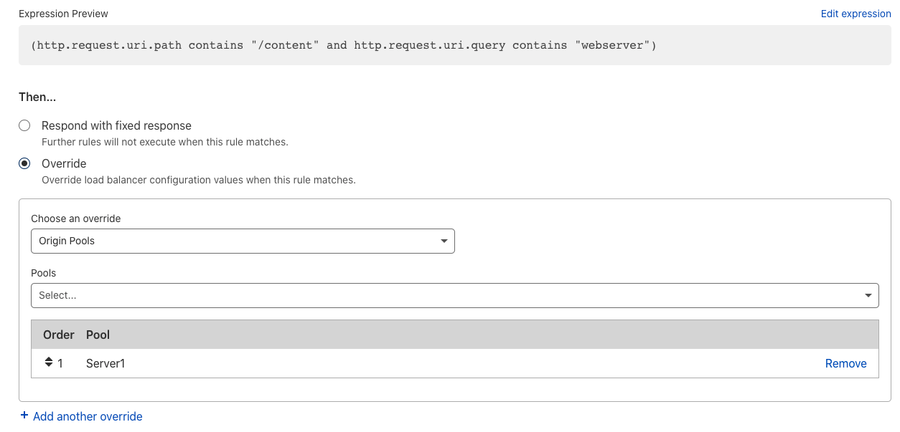

# Create Load Balancing rules

## Overview

Create and manage [Load Balancing rules](/understand-basics/load-balancing-rules) in the **Custom Rules** page, which is part of the Create/Edit Load Balancer workflow in the **Traffic** app.

---

## Before you begin

- **Understand whether Cloudflare proxies your traffic**: Depending on the nature of your traffic, you may have access to more or less fields for your load balancing rules. For more details, see [Supported fields and expressions](../reference). 

---

## Workflow

---

### 1. Create a new Load Balancing rule

1. Log in to your Cloudflare Account and select a domain.

1. Select **Traffic** > **Load Balancing**.

  

1. Edit an existing load balancer or [create a new load balancer](/create-load-balancer-ui).

1. From the Load Balancer workflow, select **Custom Rules**.

1. Select **Create Custom Rule**.

---

### 2. Build a Load Balancing expression

---

<Example>

  This example routes certain content requests from our webserver to a different origin pool.

  <strong>When incoming requests match</strong>:

  <table style="width:100%">
    <thead>
      <tr>
        <th>Field</th>
        <th>Operator</th>
        <th>Value</th>
      </tr>
    </thead>
    <tbody>
    <tr>
        <td>URI Path</td>
        <td>contains</td>
        <td><code>/content</code></td>
      </tr>
    <tr>
        <td>URI Query String</td>
        <td>contains</td>
        <td><code>webserver</code></td>
      </tr>
    </tbody>
  </table>

  <strong>Then</strong>:

  <table style="width:100%">
    <thead>
      <tr>
        <th>Action</th>
        <th>Options</th>
        <th>Value</th>
      </tr>
    </thead>
    <tbody>
    <tr>
        <td>Overrides</td>
        <td>Origin pools</td>
        <td><code>Server1</code></td>
      </tr>
    </tbody>
  </table>
</Example>

---

1. In the **Field** drop-down list, choose an HTTP property. For more details, see [Supported fields](/understand-basics/load-balancing-rules/reference).

  

1. In the **Operator** drop-down list, choose an operator. For more details, see [Operators](/understand-basics/load-balancing-rules/reference#operators).

1. Enter the value to match. When the field is an ordered list, **Value** is a drop-down list. Otherwise, **Value** is a text input.

  

1. [Optional] To create a compound expression using logical operators, select **And** or **Or**.

  

1. For an action, choose **Respond with fixed response** or **Override** and enter additional details. For a full list of actions, see [Actions](../actions).

 

1. [Optional] Select **Add another override**.

---

### 3. Save a Load Balancing rule and configuration

<Aside type='warning' header='Warning'>

To save a new load balancer rule, make sure to save both the rule **and** the overall load balancer configuration.

</Aside>

1. After you create your rule, select **Save and Deploy** or **Save as Draft**.

1. Select **Next** and review your changes:

    

1. Select **Save**.
