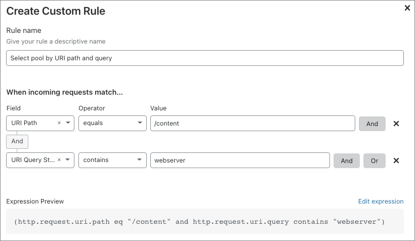
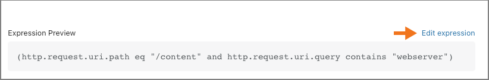
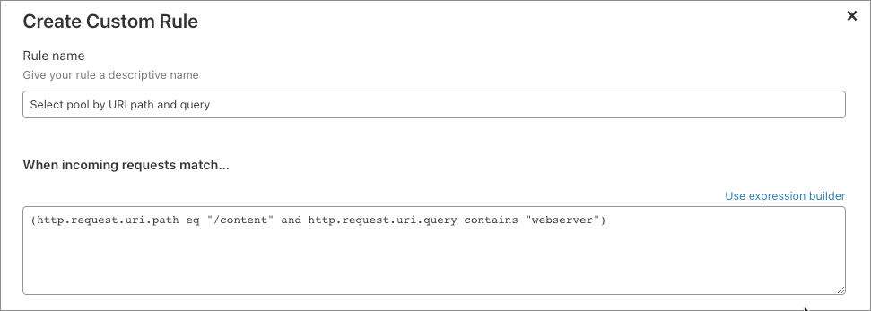

# Load Balancing expressions

## Overview

When working with [Load Balancing rules](/understand-basics/load-balancing-rules), you will encounter two kinds of expression:

- [Simple expressions](#simple-expressions) compare a value from an HTTP request to a value defined in the expression. You can identify a simple expression by the presence of a **comparison operator** (_equals, less than_, for example).

- [Compound expressions](#compound-expressions) combine two or more simple expressions into a single expression. You can identify a compound expression by the presence of a **logical operator** (_and_, _or_, for example). Since each firewall rule can only contain a single expression, compound expressions allow you to tailor rules to specific use cases with a high degree of accuracy and precision.

The **Create Custom Rule** dialog in the **Traffic** app provides two interfaces for creating expressions: the [Expression Builder](#expression-builder) and the [Expression Editor](#expression-editor).

## Simple expressions

Simple expressions are composed of three elements:

1. A **field** that represents a property of an HTTP request.
2. A representative **value** for that field, which Cloudflare compares with the actual value from the request.
3. A **comparison operator**, which specifies how the value defined in the expression must relate to the actual value from the request for the operator to return `true`.

If the comparison operator returns `true`, the request matches the expression.

This example expression returns true when a request URI path contains `/content`:

```sql
(http.request.uri.path contains "/content")
```

In general, simple expressions use this pattern:

```sql
<field> <operator> <value>
```

For a list of supported fields and comparison operators, see 

## Compound expressions

A compound expression uses a **logical operator** (_and_, _or_, for example) to combine two or more expressions. Compound expressions are powerful because they allow you to build complex statements within a single expression.

This example expression returns true when both the HTTP request URI path contains `/content` and the query string contains `stream1`:

```sql
(http.request.uri.path contains "/content") 
and (http.request.uri.query contains "webserver")
```

In general, compound expressions use this pattern:

```sql
<expression> <logical operator> <expression>
```

Note that a compound expression can itself be one of the operands of a logical operator. In this way, you can use multiple operators to construct a compound expression from many individual expressions.

## Working with expressions

The Expression Builder’s visual interface allows you to build expressions without worrying about field names and syntax.

By comparison, the Expression Editor is text only, but it supports advanced features not available in the builder.

### Expression Builder

Compound expressions are easier to scan when displayed in the Expression Builder’s visual interface, and the Expression Preview is a great reference for learning to write more advanced expressions.

This Expression Builder screenshot shows the example compound expression described earlier. Compound expressions are easier to scan when displayed in the Expression Builder’s visual interface.



Notice how the **Expression Preview** displays the expression in text:

```sql
(http.request.uri.path contains "/content") 
and (http.request.uri.query contains "webserver")
```

For more on using Cloudflare’s visual expression builder, see [_Creating Load Balancing rules_](/create-rules).

### Expression editor

The Expression Editor is a text-only interface for creating Load Balancing expressions. Although it lacks the visual simplicity of the Expression Builder, the Expression Editor editor supports advanced features, such as support for grouping symbols (parentheses).

To access the Expression Editor in the **Traffic** app, click **Edit expression** in the **Create Custom Rule** dialog:



The Expression Editor displays:



To return to the builder, click **Use expression builder**.