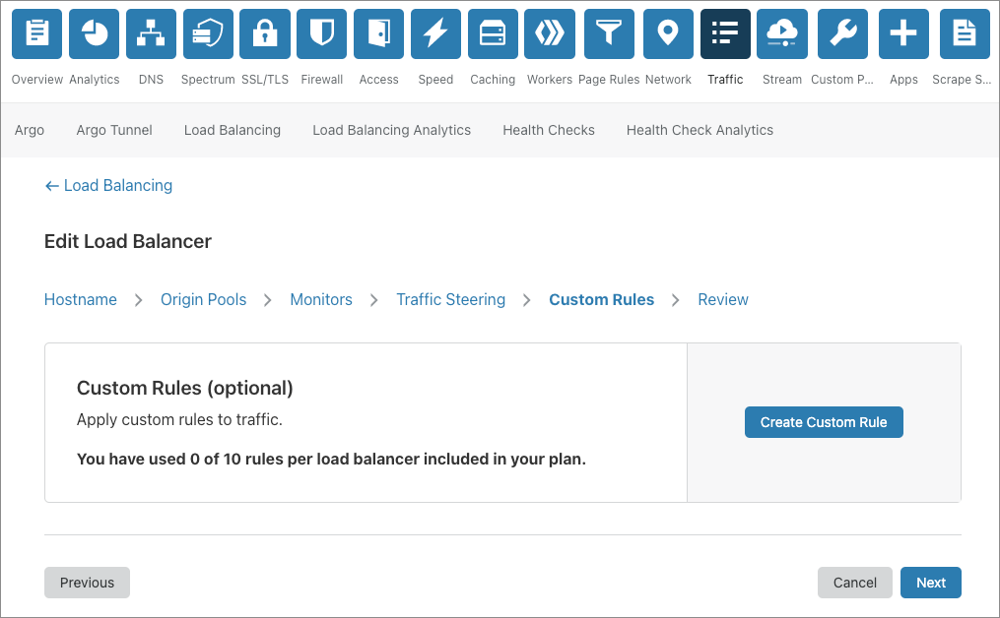

# Load Balancing rules - BETA

Use Load Balancing rules to customize the behavior of your Cloudflare [load balancer](/understand-basics/load-balancers). For example, create a Load Balancing rule that selects an [origin pool](/understand-basics/pools) based on the URI path of an HTTP request.

You can [create Load Balancing rules](/understand-basics/load-balancing-rules/create-rules), using the **Create Custom Rule** dialog, whenever you create or edit a load balancer in the **Traffic** app:

As with Cloudflare [Firewall rules](https://developers.cloudflare.com/firewall/cf-firewall-rules), each Load Balancing rule is a combination of two elements: an [expression](/understand-basics/load-balancing-rules/expressions) and an [action](/understand-basics/load-balancing-rules/actions). Expressions define the criteria for an HTTP request to trigger an action. The action tells Cloudflare how to handle the request.

When building expressions for Load Balancing rules, refer to [_Supported fields and operators_](/understand-basics/load-balancing-rules/reference) for definitions and usage.
