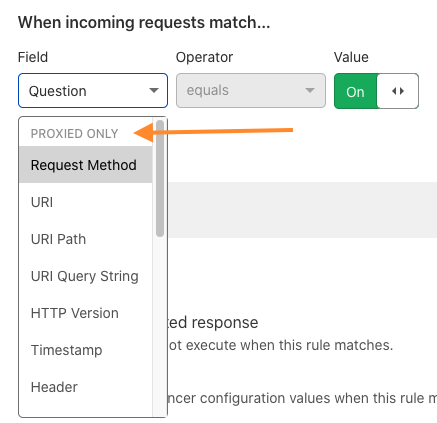

# Supported fields and operators

The fields available for load balancing rules depend on whether Cloudflare proxies the traffic going through your load balancer. 

If you use the wrong type of fields, you might see unexpected behavior from load balancing rules. For best results, always use the fields associated with your traffic's proxy status.



## Fields supported regardless of proxy

Regardless of whether your traffic is proxied, you have access to the following fields:
<table style="width:100%">
  <thead>
    <tr>
      <th style="width:20%">Name in Expression Builder</th>
      <th style="width:40%">Field</th>
      <th>Description</th>
    </tr>
  </thead>
  <tbody>
   <tr>
      <td>IP address</td>
      <td valign="top"><code>ip.src</code><br /><Type>IP&nbsp;address</Type></td>
      <td>
         <p>The client TCP IP address, which may be adjusted to reflect the actual address of the client by using, for example, HTTP headers such as
         <code class="InlineCode">X-Forwarded-For</code> or <code class="InlineCode">X-Real-IP</code>.
         </p>
         <p>Example value:
         <br /><code class="InlineCode">93.184.216.34</code>
         </p>
      </td>
    </tr>
    <tr>
      <td>Load Balancer Region</td>
      <td valign="top"><code>cf.load_balancer.region</code><br /><Type>bytes</Type></td>
      <td>
        <p>The <a href="../../traffic-steering#geo-steering">region name</a> of the data center processing the request.</p>
      </td>
    </tr>
    <tr>
      <td>Load Balancer Name</td>
      <td valign="top"><code>cf.load_balancer.name</code><br /><Type>bytes</Type></td>
      <td>
        <p>The name of the load balancer executing these rules.</p>
        <p>Example value:
         <br /><code class="InlineCode">lb.example.com</code>
         </p>
      </td>
    </tr>
  </tbody>
</table>

## Proxied traffic

If your traffic is proxied, you have access to all the fields listed under **Proxied Only** and [**Both**](#fields-supported-regardless-of-proxy), such as:
- `Request Method`
- `URI`
- `Timestamp`
- `Header`

For the most up to date list of these fields, [create a load balancing rule](../create-rules) in the UI.

For more details about the field type or properties, look for each field in our [Firewall rules documentation](https://developers.cloudflare.com/firewall/cf-firewall-language/fields).

## Unproxied traffic

If your traffic is not proxied through Cloudflare, you have access to all the fields listed under **Unproxied only** and [**Both**](#fields-supported-regardless-of-proxy).

Cloudflare Load Balancers support the following unproxied fields:
<table style="width:100%">
  <thead>
    <tr>
      <th style="width:20%">Name in Expression Builder</th>
      <th style="width:40%">Field</th>
      <th>Description</th>
    </tr>
  </thead>
  <tbody>
    <tr>
      <td>Query Type</td>
      <td valign="top"><code>dns.qry.type</code><br /><Type>Int</Type></td>
      <td>
        <p>The numeric value of the <a href= "https://en.wikipedia.org/wiki/List_of_DNS_record_types">DNS query type</a>
        </p>
        <p>Example Values:</p>
          <ul>
              <li><code class="InlineCode">1 (A record)</code></li>
              <li><code class="InlineCode">28 (AAAA record)</code></li>
          </ul>
      </td>
    </tr>
      <tr>
      <td>Question</td>
      <td valign="top"><code>dns.qry.typ</code><br /><Type>boolean</Type></td>
      <td>
        <p>A boolean indicating that the received DNS message was a question</p>
      </td>
    </tr>
    <tr>
      <td>Query Name</td>
      <td valign="top"><code>dns.qry.name</code><br /><Type>Bytes</Type></td>
      <td>
        <p>The byte of the query name asked, such as <code>example.com</code> </p>
      </td>
    </tr>
    <tr>
      <td>Query Name Length</td>
      <td valign="top"><code class>dns.qry.name.len</code><br /><Type>Int</Type></td>
      <td>
        <p>The length in bytes of the query name.
        </p>
      </td>
    </tr>  
  </tbody>
</table>

---

## Operators

### Overview

[Comparison operators](#comparison-operators) specify how values defined in an expression must relate to the actual HTTP request value for the expression to return true.

[Logical operators](#logical-operators) combine two expressions to form a compound expression and use order of precedence to determine how an expression is evaluated.

Load Balancing expressions also support grouping symbols, which allow you to organize expressions, enforce operator precedence, and nest expressions. For examples and usage, see [_Grouping symbols_](/cf-firewall-language/operators/#grouping-symbols) in the Firewall Rules documentation.

### Comparison operators

Comparison operators return `true` when a value from an HTTP request matches a value defined in an expression.

This is the general pattern for using comparison operators:

```sql
<field> <comparison operator> <value>
```

Load Balancing expressions support these comparison operators:

<TableWrap style='width:100%'>
  <table style='width:100%'>
    <thead>
    <tr>
      <th>Name</th>
      <th>Operator Notation</th>
      <th colspan="3" style="text-align:center">Supported Data Types</th>
      <th>Example (operator in bold)</th>
    </tr>
    <tr>
      <td></td>
      <td></td>
      <th>String</th>
      <th>IP</th>
      <th>Rules list</th>
      <th></th>
    </tr>
    </thead>
    <tbody>
      <tr>
        <td>Equal</td>
        <td><code class="InlineCode">eq</code></td>
        <td>&#x2705;</td>
        <td>&#x2705;</td>
        <td>&#x2705;</td>
        <td>
          <code class="InlineCode">http.request.uri.path <strong>eq</strong> "/articles/2008/"</code>
        </td>
      </tr>
      <tr>
        <td>Not equal</td>
        <td><code class="InlineCode">ne</code></td>
        <td>&#x2705;</td>
        <td>&#x2705;</td>
        <td>&#x2705;</td>
        <td>
          <code class="InlineCode">ip.src <strong>ne</strong> 93.184.216.0</code>
        </td>
      </tr>
      <tr>
        <td>Exactly<br />contains</td>
        <td><code class="InlineCode">contains</code></td>
        <td>&#x2705;</td>
        <td>&#10060;</td>
        <td>&#10060;</td>
        <td>
          <code class="InlineCode">http.request.uri.path <strong>contains</strong> "/articles/"</code>
        </td>
      </tr>
      <tr>
        <td>Matches<br />regex</td>
        <td><code class="InlineCode">matches</code></td>
        <td>&#x2705;</td>
        <td>&#10060;</td>
        <td>&#10060;</td>
        <td>
          <code class="InlineCode">http.request.uri.path <strong>matches</strong> "^/articles/200[7-8]/$"</code>
        </td>
      </tr>
      <tr>
        <td>Value is in <br />a set of values</td>
        <td><code class="InlineCode">in</code></td>
        <td>&#x2705;</td>
        <td>&#x2705;</td>
        <td>&#x2705;</td>
        <td>
          <code class="InlineCode">ip.src <strong>in</strong> {'{ 93.184.216.0 93.184.216.1 }'}</code>
        </td>
      </tr>
    </tbody>
  </table>
</TableWrap>

### Logical operators

Logical operators combine two or more expressions into a single compound expression. A compound expression has this general syntax:

```sql
<expression> <logical operator> <expression>
```

Each logical operator has an [order of precedence](#order-of-precedence). The order of precedence (along with [grouping symbols](#grouping-symbols)) determines the order in which Cloudflare evaluates logical operators in an expression. The `not` operator ranks first in order of precedence. For more on how Cloudflare evaluates logical operators in expressions, see [_Order of precedence_](https://developers.cloudflare.com/firewall/cf-firewall-language/operators#order-of-precedence) in the Firewall Rules documentation.

Load Balancing expressions support these logical operators:

<TableWrap>
<table style='width:100%'>
  <thead>
   <tr>
      <th>Name</th>
      <th>English<br />Notation</th>
      <th>C-like<br />Notation</th>
      <th>Example</th>
      <th>Order of Precedence</th>
   </tr>
  </thead>
  <tbody>
   <tr>
      <td>Logical NOT</td>
      <td><code class="InlineCode">not</code></td>
      <td><code class="InlineCode">!</code></td>
      <td>
         <code class="InlineCode"><strong>not</strong> ( http.host eq "www.cloudflare.com" and ip.src in 93.184.216.0/24 )</code>
      </td>
      <td>1</td>
   </tr>
   <tr>
      <td>Logical AND</td>
      <td><code class="InlineCode">and</code></td>
      <td><code class="InlineCode">&amp;&amp;</code></td>
      <td>
         <code class="InlineCode">http.host eq "www.cloudflare.com" <strong>and</strong> ip.src in 93.184.216.0/24</code>
      </td>
      <td>2</td>
   </tr>
   <tr>
      <td>Logical XOR<br />
        (exclusive OR)</td>
      <td><code class="InlineCode">xor</code></td>
      <td><code class="InlineCode">^^</code></td>
      <td>
         <code class="InlineCode">http.host eq "www.cloudflare.com" <strong>xor</strong> ip.src in 93.184.216.0/24</code>
      </td>
      <td>3</td>
   </tr>
   <tr>
      <td>Logical OR</td>
      <td><code class="InlineCode">or</code></td>
      <td><code class="InlineCode">||</code></td>
      <td>
         <code class="InlineCode">http.host eq "www.cloudflare.com" <strong>or</strong> ip.src in 93.184.216.0/24</code>
      </td>
      <td>4</td>
   </tr>
  </tbody>
</table>
</TableWrap>
