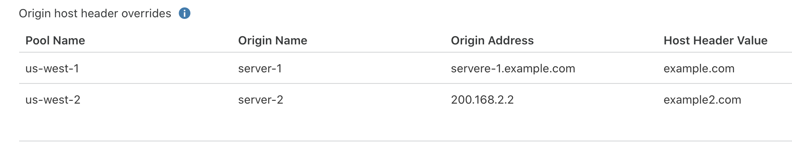

import MonitorDefinition from "../_partials/_monitor-definition.md"

# Monitors

<MonitorDefinition/>

Health checks that result in a status change for an origin server are recorded as events in the Load Balancing event logs.

<Aside type="note">

Health checks associated with load balancers are different from <strong>Standalone health checks</strong>. For more details about Standalone health checks, see the <a href="https://support.cloudflare.com/hc/articles/4404867308429">Support documentation</a>.

</Aside>

---

## Important notes

- **Availability monitoring checks the health of origin servers at the specified interval**. It reports results via email notifications and the Cloudflare API. Shorter intervals will improve failover time, but may increase the load on your origin servers.
- **The default retry rate is 5 retries/second** and is completely configurable. We do not recommend increasing the retry rate significantly. Retries use exponential backoff (1, 2, 4, 8, 16 seconds by default).
- **You can configure monitoring for specific URLs** by sending periodic HTTP requests to the load balancer, taking advantage of customizable intervals, timeouts, and status codes. Once an origin server is marked unhealthy, multi-region failover reroutes traffic to the next available server in failover order.
- **Load Balancing monitors use the following HTTP user-agent**: `"Mozilla/5.0 (compatible; Cloudflare-Traffic-Manager/1.0; +https://www.cloudflare.com/traffic-manager/; pool-id: $poolid)"`. The `$poolid` contains the first 16 characters of the Load Balancing pool that is the target of the health check.
- **To increase confidence in pool status**, increase the `consecutive_up` and `consecutive_down` fields when [creating a monitor with the API](https://api.cloudflare.com/#account-load-balancer-monitors-create-monitor). To become healthy or unhealthy, monitored origins must pass this health check the consecutive number of times specified in these parameters.
- **To prevent health checks from failing**, and to secure user infrastructure against spoofed checks from bad actors, we recommend the following:
  - Only accept connections to hosts listed in the [Cloudflare IP ranges](https://www.cloudflare.com/ips/) in your firewall or web-server.
  - Use Cloudflare's user agent (see above) to reject HTTP requests that don't come from these ranges.
  - Ensure that your firewall or web server does not block or rate limit Cloudflare health checks.

<Aside>

For more details about how origins and pools become unhealthy, refer to [Origin and pool health](/understand-basics/health-details).

</Aside>

---

## Properties

For an up-to-date list of monitor properties, refer to [Monitor properties](https://api.cloudflare.com/#load-balancer-monitors-properties) in our API documentation.

---

## Override HTTP Host headers

When your application needs specialized routing (CNAME setup or custom hosts like Heroku), change the `Host` header used in health checks.

You can set these headers on a [specific origin](/understand-basics/pools#per-origin-host-header-override) or a monitor. Headers set on an origin override headers set on a monitor.

### Host header prioritization

When a load balancer runs health checks, headers set on an origin override headers set on a monitor.

For example, you might have a load balancer for `www.example.com` with the following setup:

- Origin Pools:

  - Pool 1:

    - Origin 1 (`Host` header set to `lb-app-a.example.com`)
    - Origin 2
  
  - Pool 2:

    - Origin 3
    - Origin 4 (`Host` header set to `lb-app-b.example.com`)

- Monitor (`Host` header set to `www.example.com`)

In this scenario, health checks for **Origin 1** would use `lb-app-a.example.com`, health checks for **Origin 4** would use `lb-app-b.example.com`, and all other health checks would default to `www.example.com`. For more information on updating your custom host configuration to be compatible with Cloudflare, see [Configure Cloudflare and Heroku over HTTPS](https://support.cloudflare.com/hc/articles/205893698).

For a list of origins that override a monitor's `Host` header:

1. On a monitor, select **Edit**.
1. Select **Advanced health check settings**.
1. If you have origin overrides, you will see **Origin host header overrides**.

---

## Create monitors

For step-by-step guidance, refer to [Create monitors](/how-to/create-monitor).

---

## API commands

The Cloudflare API supports the following commands for monitors. Examples are given for user-level endpoint but apply to the account-level endpoint as well.

<TableWrap>

<table>
  <thead>
    <tr>
      <th><Strong>Command</Strong></th>
      <th><Strong>Method</Strong></th>
      <th><Strong>Endpoint</Strong></th>
    </tr>
  </thead>
  <tbody>
    <tr>
      <td><a href="https://api.cloudflare.com/#load-balancer-monitors-create-monitor">Create Monitor</a></td>
      <td><Code>POST</Code></td>
      <td><Code>user/load_balancers/monitors</Code></td>
    </tr>
    <tr>
      <td><a href="https://api.cloudflare.com/#load-balancer-monitors-delete-monitor">Delete Monitor</a></td>
      <td><Code>DELETE</Code></td>
      <td><Code>user/load_balancers/monitors</Code></td>
    </tr>
    <tr>
      <td><a href="https://api.cloudflare.com/#load-balancer-monitors-list-monitors">List Monitors</a></td>
      <td><Code>GET</Code></td>
      <td><Code>user/load_balancers/monitors</Code></td>
    </tr>
    <tr>
      <td><a href="https://api.cloudflare.com/#load-balancer-monitors-monitor-details">Monitor Details</a></td>
      <td><Code>GET</Code></td>
      <td><Code>user/load_balancers/monitors/:identifier</Code></td>
    </tr>
    <tr>
      <td><a href="https://api.cloudflare.com/#load-balancer-monitors-update-monitor">Update Monitor</a></td>
      <td><Code>PUT</Code></td>
      <td><Code>user/load_balancers/monitors</Code></td>
    </tr>
     <tr>
      <td><a href="https://api.cloudflare.com/#load-balancer-monitors-preview-monitor">Preview Monitor</a></td>
      <td><Code>POST</Code></td>
      <td><Code>user/load_balancers/monitors/:identifier/preview</Code></td>
    </tr>
  </tbody>
</table>

</TableWrap>
