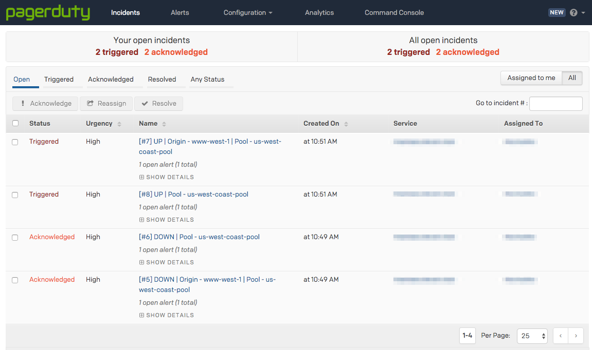

# Monitors

## Overview

Cloudflare health checks track the health of pools. They are configured through monitors, which define what type of health check to run and how frequently to run them. Cloudflare monitors your servers from each of our data centers.

Health checks that result in a status change for an origin server are recorded as events in the Load Balancing event logs. You can create, attach, and configure health checks from either the Load Balancing dashboard or the Cloudflare API.

---

## Important notes

- **Availability monitoring checks the health of origin servers every 15 seconds**. It reports results via email notifications and the Cloudflare API.
- **The default retry rate is 5 retries/second** and is completely configurable. We do not recommend increasing the retry rate significantly. Retries use exponential backoff (1, 2, 4, 8, 16 seconds by default).
- **You can configure** **monitoring for specific URLs** by sending periodic HTTP requests to the load balancer, taking advantage of customizable intervals, timeouts, and status codes. Once an origin server is marked unhealthy, multi-region failover reroutes traffic to the next available server in failover order.
- **Load Balancing monitors use the following HTTP user-agent**: `"Mozilla/5.0 (compatible; Cloudflare-Traffic-Manager/1.0; +https://www.cloudflare.com/traffic-manager/; pool-id: $poolid)"`. The `$poolid` contains the first 16 characters of the Load Balancing pool that is the target of the health check.
- **To prevent health checks from failing**, and to secure user infrastructure against spoofed checks from bad actors, we recommend the following:
  - Only accept connections to hosts listed in the [Cloudflare IP ranges](https://www.cloudflare.com/ips/) in your firewall or web-server.
  - Use Cloudflare's user agent (see below) to reject HTTP requests that don't come from these ranges.
  - Ensure that your firewall or web server does not block or rate limit Cloudflare health checks.

---

## Properties

Monitors support a great deal of customization and have the following properties:

<TableWrap>
  <table>
    <thead>
      <tr>
        <th>Name <Type>/type</Type></th>
        <th>Description <Type>/example</Type></th>
        <th>Constraints</th>
      </tr>
    </thead>
    <tbody>
      <tr>
        <td><strong><Code>port</Code></strong><br/><Type>integer</Type></td>
        <td>
          <p>Port number to connect to for the health check. Required for TCP checks. HTTP and HTTPS checks should only define the port when using a non-standard port (HTTP: default 80, HTTPS: default 443).</p>
          <div><Code>8080</Code></div>
        </td>
        <td>
          <ul>
            <li>default value: 0</li>
          </ul>
        </td>
      </tr>
      <tr>
        <td><strong><Code>method</Code></strong><br/><Type>string</Type></td>
        <td>
          <p>The method to use for the health check. This defaults to 'GET' for HTTP/HTTPS based checks and 'connection_established' for TCP based health checks.</p>
          <div><Code>"GET"</Code></div>
        </td>
        <td>
          <ul>
            <li>default value: GET</li>
          </ul>
        </td>
      </tr>
      <tr>
        <td><strong><Code>timeout</Code></strong><br/><Type>integer</Type></td>
        <td>
          <p>The timeout (in seconds) before marking the health check as failed</p>
          <div><Code>3</Code></div>
        </td>
        <td>
          <ul>
            <li>default value: 5</li>
          </ul>
        </td>
      </tr>
      <tr>
        <td><strong><Code>path</Code></strong><br/><Type>string</Type></td>
        <td>
          <p>The endpoint path to health check against. This parameter is only valid for HTTP and HTTPS monitors.</p>
          <div><Code>"/health"</Code></div>
        </td>
        <td>
          <ul>
            <li>default value: /</li>
          </ul>
        </td>
      </tr>
      <tr>
        <td><strong><Code>interval</Code></strong><br/><Type>integer</Type></td>
        <td>
          <p>The interval between each health check. Shorter intervals may improve failover time, but will increase load on the origins as we check from multiple locations.</p>
          <div><Code>90</Code></div>
        </td>
        <td>
          <ul>
            <li>default value: 60 </li>
            <li>minimum values: 
            <ul>
              <li>60 (Pro)</li>
              <li>10 (Business)</li>
              <li>5 (Enterprise)</li>
            </ul></li>
          </ul>
        </td>
      </tr>
      <tr>
        <td><strong><Code>retries</Code></strong><br/><Type>integer</Type></td>
        <td>
          <p>The number of retries to attempt in case of a timeout before marking the origin as unhealthy. Retries are attempted immediately.</p>
          <div><Code>0</Code></div>
        </td>
        <td>
          <ul>
            <li>default value: 2</li>
          </ul>
        </td>
      </tr>
      <tr>
        <td><strong><Code>follow_redirects</Code></strong><br/><Type>boolean</Type></td>
        <td>
          <p>Follow redirects if returned by the origin. This parameter is only valid for HTTP and HTTPS monitors.</p>
          <div><Code>true</Code></div>
        </td>
        <td>
          <ul>
            <li>default value: false</li>
            <li>valid values: (true,false)</li>
          </ul>
        </td>
      </tr>
      <tr>
        <td><strong><Code>probe_zone</Code></strong><br/><Type>string</Type></td>
        <td>
          <p>(known as Simulate Zone in the UI) pushes a request from Cloudflare Health Monitors through the Cloudflare stack as if it were a real visitor request to help analyze behavior or validate a configuration.  It allows you to emulate the specified zone while probing.</p>
        </td>
        <td>
        </td>
      </tr>
      <tr>
        <td><strong><Code>expected_body</Code></strong><br/><Type>string</Type></td>
        <td>
          <p>A case-insensitive sub-string to look for in the response body. If this string is not found, the origin will be marked as unhealthy. This parameter is only valid for HTTP and HTTPS monitors.</p>
<Aside type="info">

The sub-string must appear within the first 10KiB of your response body.

</Aside>
        </td>
        <td><div><Code>"alive"</Code></div></td>
      </tr>
      <tr>
        <td><strong><Code>header</Code></strong><br/><Type>object</Type></td>
        <td>
          <p>The HTTP request headers to send in the health check. It is recommended you set a Host header by default. The User-Agent header cannot be overridden. This parameter is only valid for HTTP and HTTPS monitors.</p>
        </td>
        <td><div>

```json
{
  "Host": [
    "example.com"
  ],
  "X-App-ID": [
    "abc123"
  ]
}
```

</div></td>
      </tr>
      <tr>
        <td><strong><Code>allow_insecure</Code></strong><br/><Type>boolean</Type></td>
        <td>
          <p>Do not validate the certificate when monitor use HTTPS. This parameter is currently only valid for HTTP and HTTPS monitors.</p>
          <div><Code>true</Code></div>
        </td>
        <td>
          <ul>
            <li>default value: false</li>
            <li>valid values: (true,false)</li>
          </ul>
        </td>
      </tr>
      <tr>
        <td><strong><Code>modified_on</Code></strong><br/><Type>string (date-time)</Type></td>
        <td>
          <p>Last modification time</p>
          <div><Code>"2014-01-01T05:20:00.12345Z"</Code></div>
        </td>
        <td>
          <ul>
            <li>read only</li>
          </ul>
        </td>
      </tr>
      <tr>
        <td><strong><Code>created_on</Code></strong><br/><Type>string (date-time)</Type></td>
        <td>
          <p>Creation time</p>
          <div><Code>"2014-01-01T05:20:00.12345Z"</Code></div>
        </td>
        <td>
          <ul>
            <li>read only</li>
          </ul>
        </td>
      </tr>
      <tr>
        <td><strong><Code>type</Code></strong><br/><Type>string</Type></td>
        <td>
          <p>The protocol to use for the health check. Currently supported protocols are 'HTTP','HTTPS' and 'TCP'.</p>
          <div><Code>"https"</Code></div>
        </td>
        <td>
          <ul>
            <li>default value: http</li>
          </ul>
        </td>
      </tr>
      <tr>
        <td><strong><Code>id</Code></strong><br/><Type>string</Type></td>
        <td>
          <p>API item identifier tag</p>
          <div><Code>"f1aba936b94213e5b8dca0c0dbf1f9cc"</Code></div>
        </td>
        <td>
          <ul>
            <li>
              max length:
              32
            </li>
            <li>read only</li>
          </ul>
        </td>
      </tr>
      <tr>
        <td><strong><Code>description</Code></strong><br/><Type>string</Type></td>
        <td>
          <p>Object description</p>
          <div><Code>"Login page monitor"</Code></div>
        </td>
        <td>
          <ul></ul>
        </td>
      </tr>
      <tr>
        <td><strong><Code>expected_codes</Code></strong><br/><Type>string</Type></td>
        <td>
          <p>The expected HTTP response code or code range of the health check. This parameter is only valid for HTTP and HTTPS monitors.</p>
          <div><Code>"2xx"</Code></div>
        </td>
        <td>
          <ul>
            <li>default value: 200</li>
          </ul>
        </td>
      </tr>
    </tbody>
  </table>
</TableWrap>

---

## Managing monitors via the Load Balancing dashboard

Use the **Create Load Balancer** or **Edit Load Balancer** panels in the Load Balancing dashboard to manage health check monitors. For step-by-step guidance, see _[Create, attach, and configuring health checks](/create-load-balancer-ui#create-attach-and-configure-health-checks)_.

---

## Managing monitors via the Cloudflare API

Use the `load_balancers/monitors` endpoint to manage monitors via the Cloudflare API.

### Commands

The Cloudflare API supports the following commands for monitors. (Examples are given for user-level endpoint but apply to the account-level endpoint as well.) For more detail, see _[Cloudflare API: Load Balancer Monitors](https://api.cloudflare.com/#load-balancer-monitors-properties)_.

<TableWrap>

<table>
  <thead>
    <tr>
      <th><Code>Command</Code></th>
      <th><Code>Method</Code></th>
      <th><Code>Endpoint</Code></th>
    </tr>
  </thead>
  <tbody>
    <tr>
      <td>Create Monitor</td>
      <td><Code>POST</Code></td>
      <td><Code>user/load_balancers/monitors</Code></td>
    </tr>
    <tr>
      <td>Delete Monitor</td>
      <td><Code>DELETE</Code></td>
      <td><Code>user/load_balancers/monitors</Code></td>
    </tr>
    <tr>
      <td>List Monitors</td>
      <td><Code>GET</Code></td>
      <td><Code>user/load_balancers/monitors</Code></td>
    </tr>
    <tr>
      <td>Monitor Details</td>
      <td><Code>GET</Code></td>
      <td><Code>user/load_balancers/monitors/:identifier</Code></td>
    </tr>
    <tr>
      <td>Update Monitor</td>
      <td><Code>PUT</Code></td>
      <td><Code>user/load_balancers/monitors</Code></td>
    </tr>
  </tbody>
</table>

</TableWrap>

---

## Health check integration with PagerDuty

To integrate Cloudflare Health Check notifications with PagerDuty, follow the steps outlined in PagerDuty’s _[Email Integration Guide](https://www.pagerduty.com/docs/guides/email-integration-guide/)_. If you do not have a PagerDuty account, you will first need to set that up.

PagerDuty will generate an email address that will create incidents based on emails sent to that address.

If you already have email integration configured in PagerDuty, you can find the designated email address by going to **Configuration > Services > Email** (under **Integrations**).


When creating the Notifier object, configure the email to go to the PagerDuty integration email. Consequently, whenever a pool or origin goes down, an Incident will be created to capture it.


