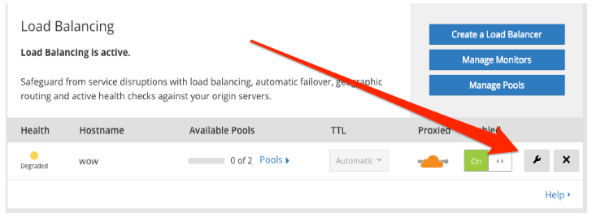

# Session affinity

<Aside type='warning' header='Important'>

Cloudflare supports only cookie-based session affinity. Other methods, such as TCP session affinity, are not supported.

</Aside>

## Overview

Loading a website usually requires fetching multiple assets from a web server. Cloudflare Session Affinity minimizes redundant network requests by automatically directing requests from the same client to the same origin web server. Cloudflare sets a cookie on the initial response to the client. Using the cookie in subsequent client requests ensures those requests are sent to the same origin, unless the origin is unavailable.

When enabled, Cloudflare Session Affinity does the following:

- **When a client makes its first request**, Cloudflare sets a CFLib cookie on the client. The cookie encodes the origin to which the request will be forwarded.
- **Subsequent requests by the same client are forwarded to that origin** for the duration of the cookie and as long as the origin server remains healthy.
- **If the cookie expires or the origin server is unhealthy**, Cloudflare sets a new cookie encoding the appropriate failover origin.

All sessions default to 23 hours unless a custom session TTL is specified (in seconds) between 30 minutes and 7 days. A Session Affinity Cookie is required to honor the TTL. The session cookie is secure when [Always Use HTTPS](https://support.cloudflare.com/hc/articles/204144518#h_a61bfdef-08dd-40f8-8888-7edd8e40d156) is enabled. Additionally, HttpOnly is always enabled for the cookie to prevent cross-site scripting attacks.

---

## Enabling Session Affinity from the Cloudflare dashboard

To enable Session Affinity, use the **Session Affinity** panel in the **Load Balancing** app.

### Configuring Session Affinity for a new load balancer

You can enable **Session Affinity** when you [create a load balancer](/create-load-balancer-ui), during the first step of the Create Load Balancer wizard.

To enable session affinity, click the **By Cloudflare cookie only** radio button and toggle Session Affinity:


The **Client IP fallback** option behaves the same as the cookie option except the client IP address is used as a fallback when no session affinity cookie is provided.

<Aside type='warning' header='Important'>

Session Affinity with Client IP fallback is not supported for load balancers in [DNS-only mode (gray cloud)](/understand-basics/proxy-modes).

</Aside>

### Configuring Session Affinity for an existing load balancer

You can configure session affinity for an existing load balancer from the Load Balancing dashboard. Click the **Edit** button associated with the load balancer to open the **Edit Load Balancer** view and access the **Session Affinity** option.



### Origin Drain

Drain or remove all traffic from an origin without affecting any active customers using Origin Drain. Enable Origin Drain by entering a value in the **Origin drain duration TTL** field, after enabling Session Affinity. **Origin drain duration TTL** is the time (in seconds) it takes to drain all active connections. Traffic drains from any disabled origin or from all origins within a disabled pool.


To check the status of a disabled origin’s drain, use the added **Drain Time** column in the Manage Load Balancer table. **Drain Time** shows the time remaining for a drain in progress. You can edit the **Origin drain duration TTL** field value while an origin drains. Entering a value shorter than the remaining TTL for drains in progress servers current connections to those origins.


When a drain is **Complete**, there are no longer any connections to that origin.


---

## Enabling Session Affinity via the Cloudflare API

Session affinity is a property of load balancers. Use the following endpoint to configure Session Affinity (see [_Create a load balancer with the API_](/create-load-balancer-api/)):

```txt
zones/:identifier/load_balancers
```

Set the `session_affinity` parameter to configure the feature. The default value is an empty string, which indicates that Session Affinity is disabled. To enable it, use the value “cookie” in your request.

Set the `session_affinity_ttl` parameter to configure the duration of session affinity cookies. Values are in seconds and must be in the range 1800–604800 (30 minutes to seven days). Unless `session_affinity` is explicitly set, the default value of 23 hours is used. This parameter is ignored when Session Affinity is disabled.

For a detailed description of the limitations and values available for `session-affinity` and `session_affinity_ttl`, see [_Load balancers_](/understand-basics/load-balancers/#properties).

### Configuring Session Affinity for a new load balancer

You can configure session affinity as part of your request to the Create Load Balancer command.

**Request example (_curl_)**

```bash
curl -X POST "https://api.cloudflare.com/client/v4/zones/699d98642c564d2e855e9661899b7252/load_balancers" \
     -H "X-Auth-Email: user@example.com" \
     -H "X-Auth-Key: c2547eb745079dac9320b638f5e225cf483cc5cfdda41" \
     -H "Content-Type: application/json" \
     --data '   "description":"Load Balancer for www.example.com",
   "name":"www.example.com",
   "ttl":30,
   "fallback_pool":"17b5962d775c646f3f9725cbc7a53df4",
   "default_pools":[
      "17b5962d775c646f3f9725cbc7a53df4",
      "9290f38c5d07c2e2f4df57b1f61d4196",
      "00920f38ce07c2e2f4df50b1f61d4194"
   ],
   "region_pools":{
      "WNAM":[
         "de90f38ced07c2e2f4df50b1f61d4194",
         "9290f38c5d07c2e2f4df57b1f61d4196"
      ],
      "ENAM":[
         "00920f38ce07c2e2f4df50b1f61d4194"
      ]
   },
   "pop_pools":{
      "LAX":[
         "de90f38ced07c2e2f4df50b1f61d4194",
         "9290f38c5d07c2e2f4df57b1f61d4196"
      ],
      "LHR":[
         "abd90f38ced07c2e2f4df50b1f61d4194",
         "f9138c5d07c2e2f4df57b1f61d4196"
      ],
      "SJC":[
         "00920f38ce07c2e2f4df50b1f61d4194"
      ]
   },
   "proxied":true,
   "steering_policy":"dynamic_latency",
   "session_affinity":"cookie",
   "session_affinity_ttl":5000
}''
```

**Response**

```json
{
  "success": true,
  "errors": [],
  "messages": [],
  "result": {
    "id": "699d98642c564d2e855e9661899b7252",
    "created_on": "2014-01-01T05:20:00.12345Z",
    "modified_on": "2014-01-01T05:20:00.12345Z",
    "description": "Load Balancer for www.example.com",
    "name": "www.example.com",
    "enabled": true,
    "ttl": 30,
    "fallback_pool": "17b5962d775c646f3f9725cbc7a53df4",
    "default_pools": [
      "17b5962d775c646f3f9725cbc7a53df4",
      "9290f38c5d07c2e2f4df57b1f61d4196",
      "00920f38ce07c2e2f4df50b1f61d4194"
    ],
    "region_pools": {
      "WNAM": [
        "de90f38ced07c2e2f4df50b1f61d4194",
        "9290f38c5d07c2e2f4df57b1f61d4196"
      ],
      "ENAM": [
        "00920f38ce07c2e2f4df50b1f61d4194"
      ]
    },
    "pop_pools": {
      "LAX": [
        "de90f38ced07c2e2f4df50b1f61d4194",
        "9290f38c5d07c2e2f4df57b1f61d4196"
      ],
      "LHR": [
        "abd90f38ced07c2e2f4df50b1f61d4194",
        "f9138c5d07c2e2f4df57b1f61d4196"
      ],
      "SJC": [
        "00920f38ce07c2e2f4df50b1f61d4194"
      ]
    },
    "proxied": true,
    "steering_policy": "dynamic_latency",
    "session_affinity": "cookie",
    "session_affinity_ttl": 5000
  }
}
```

### Configuring Session Affinity for an existing load balancer

Use the Update Load Balancer endpoint to configure session affinity for an existing load balancer:

```txt
PUT zones/:identifier/load_balancers/:identifier
```

**Request example (curl)**

```bash
curl -X PUT "https://api.cloudflare.com/client/v4/zones/699d98642c564d2e855e9661899b7252/load_balancers" \
     -H "X-Auth-Email: user@example.com" \
     -H "X-Auth-Key: c2547eb745079dac9320b638f5e225cf483cc5cfdda41" \
     -H "Content-Type: application/json" \
     --data '   "description":"Load Balancer for www.example.com",
   "name":"www.example.com",
   "Enabled":true,
    "proxied":true,
   "steering_policy":"dynamic_latency",
   "session_affinity":"cookie",
   "session_affinity_ttl":5000
}''
```

**Response**

```json
{
  "success": true,
  "errors": [],
  "messages": [],
  "result": {
    "id": "699d98642c564d2e855e9661899b7252",
    "created_on": "2014-01-01T05:20:00.12345Z",
    "modified_on": "2014-01-01T05:20:00.12345Z",
    "description": "Load Balancer for www.example.com",
    "name": "www.example.com",
    "enabled": true,
    "proxied": true,
    "steering_policy": "dynamic_latency",
    "session_affinity": "cookie",
    "session_affinity_ttl": 5000
  }
}
```
