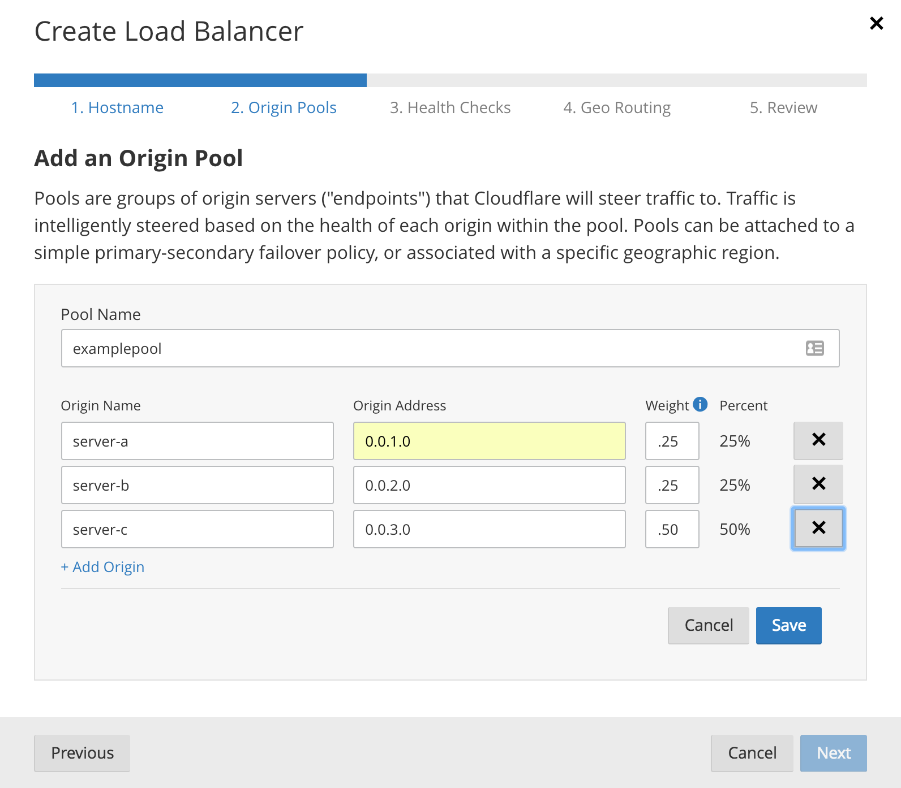

# Weighted load balancing

## Overview

Weighted load balancing allows the user to set a relative weight for each origin server in a pool. These weights determine the percentage of traffic sent to available origins within a pool. If an origin becomes unhealthy, traffic will be rebalanced to the remaining available origins according to their respective weights.

---

## Important notes

When working with origin weights, note the following:

- **The value of each origin weight must be between 0 and 1**, and the weight must be expressed in increments of 0.01 (a weight of 0.015 is not valid).
- **The default weight is 1**.
- **The percentage of traffic to send to a pool** is calculated as follows:

  _Percent traffic to send to pool = origin weight for pool ÷ sum of available weights_

- **Two pools with the same origin weights will receive the same traffic distribution**.
- **If you do not enter weights, all origins will default to a weight of 1**, distributing traffic equally among the active origins.
- **When enabled, session affinity can affect traffic distribution**, since established sessions are not reset when origin weights are modified.

No traffic is sent to a Load Balancer origin of 0 weight except under the following conditions:

- The origin is used in multiple pools and has multiple weights assigned.  Check the origin in the Cloudflare Traffic App or via the List Pools API to confirm.
- Health Checks are still sent at the expected interval for a 0-weight origin.
- Grey-clouded Load Balancers support weights; however, DNS resolvers may cache resolved IPs for clients.

---

## Origin weights example

Here’s an example applying weights to three origin servers:

- **Weights:** Origin Server A = 0.25; Origin Server B = 0.25; Origin Server C = 0.50
- **When all origins are healthy**, each origin will receive the following proportion of total traffic: A = 25%; B = 25%; C = 50%.
- **When one origin is unhealthy** (such as origin C), each healthy origin will receive the following proportion of total traffic: A = 50%; B=50%.

A significant amount of traffic is required for the distribution to converge on the expected values.

---

## Configuring weights from the Load Balancing dashboard

Users can configure origin weights when they set up a load balancer or from the **Load Balancing** dashboard in the **Traffic** app.



---

## Configuring weights via the Cloudflare API

Origin weight is a property of origin server objects, which are associated with pools. To configure the weight of an origin server with the Cloudflare API, use the Update Pools command to set the `weight` property of the origin.

The example below uses the Update Pools command—`POST /user/load_balancers/pools`—to create a pool named _examplepool_ and set weights for each of three origins.

**Request (curl)**

```bash
curl -X POST "https://api.cloudflare.com/client/v4/user/load_balancers/pools" \
     -H "X-Auth-Email: user@example.com" \
     -H "X-Auth-Key: c2547eb745079dac9320b638f5e225cf483cc5cfdda41" \
     -H "Content-Type: application/json" \
--data '{
   "description":"Primary data center - Provider XYZ",
   "name":"primary-dc-1",
   "enabled":true,
   "minimum_origins":2,
   "monitor":"f1aba936b94213e5b8dca0c0dbf1f9cc",
   "origins":[
      {
        "name": "server-a",
        "address": "0.0.1.0",
        "weight": 0.25
       },
       {
         "name": "server-b",
         "address": "0.0.2.0",
         "weight": 0.25
       },
       {
         "name": "server-c",
         "address": "0.0.3.0",
         "weight": 0.50
       }
   ]
}'
```

**Response**

```json
{
  "success": true,
  "errors": [],
  "messages": [],
  "result": {
    "id": "17b5962d775c646f3f9725cbc7a53df4",
    "created_on": "2014-01-01T05:20:00.12345Z",
    "modified_on": "2014-01-01T05:20:00.12345Z",
    "description": "Primary data center - Provider XYZ",
    "name": "primary-dc-1",
    "enabled": true,
    "minimum_origins": 2,
    "monitor": "f1aba936b94213e5b8dca0c0dbf1f9cc",
    "check_regions": [
      "WEU",
      "ENAM"
    ],
 "origins":[
      {
        "name": "server-a",
        "address": "0.0.1.0",
        "weight": 0.25
       },
       {
         "name": "server-b",
         "address": "0.0.2.0",
         "weight": 0.25
       },
       {
         "name": "server-c",
         "address": "0.0.3.0",
         "weight": 0.50
       }
   ]
}
```
