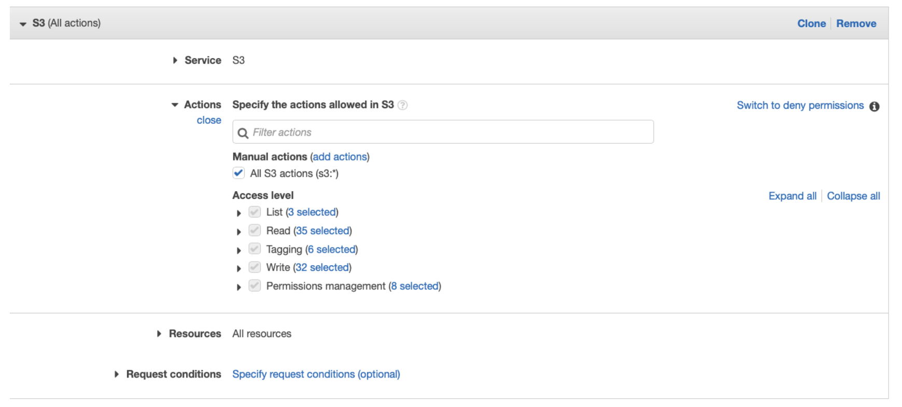
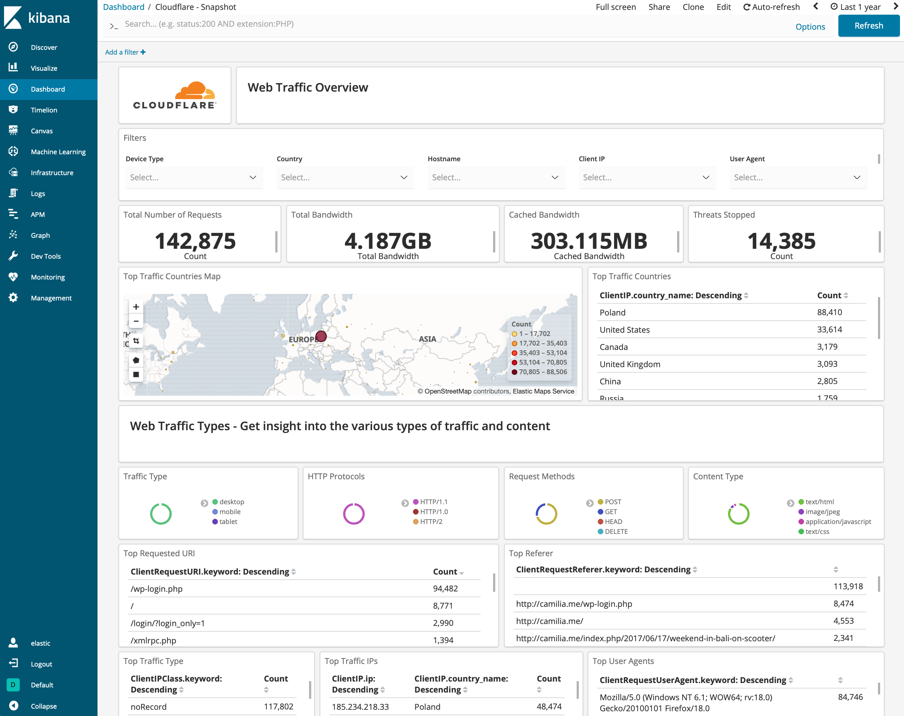
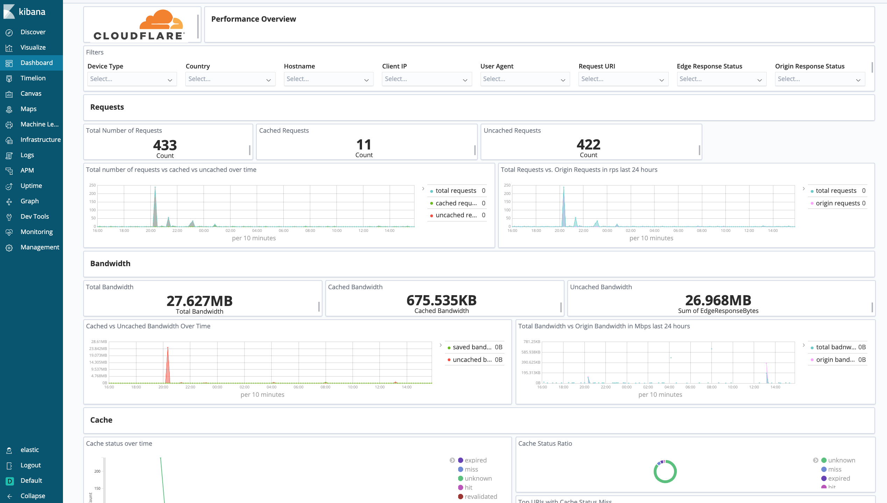
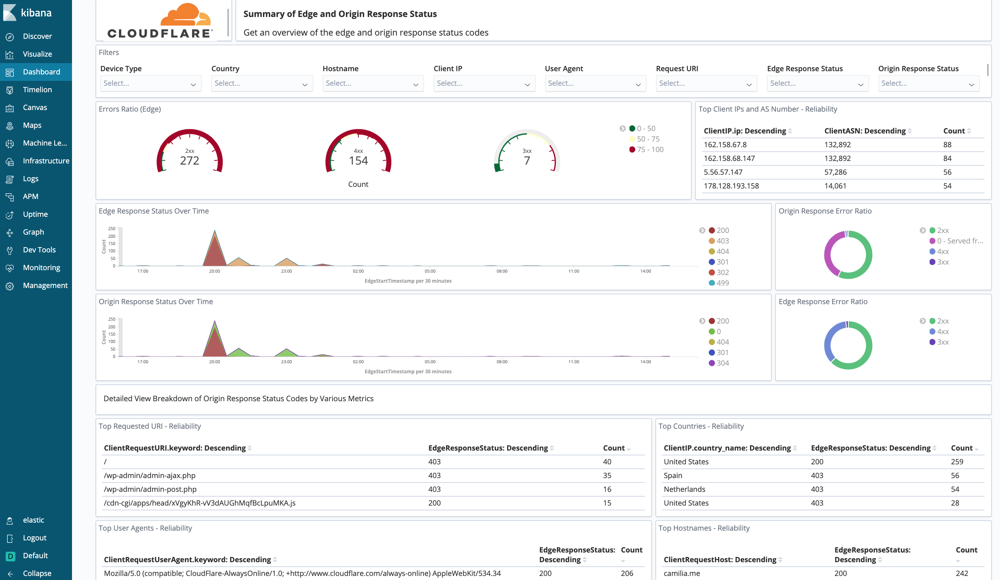
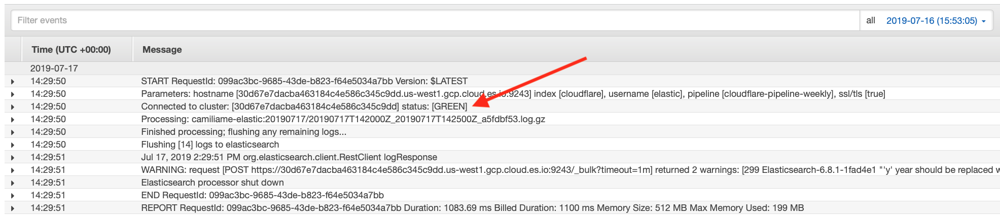
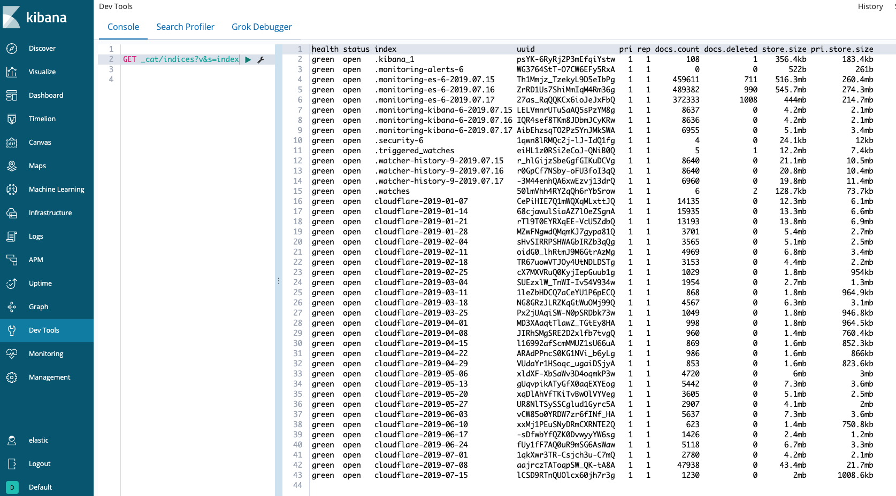

# Elastic

This tutorial explains how to analyze [Cloudflare Logs](https://www.cloudflare.com/products/cloudflare-logs/) using Elastic and Kibana.

## Overview

If you haven’t used Cloudflare Logs before, visit our [Logs documentation](/) for more details. Contact your Cloudflare Customer Account Team to enable logs for your account.

### Prerequisites

Before sending your Cloudflare log data to Elastic, make sure that you:

- Have an existing Elastic instance (versions 6.x and 7.x supported)
- Have a Cloudflare Enterprise account with Cloudflare Logs enabled
- Configure [Logpush](/logpush/) or [Logpull](/logpull-api/)

<Aside type="note" header="Note">

Cloudflare logs are HTTP/HTTPS request logs in JSON format and are gathered from our 194+ data centers globally. By default, timestamps are returned as Unix nanosecond integers. We recommend using the RFC 3339 format for sending logs to Elastic.
</Aside>

## Task 1 - Preparation

Before getting Cloudflare logs into Elastic:

1. Install an AWS Lambda function, available in the file _cloudflare-elastic-lambda.zip_ from GitHub at this location: [https://github.com/cloudflare/cloudflare-elastic/releases/tag/v0.3-7.x](https://github.com/cloudflare/cloudflare-elastic/releases/tag/v0.3-7.x).

2. Upload the _cloudflare-elastic-lambda.zip_ file to an S3 bucket.

   

## Task 2 - Create Elasticsearch deployment on Elastic Cloud

1. Create an account on [Elastic Cloud](https://cloud.elastic.co) and log in.

2. Once logged in, create a new deployment where the Cloudflare logs will reside.
   

3. Configure your new deployment with the following parameters:

   - **Name**: _cloudflare-elastic-logs_

   - **Cloud provider**: _Amazon Web Services_ or _Google Cloud Platform_

   - **Region**: Geographical region in which to host the deployment

   - **Version**: Choose version _6.x_ or _7.x_

   - **Template**: Choose _Hot-Warm Architecture_ (recommended) or _I/O Optimize_
     

4. Click **Customize Deployment**. On this page, you can set your Elasticsearch cluster memory and storage.

   - **I/O Optimized Template Configuration**
     For this options, we recommend configuring your cluster to have 2 availability zones and 8 GB of RAM.

   - **Hot-Warm Template Configuration**
     For this option, we recommend configuring your cluster as:

     - _Hot Zone_: 2 availability zones, 8 GB RAM

     - _Warm Zone_: 2 availability zones, 8 GB RAM

     
     In a hot-warm template, the system will automatically manage the data lifecycle for you by migrating old data to less expensive storage. To configure this, click **Configure index management**.

5. Add an index pattern for `cloudflare-*` and set it to migrate data off the hot zone after 7 days.
   

6. You are now ready to create your Elastic deployment. Click **Create deployment**. The page will refresh with details of your new cluster. It is important to save the randomly generated password (see screenshot). All Elastic deployments are secure by default and are bootstrapped with a randomly generated password for the **Elastic** user. You will use this password to log in to view your Cloudflare logs.

## Task 3 - Configure the deployment

Next, to configure your deployment:

1.  From [https://github.com/cloudflare/cloudflare-elastic/releases/tag/v0.1](https://github.com/cloudflare/cloudflare-elastic/releases/tag/v0.1) download the following files:

    - _cloudflare-index-template.json_

    - _cloudflare-ingest-pipeline-daily.json_

    - _cloudflare-ingest-pipeline-weekly.json_

    - _install-artifacts.sh_

    - _dashboards.json_

2.  Using the Elasticsearch endpoint for your new deployment (found on the main page), run the following command from a terminal, using the random password from above.

        ./install-artifacts.sh -u elastic -p <RANDOM PASSWORD> -e https://_<YOUR DEPLOYMENT ENDPOINT>_:9243

3.  To install the Cloudflare dashboards, log in to the Kibana user interface using the **elastic** username and the randomly generated password.

4.  Navigate to **Management** > **Kibana** > **Saved Objects**.

5.  Upload _dashboards.json_ by clicking the **Import** link.

## Task 4 - Create the Lambda function in AWS

To create the Lambda function:

1. Install the function: create the Lambda, which will read Cloudflare logs from S3 and import them into your Elastic cluster.

2. Log in to your AWS console and navigate to the Lambda section. Create a new function, using the Java 8 runtime and give it a name such as _cloudflare-elastic-logs_.

3. Configure the handler as `com.cloudflare.elastic.ElasticLambdaForwarder::handleRequest` and upload the function that we had previously saved to our S3 bucket.
   

4. Configure the function. The Lambda function requires the following environment variables:

   - **elastic_hostname**: Copy the Elasticsearch endpoint URL from your deployment. Remove the port number and https:// prefix; for example: `2202aa790db546268248a5bd1e35aea6.us-west1.gcp.cloud.es.io`.

   - **elastic_username**: Enter _elastic_.

   - **elastic_password**: Use the randomly generated password that was created for you.
     

5. To connect your Cloudflare S3 log bucket. the last step is to tell the Lambda function to listen for events on the S3 bucket where your Cloudflare logs reside. Choose the S3 trigger type and configure it with the name of the S3 bucket. For **Event type**, select _All object create events_.

6. Ensure your execution role is configured. In order for the function to be able to read logs from the S3 bucket, you may have to configure the execution role.
   

7. View the execution role and add an inline policy that enables the function to read from the bucket.
   

8. Give the policy a name and save it.

9. Save the Lambda and start logging.

10. Finally, save the Lambda configuration. Once it is saved, the Cloudflare logs will start showing up in Kibana on your Elastic Cloud deployment.

## Task 5 - View the Dashboards in Kibana

Once Successfully imported, you can find all Cloudflare dashboards under **Kibana** > **Dashboard**.

### About the dashboards

There are nine dashboards to help you analyze Cloudflare logs. You can also use filters within the dashboards to help narrow the analysis by date and time, device type, country, user agent, client IP, hostname, and more. Filtering can further help you with debugging and tracing.

#### Snapshot

This is a quick overview of the most important metrics from your Cloudflare Logs, including the total number of requests, top visitors by geography, IP, user agent, traffic type, the total number of threats, and bandwidth usage.

#### Security

_Cloudflare - Security (Overview)_ - Get insights on threats to your websites and applications, including the number of threats stopped, threats over time, top threat countries, and more.

_Cloudflare - Security (WAF)_ - Get insights on threat identification and mitigation by our Web Application Firewall, including events like SQL injections, XSS, and more. Use this data to fine tune the firewall to target obvious threats and prevent false positives.

_Cloudflare - Security (Rate Limiting)_ - Get insights on rate limiting protection against denial-of-service attacks, brute-force login attempts, and other types of abusive behavior targeted at your websites or applications.

_Cloudflare - Security (Bot Management)_ - Reliably detects and mitigates bad bots to prevent credential stuffing, spam registration, content scraping, click fraud, inventory hoarding, and other malicious activities.

#### Performance

_Cloudflare - Performance (Requests, Bandwidth, Cache)_ - Identify and address performance issues and caching misconfigurations. Metrics include total vs. cached bandwidth, saved bandwidth, total requests, cache ratio, top uncached requests, and more.

_Cloudflare - Performance (Hostname, Content Type, Request Methods, Connection Type)_ - Get insights into your most popular hostnames, most requested content types, breakdown of request methods, and connection type.

_Cloudflare - Performance (Static vs. Dynamic Content)_ - Get insights into the performance of your static and dynamic content, including slowest URLs.

#### Reliability

Get insights on the availability of your websites and applications. Metrics include origin response error ratio, origin response status over time, percentage of 3xx/4xx/5xx errors over time, and more.

### Filters

All dashboard have a set of filters that you can apply to the entire dashboard, as shown in the following example. Filters are applied across the entire dashboard.

<Aside type="note" header="Note">

You can use filters to drill down and examine the data at a granular level. Filters include client country, client device type, client IP, client request host, client request URI, client request user agent, edge response status, origin IP, and origin response status.
</Aside>

The default time interval is set to 24 hours. Note that for correct calculations filter will need to exclude Worker subrequests (**WorkerSubrequest** = _false_) and purge requests (**ClientRequestMethod** is not _PURGE_).

#### Available Filters

- Date (EdgeStartTimestamp)

- Device Type

- Country

- Hostname

- Client IP

- User Agent

- Request URI

- Edge Response Status

- Origin Response Status

- Origin IP

- RayID

- Worker Subrequest

- Client Request Method

## Debugging tips

### Debug the AWS Lambda function

#### Review the Lambda function logs in AWS

If you detect issues with your AWS Lambda function in Elastic, you can review the AWS CloudWatch logs that are generated automatically for tht specific Lambda function.

To begin, in AWS:

1. Go to **Lambda** > **Functions** > _\<your Lambda function\>_.
2. Click the **Monitoring** tab.
3. Click **View logs in CloudWatch**.

A list of log streams generated by the Lambda function (see image below) appears. Each stream contains log messages. However, some log streams will either be empty or not contain any useful information. You might need to review several of them.

When you click to review a stream, you want to look for messages starting with the the text _Connected to cluster:_ and ending with _status: [GREEN]_ as shown in the image below.

If you see _status: [RED]_, then your cluster isn’t healthy and it’s likely that your Cloudflare logs won’t appear. If this is the case, review how to debug in Kibana (see below).

It is important to verify the return status of the call to Elasticsearch. Lines starting with _Flushing [N] logs to elasticsearch_ and followed by a response line indicate that everything is working as expected.

<Aside type="note" header="Note">

You might see a _WARNING_ message containing text that says _‘y’ year should be replaced…_. You can ignore this message.
</Aside>

If you run into any other issues, take note of the exact return message and contact your Cloudflare support team.

#### Review the AWS Lambda function health status from the Kibana console in Elastic Cloud

To analyze the health status of the Lambda function from Kibana:

1. From Elastic Cloud, launch the Kibana console.
   
2. Find the **Dev Tools** app on the left navigation bar.
3. Under the **Console** tab, type the following into the left pane: _GET \_cat/indices?v&s=index_.
4. In the right pane, you should see a table of indices with the column headings: **health status index**, **uuid**, **pri**, **rep**, **docs.count**, **docs.deleted**, **store.size**, and **pri.store.size**.

The first column should read _green_. If it does not, or if there are no _cloudflare-&lt;DATE>_ indices, then there is a problem loading the logs from the AWS Lambda function.

