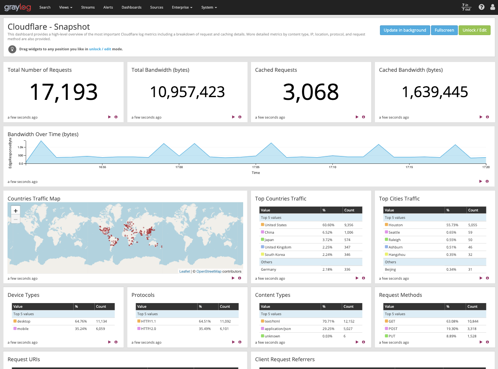

# Graylog

This tutorial explains how to analyze [Cloudflare Logs](https://www.cloudflare.com/products/cloudflare-logs/) using [Graylog](https://go.graylog.com/cloudflare).

## Overview

If you haven't used Cloudflare Logs before, visit our [Logs documentation](/) for
more details. Contact your Cloudflare Customer Account Team to enable logs for
your account.

### Prerequisites

Before sending your Cloudflare log data to Graylog, make sure that you:

- Have an existing Graylog installation. Both single-node and cluster configurations are supported
- Have a Cloudflare Enterprise account with Cloudflare Logs enabled
- Configure [Logpush](https://developers.cloudflare.com/logs/logpush/)

<Aside type="note" header="Note">

Cloudflare logs are HTTP/HTTPS request logs in JSON format and are gathered from our 200+ data centers globally. By default, timestamps are returned as Unix nanosecond integers. All timestamp formats are supported by Graylog.
</Aside>

## Task 1 - Preparation

Before getting Cloudflare logs into Graylog:

1. Configure Cloudflare [Logpush](https://developers.cloudflare.com/logs/logpush/) to push logs with all desired fields to an AWS S3 bucket of your choice.
2. Download the latest Graylog Integration for Cloudflare from the Graylog website: [https://go.graylog.com/cloudflare](https://go.graylog.com/cloudflare).
3. Decompress the zip file.

Once decompressed, the integration package includes:

- _graylog-s3-lambda.jar_
- _content-packs/cloudflare/cloudflare-logpush-content-pack.json_
- _content-packs/cloudflare/threat-lookup.csv_

## Task 2 - Create and configure the AWS Lambda Function

1.  Navigate to the Lambda service page in the AWS web console.
2.  Create a new Lambda function and specify a _function name_ of your choice and the _Java-8 runtime_.
3.  Create or specify an execution role with the following permissions. You can also further restrict the resource permissions as desired for your specific set-up.

```bash
{
  "Version": "2012-10-17",
  "Statement": [
    {
      "Sid": "Policy",
      "Effect": "Allow",
      "Action": [
        "logs:CreateLogGroup"
        "s3:GetObject",
        "logs:CreateLogStream",
        "logs:PutLogEvents"
      ],
      "Resource": [
        "arn:aws:logs:your-region:your-account-number:*"
        "arn:aws:s3:your-region::cloudflare-bucket-name/*"
      ]
    }
  ]
}
```

    **Note:** If your Graylog cluster is running in a VPC, you may need to add the _AWSLambdaVPCAccessExecutionRole_ managed role to allow the Lambda function to route traffic to the VPC.

4.  Once you've created the Lambda function, upload the function code **_graylog-s3-lambda.jar_** downloaded in [Task 1](#task1).  Specify the following method for the Handler: _org.graylog.integrations.s3.GraylogS3Function::handleRequest_.

5.  Specify at least the following required environment variables to configure the Lambda function for your Graylog cluster:

    - **CONTENT_TYPE** (required) - _application/x.cloudflare.log_ value to indicate that the Lambda function will process Cloudflare logs.
    - **COMPRESSION_TYPE** **_(required_** **)** - _gzip_ since Cloudflare logs are gzip compressed.
    - **GRAYLOG_HOST** _(required)_ - hostname or IP address of the Graylog host or cluster load balancer.
    - **GRAYLOG_PORT** _(optional - defaults to 12201)_ - The Graylog service port.
    - **CONNECT_TIMEOUT** _(optional - defaults to 10000)_ - The number of milliseconds to wait for the connection to be established.
    - **LOG_LEVEL** _(optional - defaults to INFO)_ - The level of detail to include in the CloudWatch logs generated from the Lambda function. Supported values are _OFF_, _ERROR_, _WARN_, _INFO_, _DEBUG_, _TRACE_, and _ALL_. Increase the logging level to help with troubleshooting. See [Defining Custom Log Levels in Code](https://logging.apache.org/log4j/2.0/manual/customloglevels.html) for more information.
    - **CLOUDFLARE_LOGPUSH_MESSAGE_FIELDS** _(optional - defaults to all)_ - The fields to parse from the message. Specify as a comma-separated list of field names.
    - **CLOUDFLARE_LOGPUSH_MESSAGE_SUMMARY_FIELDS** _(optional - defaults to ClientRequestHost, ClientRequestPath, OriginIP, ClientSrcPort, EdgeServerIP, EdgeResponseBytes)_ - The fields to include in the message summary that appears above the parsed fields at the top of each message in Graylog. Specify as a comma-separated list of field names.
      

      **Note:** More configuration variables are available to fine-tune the function configuration in the Graylog Lambda S3 [README](https://github.com/Graylog2/graylog-s3-lambda/blob/master/README.md#step-2-specify-configuration) file.

6.  Create an AWS S3 Trigger for the Lambda function so that the function can process each Cloudflare log field that is written. Specify the same S3 bucket from [Task 1](#task1) and choose the _All object create events_ option. Any other desired file filters can be applied here.
    

7.  If your Graylog cluster is located within a VPC, you will need to [configure your Lambda function to access resources in a VPC](https://docs.aws.amazon.com/lambda/latest/dg/configuration-vpc.html). You may also need to create a [VPC endpoint for the AWS S3 service](https://docs.aws.amazon.com/vpc/latest/userguide/vpc-endpoints.html#create-vpc-endpoint). This allows the Lambda function to access S3 directly when running in a VPC.

<Aside type="note" header="Note">

By default, all log messages are sent over TCPt. TLS encryption between the
Lambda function and Graylog is not currently supported. We recommend taking
appropriate measures to secure the log messages in transit, such as placing
the Lambda function within a secure VPC subnet where the Graylog node or
cluster is running.
</Aside>

## Task 3 - Import the content pack in Graylog

Importing the Cloudflare Logpush content pack into Graylog loads the
necessary configuration to receive Cloudflare logs and installs the
Cloudflare dashboards.

The following components install with the content pack:

- Cloudflare dashboards ([Task 4](#task4)).
- A Cloudflare GELF (TCP) input that allows Graylog to receive Cloudflare logs.
- A Cloudflare message [stream](https://docs.graylog.org/en/3.1/pages/streams.html).
- [Pipeline](https://docs.graylog.org/en/3.1/pages/pipelines/pipelines.html) rules that help to process and parse Cloudflare log fields.

To import the content pack:

1.  Locate the _cloudflare-logpush-content-pack.json_ file that you downloaded and extracted in [Task 1](#task1).
2.  In Graylog, go to **System** > **Content Packs** and click **Upload**in the top right. Once uploaded, the Cloudflare Logpush content pack will appear in the list of uploaded content packs.
    
3.  Click **Install**.
    
4.  In the **Install** dialog, enter an optional install comment, and verify that the correct values are entered for all configuration parameters.

    - A path is required for the MaxMind™️ database, available at [https://dev.maxmind.com/geoip/](https://dev.maxmind.com/geoip/).
    - A path is also required for the _Threat Lookup_ CSV file, extracted in [Task 1](#task1).

    

5.  Once installed, your Graylog cluster will be ready to receive Cloudflare logs from the Lambda function.

Refer to the Graylog Lambda S3 [README](https://github.com/Graylog2/graylog-s3-lambda/blob/master/README.md) for additional information and troubleshooting tips.

## Task 4 - View the Cloudflare Dashboards

You can view your dashboard in the [Graylog Cloudflare integration page](https://go.graylog.com/cloudflare). The dashboards include:

### Cloudflare - Snapshot

This is an at-a-glance overview of the most important metrics from your websites and applications on the Cloudflare network. You can use dashboard filters to further slice and dice the information for granular analysis of events and trends.

Use this dashboard to:

- Monitor the most important web traffic metrics of your websites and applications on the Cloudflare network
- View which countries and IPs your traffic is coming from, and analyze the breakdown between mobile and desktop traffic, protocol, methods, and content types



### Cloudflare - Security

This overview provides insights into threats to your websites and applications, including number of threats stopped,threats over time, top threat countries, and more.

Use this dashboard to:

- Monitor the most important security and threat metrics for your websites and applications
- Fine-tune and configure your IP firewall


### Cloudflare - Performance

This dashboard helps to identify and address performance issues and caching misconfigurations. Metrics include total vs. cached bandwidth, saved bandwidth, total requests, cache ratio, top uncached requests, and more.

Use this dashboard to:

- Monitor caching behavior and identify misconfigurations
- Improve configuration and caching ratio


### Cloudflare - Reliability

This dashboard provides insights on the availability of your websites and applications. Metrics include origin response error ratio, origin response status over time, percentage of 3xx/4xx/5xx errors over time, and more.

Use this dashboard to:

- Investigate errors on your websites and applications by viewing edge and origin response status codes
- Further analyze errors based on status codes by countries, client IPs, hostnames, and other metrics


### Cloudflare - Bots

Use this dashboard to detect and mitigate bad bots so that you can prevent credential stuffing, spam registration, content scraping, click fraud, inventory hoarding, and other malicious activities.

<Aside type="note" header="Note">

To get bot requests identified correctly, use only one Cloudflare
Firewall Rule, configured with the action _Challenge (Captcha)_. To lear more, consult the [Cloudflare Firewall Rules documentation](https://developers.cloudflare.com/firewall/cf-firewall-rules/).
</Aside>

Use this dashboard to:

- Investigate bot activity on your website and prevent content scraping,
  checkout fraud, spam registration, and other malicious activities
- Use insight to tune Cloudflare to prevent bots from excessive usage and
  abuse across websites, applications, and API endpoints


