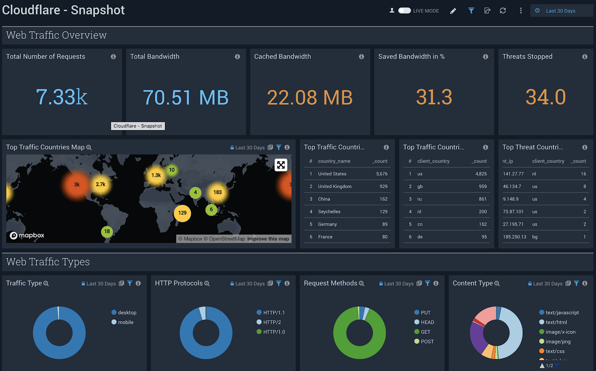

# Sumo Logic

This tutorial explains how to analyze [Cloudflare Logs](https://www.cloudflare.com/products/cloudflare-logs/) using the [Cloudflare App for Sumo Logic](https://help.sumologic.com/07Sumo-Logic-Apps/18SAAS_and_Cloud_Apps/Cloudflare).

## Overview

If you haven’t used Cloudflare Logs before, visit our [Logs documentation](/) for more details. Contact your Cloudflare Customer Account Team to enable logs for your account.

This tutorial describes how to use Cloudflare Logpush to send logs to AWS S3 and the [AWS S3 source collector](https://help.sumologic.com/03Send-Data/Sources/02Sources-for-Hosted-Collectors/Amazon-Web-Services/AWS-S3-Source) to get logs into Sumo Logic. To learn how to use Logpush to send logs to AWS S3, refer to the [Logpush documentation](/logpush/). Alternatively, you can use [Logpull](/logpull-api/) to get logs to your Sumo Logic instance directly and skip Task 1.

### Prerequisites

Before sending your Cloudflare log data to Sumo Logic, make sure that you:

- Have an existing Sumo Logic account
- Have a Cloudflare Enterprise account with Cloudflare Logs enabled
- Configure [Logpush](/logpush/) or [Logpull](/logpull-api/)
- Consult the [Sumo Logic documentation](https://help.sumologic.com/07Sumo-Logic-Apps/18SAAS_and_Cloud_Apps/Cloudflare) for the Cloudflare App

<Aside type="note" header="Note">

Cloudflare logs are HTTP/HTTPS request logs in JSON format and are gathered from our 200+ data centers globally. By default, timestamps are returned as Unix nanosecond integers. We recommend using the RFC 3339 format for sending logs to Sumo Logic.
</Aside>

## Task 1 - Send Cloudflare Logs data to Sumo Logic

You can use either **Cloudflare Logpush** or **AWS S3** to send your Cloudflare Logs data to Sumo Logic.

### 1.1 - Send logs data via Cloudflare Logpush

To enable Cloudflare Logpush in Sumo Logic:

1. Configure a [Hosted Collector](https://help.sumologic.com/03Send-Data/Hosted-Collectors/Configure-a-Hosted-Collector).

2. Configure an [HTTP Logs and Metrics Source](https://help.sumologic.com/03Send-Data/Sources/02Sources-for-Hosted-Collectors/HTTP-Source).

3. Provide the _HTTP Source Address (URL)_ required by the Cloudflare Logpush API or Cloudflare dashboard UI.

4. Enable Cloudflare Logpush to Sumo Logic via either:
   - the Cloudflare dashboard [Logpush UI](/logpush/logpush-dashboard/), or
   - the [Logpush API](/logpush/logpush-configuration-api/).

### 1.2 Send log data via AWS S3

To connect AWS S3 to Sumo Logic:

1. [Configure your AWS S3 Source](https://help.sumologic.com/03Send-Data/Sources/02Sources-for-Hosted-Collectors/Amazon-Web-Services/AWS-S3-Source).

2. Begin collecting Cloudflare logs data.

## Task 2 - Filter Workers requests

If you have [Cloudflare Workers](https://www.cloudflare.com/products/cloudflare-workers/) enabled and want to filter them out from the logs, do the following:

Under **Processing Rules for Logs** create a **Filter** (processing rule regex on our Cloudflare collector) to exclude any log data where **WorkerSubrequest** is _true_, as illustrated below:

## Task 3 - Install the Cloudflare App

To install the [Cloudflare App for Sumo Logic](https://help.sumologic.com/07Sumo-Logic-Apps/18SAAS_and_Cloud_Apps/Cloudflare):

1. In the Sumo Logic UI, click **App Catalog** and search for _Cloudflare_.
   

2. Click **Add to Library** and specify the **Source** category _Cloudflare_, which was completed in Step 1.

You should now be able to see the Cloudflare dashboards populated with your Cloudflare log data.

## Task 4 - View the Dashboards

There are nine dashboards to help you analyze Cloudflare logs. You can also use filters within the dashboards to help narrow the analysis by date and time, device type, country, user agent, client IP, hostname, and more, to further help with debugging and tracing.

### About the Dashboards

#### Cloudflare - Snapshot

Get a quick overview of the most important metrics from your websites and applications on the Cloudflare network.

#### Cloudflare - Reliability

Get insights on the availability of your websites and Applications. Metrics include origin response error ratio, origin response status over time, percentage of 3xx/4xx/5xx errors over time, and more.

#### Cloudflare - Security (Overview)

Get insights on threats to your websites and applications, including number of threats stopped, threats over time, top threat countries, and more.

#### Cloudflare - Security (WAF)

Get insights on threat identification and mitigation by our Web Application Firewall, including events like SQL injections, XSS, and more. Use this data to fine tune the firewall to target obvious threats and prevent false positives.

#### Cloudflare - Security (Rate Limiting)

Get insights on rate limiting protection against denial-of-service attacks, brute-force login attempts, and other types of abusive behavior targeted at your websites or applications.

#### Cloudflare - Security (Bot Management)

Investigate bot activity on your website to prevent content scraping, checkout fraud, spam registration and other malicious activities.

#### Cloudflare - Performance (Requests, Bandwidth, Cache)

Identify and address performance issues and caching misconfigurations. Metrics include total vs. cached bandwidth, saved bandwidth, total requests, cache ratio, top uncached requests, and more.

#### Cloudflare - Performance (Hostname, Content Type, Request Methods, Connection Type)

Get insights into your most popular hostnames, most requested content types, breakdown of request methods, and connection type.

#### Cloudflare - Performance (Static vs. Dynamic Content)

Get insights into the performance of your static and dynamic content, including slowest URLs.

### Filters

All dashboards have a set of filters that you can apply to the entire dashboard, as shown below.

Click the **funnel icon** in the top dashboard menu bar to display a scrollable list of filters that are applied across the entire dashboard.

<Aside type="note" header="Note">

You can use filters to drill down and examine the data at a granular level. Filters include client country, client device type, client IP, client request host, client request URI, client request user agent, edge response status, origin IP, and origin response status.
</Aside>

Each panel has a set of filters that are applied to the results for that panel only, as shown in the following example. Click the funnel icon in the top panel menu bar to display a list of panel-specific filters.

The default time interval is set to 24 hours. Note that for correct filter calculations, you need to exclude Worker subrequests (**WorkerSubrequest** = _false_) and purge requests (**ClientRequestMethod** is not _PURGE_).

#### Available Filters

- Date (EdgeStartTimestamp)

- client_country

- client_device_type

- client_ip

- client_request_host

- client_request_method

- client_request_uri

- client_request_user_agent

- edge_response_status

- origin_ip

- origin_response_status

- ray_id

- worker_subrequest

## Debugging tips

### Incomplete dashboards

The Sumo Logic Cloudflare App relies on data from the Cloudflare Enterprise Logs fields outlined below. Depending on which fields you have enabled, certain dashboards might not populate fully.

If that is the case, verify and test the Cloudflare App filters below each dashboard (these filters are the same across all dashboards). You can delete any filters that you don’t need, even if such filters include data fields already contained in your logs.

The available fields are:

- CacheCacheStatus

- CacheResponseBytes

- CacheResponseStatus

- ClientASN

- ClientCountry

- ClientDeviceType

- ClientIP

- ClientIPClass

- ClientRequestBytes

- ClientRequestHost

- ClientRequestMethod

- ClientRequestPath

- ClientRequestProtocol

- ClientRequestReferer

- ClientRequestURI

- ClientRequestUserAgent

- ClientSSLCipher

- ClientSSLProtocol

- ClientSrcPort

- EdgeColoCode

- EdgeColoID

- EdgeEndTimestamp

- EdgePathingOp

- EdgePathingSrc

- EdgePathi

- ngStatus

- EdgeRateLimitAction

- EdgeRateLimitID

- EdgeRequestHost

- EdgeResponseBytes

- EdgeResponseContentType

- EdgeResponseStatus

- EdgeServerIP

- EdgeStartTimestamp

- FirewallMatchesActions

- FirewallMatchesSources

- FirewallMatchesRuleIDs

- OriginIP

- OriginResponseStatus

- OriginResponseTime

- OriginSSLProtocol

- RayID

- WAFAction

- WAFFlags

- WAFMatchedVar

- WAFProfile

- WAFRuleID

- WAFRuleMessage

- WorkerSubrequest

- ZoneID
