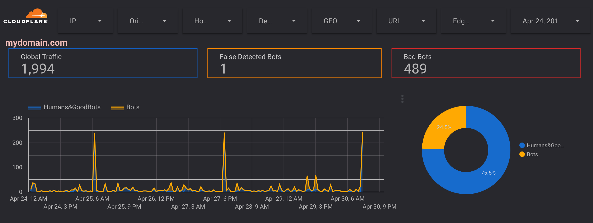
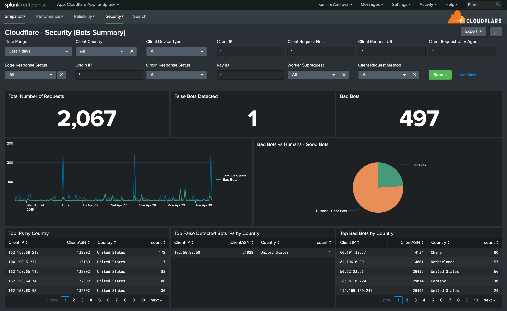
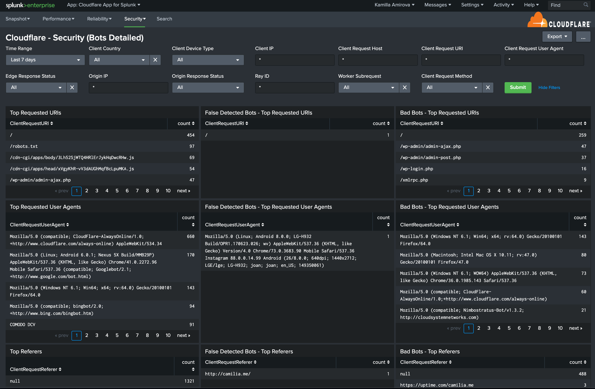
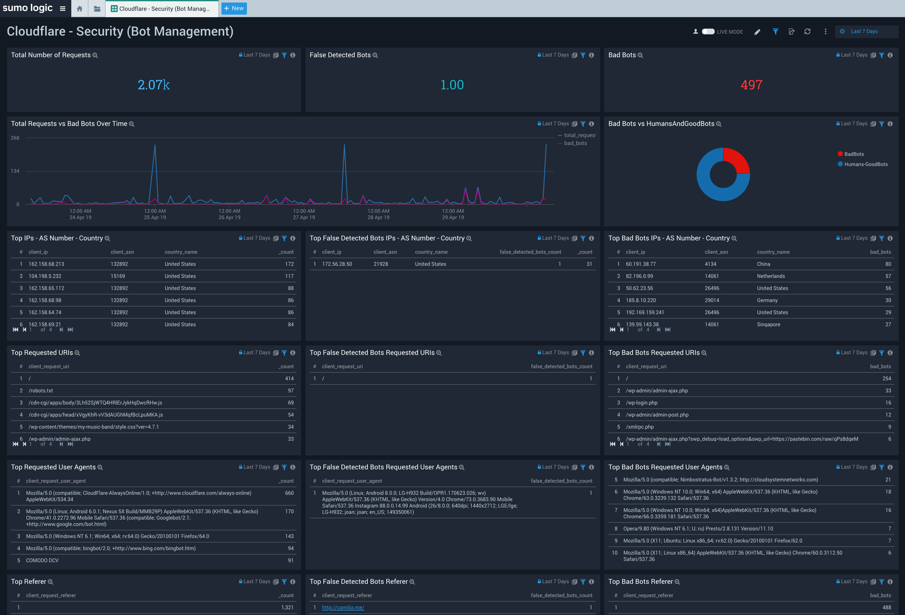

# Bot Management Dashboard

This tutorial explains how to activate Cloudflare **Bot Management** and view related dashboards in the Elastic, Google Data Studio, Looker, Splunk, and Sumo Logic analytics platforms.

## Overview

[Bot Management](https://www.cloudflare.com/products/bot-management/) is a Cloudflare Enterprise feature. To enable it, contact your Cloudflare Account Team.

If you haven’t used Cloudflare Logs before, visit our [Logs documentation](/) for more details. Contact your Cloudflare Customer Account Team to enable logs for your account.

### Prerequisites

Before getting started, make sure that you:

- Have a Cloudflare Enterprise account with Cloudflare Logs and Bot Management enabled
- Configure [Logpush](/logpush/) or [Logpull](/logpull-api/)
- Have enabled the [_EdgePathingSrc_ and _EdgePathingStatus_](/reference/pathing-status/) fields in Cloudflare Logs to ensure bot requests are captured
- Are familiar with [Cloudflare Bot Management](https://support.cloudflare.com/hc/articles/360027519452)
- Follow your analytics provider’s guides for getting logs from AWS S3 or Google Cloud Platform into your analytics platform

<Aside type="note" header="Note">

You can also refer to our [tutorials for enabling logs and dashboards for several analytics providers](/analytics-integrations/).
</Aside>

## Task 1 - Configure Cloudflare to Detect Bot Traffic

Before proceeding, make sure that you’ve enabled Cloudflare Bot Management for your Enterprise account. To start:

1. In the Cloudflare dashboard, create a Firewall rule. [_Learn more_](https://developers.cloudflare.com/firewall/cf-dashboard/create-edit-delete-rules/).
2. For **Rule name**, enter _Bot management - Generic_.
3. Under **Expression Preview,** click **Edit Expression**, then copy and paste the following expression: `(bot score lt 30 and not verified_bot)`.
   - This rule only selects requests with a bot score less than 30 and excludes good bots. Requests with a score under 30 are considered bad bots. Your Firewall rule can be as granular as required. For example, applying conditions only for a specific URL, like login or sign-up pages.
4. Choose an **action**: _Log_ or _Challenge (Captcha)_.
   - Cloudflare recommends starting with the action of _Log_ and running it for several days in order to identify which requests fall under the rule above to check if any false positives are registered. You can refine the rule expression further, based on your findings. Once you complete testing, switch the rule action to _Challenge (Captcha)_.
5. Click **Save**.

<Aside type="note" header="Note">

You can track bots in Cloudflare logs only when using the action _Challenge (Captcha)_. Cloudflare plans to add support for the _Log_ action in late 2019.
</Aside>

## Task 2 - View Bot Traffic Dashboards

### Viewing dashboards for existing analytics integrations

The Cloudflare Bot Management Dashboard is already available in Elastic, Google Data Studio, Looker, Splunk, and Sumo Logic. If you use any of those platforms, you do not need to do anything else to view these existing dashboards.

See the [Analytics Integrations](/analytics-integrations/) and [Analyze log data with Google Cloud](/analytics-integrations/google-cloud/) sections for details.

### Viewing dashboards for other platforms

If you use a platform that is not part of the integrations mentioned above, you will need to design your own dashboards.

The following sub-sections describe how to identify bot requests and perform the correct calculations using data from your Cloudflare logs.

#### Identify bot requests

Combining the following two fields reveals if the request is a **bot** request:

    EdgePathingSrc = 'filterBasedFirewall' AND EdgePathingStatus = 'captchaNew'

#### Identify valid requests

Valid requests are those for which the user can solve the CAPTCHA. In this case, `EdgePathingStatus = 'captchaSucc'`.

The following combination of fields reveals which CAPTCHAs were solved:

    EdgePathingSrc = 'filterBasedFirewall' AND EdgePathingStatus = 'captchaSucc'

#### Calculate number of bad bots

To start, make sure to exclude solved CAPTCHAs from calculations:

    Bad Bots = SUM(EdgePathingSrc = 'filterBasedFirewall' AND EdgePathingStatus = 'captchaNew') - SUM(EdgePathingSrc = 'filterBasedFirewall' AND EdgePathingStatus = 'captchaSucc' )

If you see a significant increase in CAPTCHA conversion rate, contact your Cloudflare Account Team for further investigation.

### Understand the Bot Management Dashboard

The Bot Management Dashboard consists of three columns to help you better understand and monitor traffic behavior. You can also analyze the ratio between all traffic and bot traffic.

The columns are:

1. Global Traffic - Shows all requests

2. Solved CAPTCHAs - Shows requests with solved CAPTCHAs

3. Bad Bots - Shows confirmed bad bot requests, which exclude solved CAPTCHAs

<Aside type="note" header="Note">

**Limitations**: To identify bot requests correctly, the associated Firewall rules can only be set to the action _Challenge (Captcha)_. If you have more than one rule with this same action (and used for purposes other than bot management), such rule will interfere and you will see overlapping or conflicting metrics without the option to identify which Firewall rule triggered.
</Aside>

#### Example dashboards

The following images demonstrate some of the dashboards available.

**Elastic** ([_Learn more_](/analytics-integrations/elastic/))

**Google Data Studio** ([_Learn more_](/analytics-integrations/google-cloud/))

**Graylog** ([_Learn more_](/analytics-integrations/graylog/))

**Looker** ([_Learn more_](/analytics-integrations/looker/))

**Splunk** ([_Learn more_](/analytics-integrations/splunk/))

**Sumo Logic** ([_Learn more_](/analytics-integrations/sumo-logic/))

