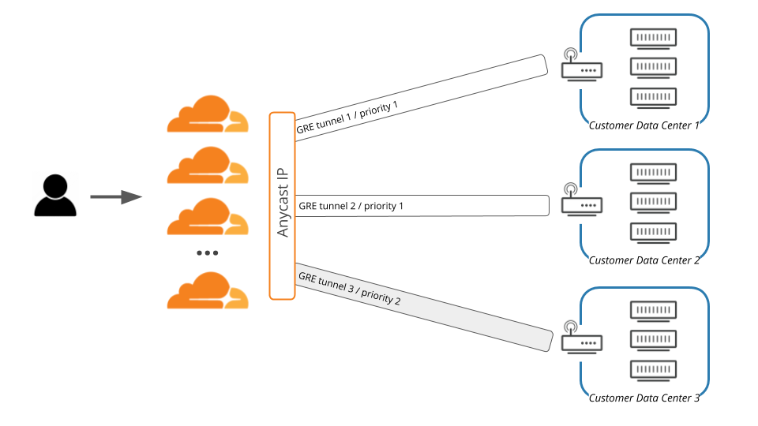
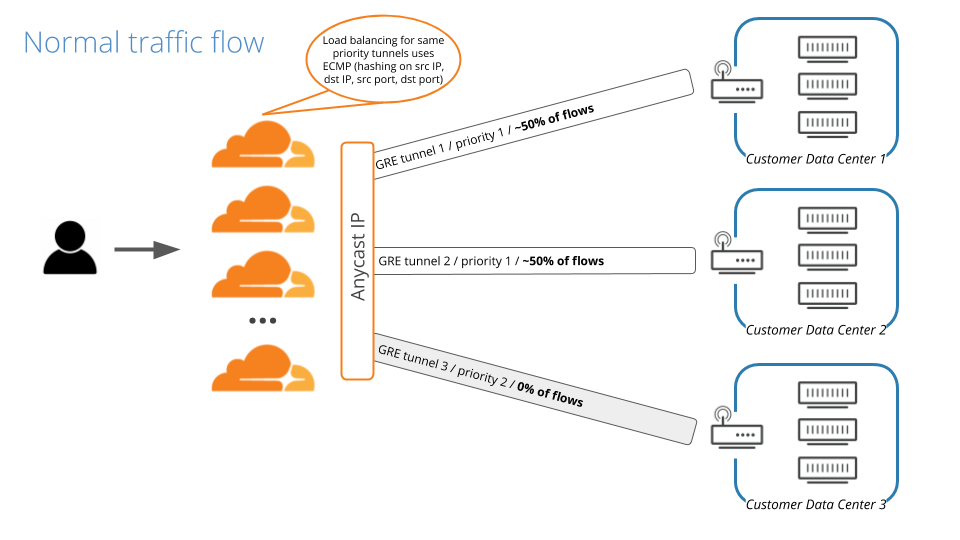
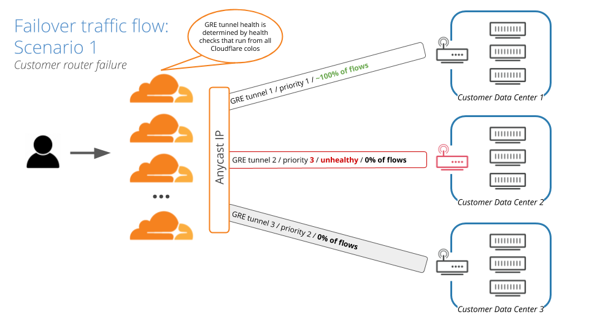
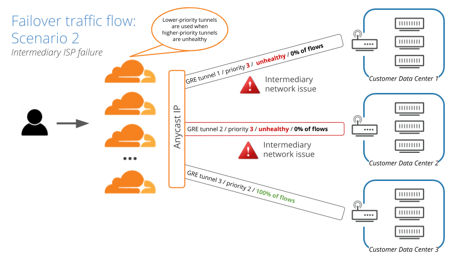

# Traffic steering

Magic Transit uses a static configuration to route traffic through [Generic Routing Encapsulation (GRE) tunnels](/about/tunnels-and-encapsulation) from Cloudflare’s edge to your data center(s).

Magic Transit steers traffic along GRE tunnel routes based on priorities you define. You [assign tunnel route priorities](/set-up/provide-configuration-data/assign-tunnel-route-priorities) during the Magic Transit [onboarding process](/set-up/onboarding/).

The example in this diagram has three tunnel routes. Tunnels 1 and 2 have top priority—Tunnel 3 is secondary.

When there are multiple routes with equal priority and different next-hops—Tunnel 1 versus Tunnel 2, for example—Cloudflare uses equal-cost multi-path (ECMP) routing.

The use of ECMP routing provides load balancing across tunnels with the same priority.

## Equal-cost multi-path routing

Equal-cost multi-path routing uses hashes calculated from packet data to determine routes. The hash always uses the source and destination IP addresses. For TCP and UDP packets, the hash includes the source and destination ports as well. The ECMP algorithm divides the hash for each packet by the number of equal-cost next hops. The modulus (remainder) determines the route the packet takes.

Using ECMP has a number of consequences:

* Routing to equal-cost paths is probabilistic.

* Packets in the same session (or flow)—with the same source and destination—have the same hash and thus use the same next hop.

* Routing changes in the number of equal-cost next hops—for example, due to dynamic prioritization triggered by health check events—can cause traffic to use different tunnels.

As a result, ECMP provides load balancing across tunnels with the same priority.

## Examples

This diagram illustrates how ECMP distributes traffic equally across 2 paths with the same priority:

When Magic Transit health checks determine that GRE Tunnel 2 is unhealthy, that route is dynamically de-prioritized, leaving Tunnel 1 the sole top-priority route. As a result, traffic is steered away from Tunnel 2, and all traffic flows to Tunnel 1:

When Magic Transit determines that GRE Tunnel 1 is unhealthy as well, that route is also de-prioritized, leaving GRE Tunnel 3 as the top priority route. In that case, all traffic flows to GRE Tunnel 3:

When Magic Transit determines that Tunnels 1 and 2 are healthy again, it re-prioritizes those routes, and traffic flow returns to normal:

## ECMP and bandwidth utilization

Because ECMP is probabilistic, the algorithm routes roughly the same number of flows through each tunnel. However it does _not_ consider the amount of traffic already sent through a tunnel when deciding where to route the next packet.

For example, consider a scenario with many very low-bandwidth TCP connections and one very high-bandwidth TCP connection. Packets for the high-bandwidth connection have the same hash and thus use the same tunnel. As a result, that tunnel utilizes greater bandwidth than the others.

<Aside type='note' header='Note'>

Magic Transit supports a "weight" field that you can apply to a tunnel so that a specified percentage of traffic uses that tunnel rather than other equal-cost tunnels.

For example, in a scenario where you want to route 70% of your traffic through ISP A and 30% through ISP B, you can use the weight field to help achieve that.

Keep in mind that ECMP balances flows probabilistically, the use of weights is only approximate.

For more on Magic Transit tunnel weights, contact your Cloudflare customer service manager.

</Aside>
