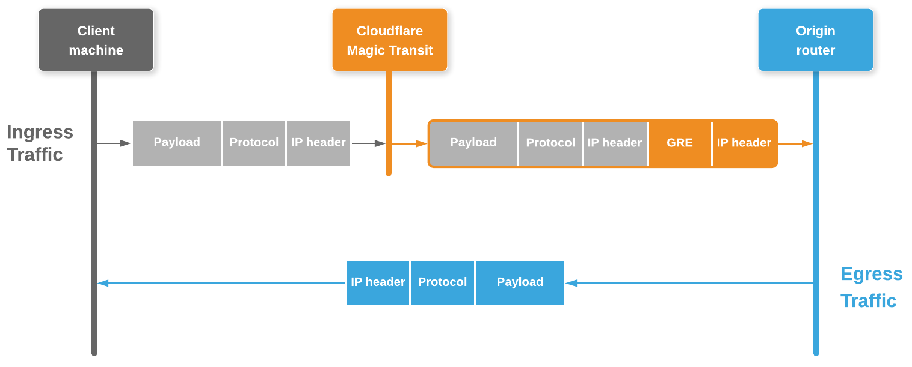

# Tunnels & encapsulation

Magic Transit uses [Generic Routing Encapsulation (GRE)](https://www.cloudflare.com/learning/network-layer/what-is-gre-tunneling/) tunnels to transmit packets from Cloudflare’s edge to your origin network. Cloudflare sets up GRE tunnel endpoints on edge servers (inside your network namespace), and you [set up tunnel endpoints](/set-up/provide-configuration-data/specify-gre-tunnel-endpoints) on routers at your data center.

This diagram illustrates the flow of traffic with Magic Transit:

<Aside>

Egress packets are routed by your ISP interface, not Cloudflare.

</Aside>

## Encapsulation

Magic Transit encapsulates IP packets destined for your network and transmits them across the GRE tunnels to your tunnel endpoint router, which decapsulates the packets and sends them to your internal network.

This diagram illustrates how Magic Transit encapsulates packets at the Cloudflare edge and transmits them to a customer’s tunnel endpoint router (Acme in this example):

<Aside>

To accommodate the additional header data introduced by encapsulation, the maximum segment size (MSS) must be adjusted so that packets comply with the standard Internet routable maximum transmission unit (MTU), which is 1500 bytes.

Because egress packets are routed via your ISP interface, not Cloudflare, you must set this value at your physical egress interfaces (not the GRE tunnel interfaces).

For instructions, see [_Set Maximum Segment Size_](/set-up/requirements/#set-maximum-segment-size).

</Aside>

## Anycast GRE

Magic Transit uses [Anycast](https://www.cloudflare.com/learning/cdn/glossary/anycast-network/) IP addresses for Cloudflare’s GRE tunnel endpoints, meaning that any server in any data center is capable of encapsulating and decapsulating packets for the same GRE tunnel.

This works because the GRE protocol is stateless—each packet is processed independently and does not require any negotiation or coordination between tunnel endpoints. While the tunnel endpoint is technically bound to an _IP address_, it need not be bound to a specific _device_. Any device that can strip off the outer headers and then route the inner packet can handle any GRE packet sent over the tunnel.

The result is that Cloudflare’s Anycast GRE architecture provides a conduit to your GRE tunnel for every server in every data center on Cloudflare’s global edge network, as illustrated in this diagram:

