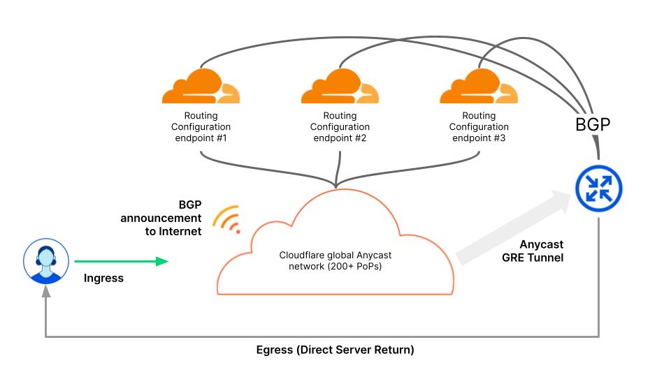

# Specify prefixes to advertise

Cloudflare measures the Magic Transit prefix count based on the number of prefixes a customer announces through Cloudflare. The size of the prefix does not matter; there is no commercial or technical restriction. However, prefixes can only be announced exactly as they were provisioned. For example, a /20 prefix onboarded to Magic Transit can only be announced as a /20. Smaller subnets that constitute the /20 cannot be announced individually. To announce the 16x /24s within the /20, for example, requires onboarding all 16 prefixes individually. If this disaggregated setup is desired, the total Magic Transit prefix count will increase.

List all prefixes and the ASNs where they should originate. When specifying prefixes, observe these guidelines:

- Prefixes must support at least 256 hosts (/24 in classless inter-domain routing CIDR notation.
- Internet Routing Registry entries and Letters of Authorization must match the prefixes and originating prefixes you submit to Cloudflare.
- When using contiguous prefixes, specify aggregate prefixes where possible.
- When using Route Origin Authorizations (ROAs) to sign routes for [resource public key infrastructure (RPKI)](https://tools.ietf.org/html/rfc8210), the prefix and originating ASN must match the onboarding submission.
- If you do not own an ASN, you can use the Cloudflare Customer ASN (AS209242).

  Prefix configuration example

| Prefix          | Originating AS |
| ----------------| -------------- |
| 103.21.244.0/23 | AS209242       |
| 131.0.72.0/22   | AS395747       |
| 103.21.245.0/24 | AS395747       |

<Aside type='note' header='Note'>

When customers supply their own ASN, Cloudflare prepends the main Cloudflare ASN (AS13335) to the BGP AS_PATH. For example, if the customer ASN is AS64496, anyone directly peering with Cloudflare sees the path as `13335 64496`.

If you do not have an ASN or do not want to bring your ASN to Cloudflare, you can use the Cloudflare Customer ASN (AS209242). In this case, the path becomes `13335 209242`.

</Aside>

## Border Gateway Protocol (BGP) control for advertisements

Use BGP to control the status of your prefix — advertised or withdrawn — from Cloudflare's edge for more flexibility and control over your routes. The BGP controlled advertisement system works by establishing BGP sessions to Cloudflare's routing endpoints, which propagate BGP routes globally across all the locations at Cloudflare's edge.

To prevent unexpected behavior, you must use either BGP control or dynamic advertisement for your prefixes but you cannot use both.

To begin using BGP control, contact your account team with the following information:

- BGP endpoint IP addresses
- Prefixes you want to use with BGP control
- Your ASN for the BGP session

After receiving your information, Cloudflare updates firewall filters to establish the BGP session and provides you with the BGP endpoints to control your prefixes.
