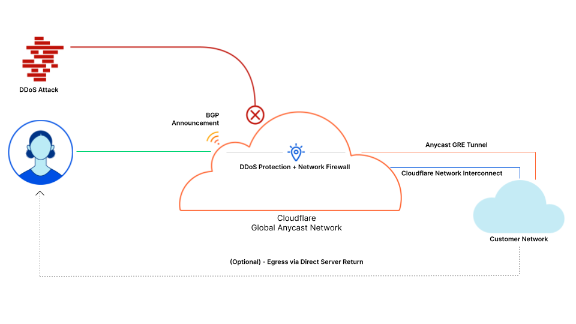

# Cloudflare Magic Transit

Magic Transit delivers network functions at Cloudflare scale — DDoS protection, traffic acceleration, and much more from every Cloudflare data center — for on-premise, cloud-hosted, and hybrid networks.

<Aside type="note" header="Note">

Magic Transit is not yet supported on Cloudflare's China Network.

</Aside>

<ButtonGroup>
  <Button type="primary" href="/get-started">Get started</Button>
  <Button type="secondary" href="/about">Learn more</Button>
</ButtonGroup>
