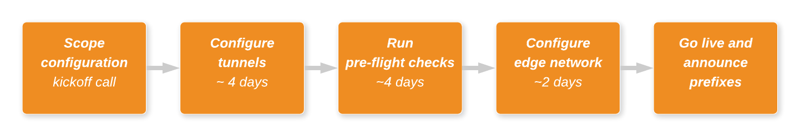

# Magic Transit onboarding

The onboarding process, from scoping to going live, typically takes about 10 business days, and Cloudflare can significantly accelerate this timeline in active-attack scenarios.

Throughout the onboarding process, Cloudflare partners closely with your organization to accomplish the following tasks:

## Scope your configuration

Starting with an initial kickoff call, Cloudflare engages with your organization to confirm the scope and timeline for setting up Magic Transit.

*Duration:* Less than 1 business day

*Customer requirements:* See _[Requirements](/set-up/requirements/)_

## Configure tunnels

Cloudflare sets up Anycast tunnels for Magic Transit based on configuration details you supply, as outlined below.

*Duration:* ~4 business days

*Customer requirements:* Supply information specified in _[Specify GRE Tunnel Endpoints](/set-up/provide-configuration-data/specify-gre-tunnel-endpoints/)_ so that Cloudflare can set up your tunnels.

## Run pre-flight checks

Once Cloudflare has staged the tunnels, we validate tunnel connectivity, LOA, IRR, and maximum segment size (MSS) configurations.

To ensure that the integration is ready to go live the following week, complete this step by close of business Friday.

*Duration:* ~4 business days

## Configure edge network

Once Cloudflare’s pre-flight checks have passed and a date to complete the change has been verified by your account team, engineering will start the process of onboarding your prefixes to Cloudflare’s edge network.

To configure the edge network, Cloudflare does the following:

1. Route traffic sourced from Cloudflare’s network.
1. Attract traffic from the broader Internet by advertising your customer-owned prefixes.

These routing changes return any traffic generated within the Cloudflare edge network to the GRE tunnels set up for Magic Transit. This can happen under the following 2 conditions:

- An IP within your Magic Transit prefix accesses a web property proxied by Cloudflare.
- You have a proxied zone set up on Cloudflare with a target IP within a Magic Transit prefix range.

You control the edge router advertisement, which dictates whether Cloudflare’s edge network advertises your prefixes. Advertisement is activated at the go-live call, routing traffic via Cloudflare and the GRE tunnels to your data center(s).

<Aside type='warning' header='Important'>

It is critical that you put the appropriate MSS clamps in place before routing changes are made. Failure to apply an MSS clamp may result in dropped packets and hard-to-debug connectivity issues.

When using [Cloudflare Network Interconnect](/network-interconnect/) with Magic Transit, you must set the MSS clamp size to 1332 bytes to accommodate additional overhead from the foo-over-UDP (FOU) protocol and IPv6. These are used to backhaul data from the colocation facility where traffic is ingested (close to the end user) to the facility with the CNI link.

</Aside>

*Duration:* ~2 business days

## Go live and announce prefixes

Once edge network configuration is complete, the final step is to schedule a go-live call. During this call you announce your prefixes from Cloudflare’s edge network for the first time.
