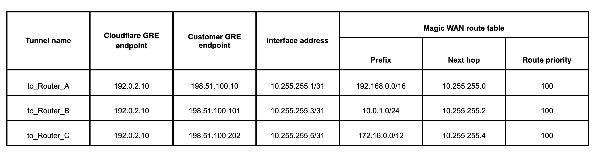
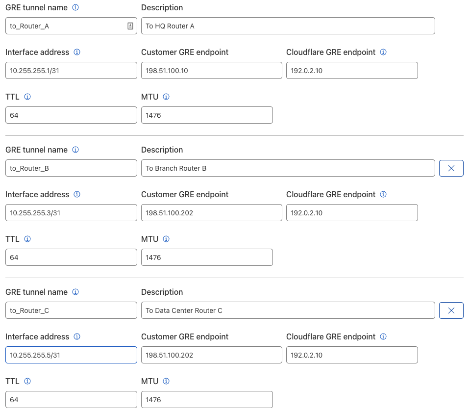
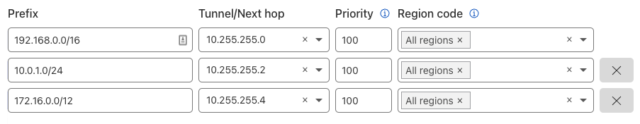

# Connect to Secure Web Gateway with Magic WAN

You can route traffic through Magic WAN and Secure Web Gateway to secure Internet browsing and SaaS application access from internal users and devices. 

In this tutorial, you will learn how to configure the GRE tunnel on-ramp to Magic WAN, which connects to Secure Web Gateway (SWG), from enterprise site routers. 

## Prerequisites

Before you can configure the GRE tunnel on-ramp to Magic WAN, the following items should already be completed:

- Purchased Magic WAN and Secure Web Gateway
- Cloudflare created and provisioned Magic WAN and Secure Web Gateway
- Received the Cloudflare GRE endpoint (Anycast IP address) assigned to Magic WAN
- Established connectivity between site edge routers and the Cloudflare GRE endpoint via the Internet or Cloudflare Network Interconnect (CNI)
- Use site routers that support GRE tunnels and Policy-based Routing (PBR) so that specific Internet-bound traffic from the sites' private networks can be routed over the GRE tunnel to Magic WAN, and subsequently Secure Web Gateway, to enforce a user's specific web access policies.

## Example scenario

For the purpose of this tutorial, setup will reference a scenario where an enterprise has three sites: headquarters, a branch office, and a data center. Each site has a local private network with RFC1918 address assignments:

- Headquarters is assigned a `192.168.0.0/16` network, and Router A is the site router terminating the GRE tunnel
- Branch office is assigned `10.0.1.0/24` network, and Router B is the site router terminating the GRE tunnel
- Data center is assigned with `172.16.0.0/12` network, and Router C is the site router terminating the GRE tunnel

Each site's private network has an on-ramp to Cloudflare's Anycast network using GRE tunnels, and the Cloudflare tunnel endpoint IP address is `192.0.2.10`. The table below summarizes the GRE tunnel configuration and route table entries for the Magic WAN topology.

## Add GRE tunnels

1. Log in to your [Cloudflare dashboard](https://dash.cloudflare.com) and select **Magic Transit**.
1. Next to **GRE tunnels and static routes configuration**, click **Configure**.
1. From **GRE tunnels**, click **Create**.
1. On the **Add GRE tunnels** page, fill out the information for the GRE tunnels. 
1. (Optional) We recommend you test your tunnel before officially adding it. To test the tunnel, click **Test tunnels**.
1. To add multiple tunnels, click **Add GRE tunnel** for each new tunnel.
1. When you are done, click **Add tunnels**.

In keeping with the example scenario, the list of tunnels should match the example below.

## Add static routes

1. From **Magic Transit**, click **Static routes**.
1. On the **Static Routes** page, click **Create** to add a new route.
1. Enter the information for your route.
1. While optional, we highly recommend testing your route before adding it by clicking **Test routes**.
1. If your test was successful, click **Add routes** when you are done.

In keeping with the example scenario, the list of static routes should match the example below.

## Secure Web Gateway

After setting up the GRE tunnels and static routes, configure the policies for Secure Web Gateway in the Teams dashboard. To set up the policies, refer to [Secure Web Gateway policies](https://developers.cloudflare.com/cloudflare-one/policies/filtering).

After you configured Secure Web Gateway, enterprise users and devices from each of the sites mentioned in the example scenario would be able to safely browse or access Internet resources under the protection of the Cloudflare edge network.
