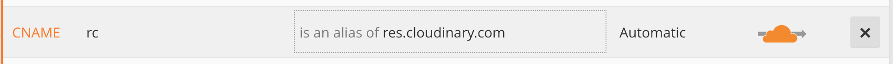
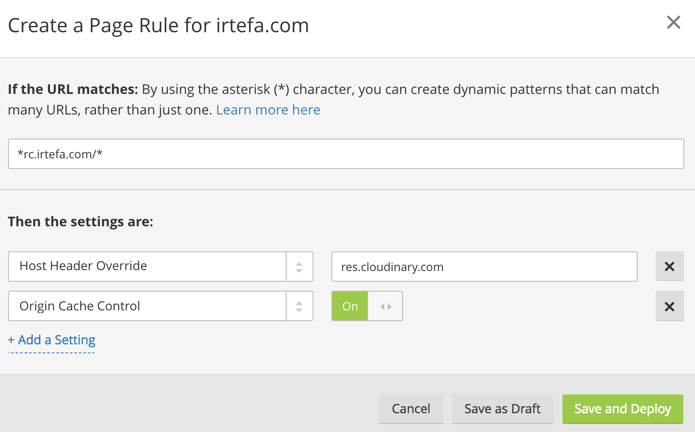

If you have already signed up with Cloudflare and set up the portal, follow the next steps to put your APIs behind Cloudflare. 

This is important because the SDK performs a healthceck to ensure the edge is active. The SDK performs this health check by checking the first API endpoint listed in the Whitelist (in the portal; more about this later). If the whitelisted domain is not orange clouded the health check fails and requests travel as is. 

## CNAME Setup
If you already have a Cloudflare account, then you can go to the DNS settings and add a CNAME setup to create an orange clouded endpoint. For example, I will setup the API for my domain `irtefa.com`. The API endpoint is `res.cloudinary.com` which is not orange clouded. I will create a simple CNAME setup to make `res.cloudinary.com` orange clouded:

## Add Page Rule
You can replace the API endpoint from `res.cloudinary.com` to `rc.irtefa.com`. You also have to setup a page rule to override the Host Header and enable Origin Cache Control.

Now repeat this for all the API endpoints in your app that are not behind Cloudflare.