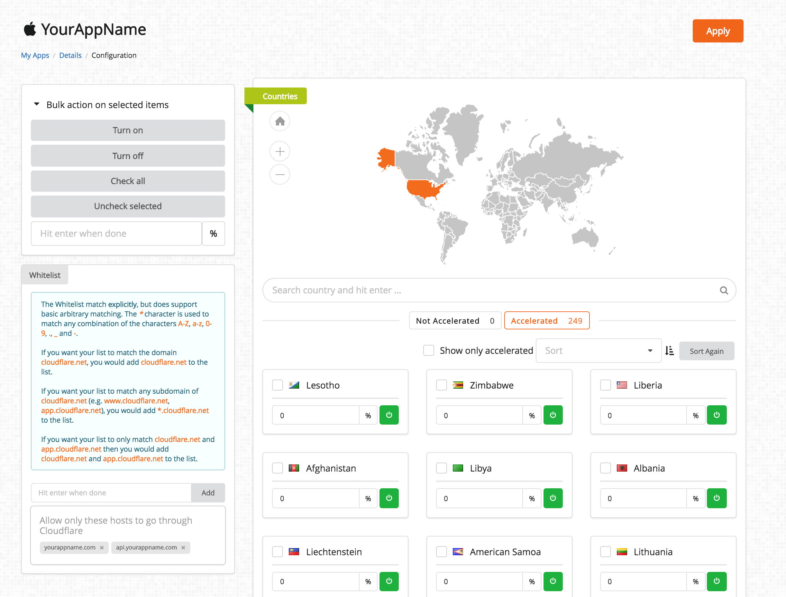

# Acceleration mode

Cloudflare Mobile SDK is an App Acceleration framework for a Mobile-First World. Our simple 2-line SDK speeds up app performance on networks around the world.

With Cloudflare's Mobile SDK you can:

* **Improve Performance**: Cloudflare's Mobile SDK improves in-app performance by 30%-300% using a custom protocol.

* **Reduce Errors**: Reduce networks errors up to 90% by smartly routing around network congestion and latency when connecting to the nearest Cloudflare data center.

Improved performance coupled with reduced errors lead to *higher conversions* for application owners.

Your app accelerated by Cloudflare's Mobile SDK receives the speed and security of the world's most peered CDN with 130+ data centers around the world.


## Integration

The Cloudflare Mobile SDK is very easy to integrate with your existing app. Once you have imported the SDK, it's a single line change in your AppDelegate file inside `didFinishLaunchingWithOptions`.

```swift
func application(_ application: UIApplication,
                  didFinishLaunchingWithOptions launchOptions: [UIApplicationLaunchOptionsKey: Any]?) -> Bool {

    //Cloudflare Mobile SDK Setup
    CFMobile.initialize("CLOUDFLARE_CLIENT_KEY");// Substitute this line with: [CFMobile initialize:@"CLOUDFLARE_CLIENT_KEY"]; if you are using Objective C
    ..........
    ..........
    ..........
    return true
}
```

Similarly, on Android, once you have imported the library, initialize Cloudflare mobile SDK only once on the main thread at the beginning of your `onCreate` activity:

```java
public void onCreate() {
    super.onCreate();
    CFMobile.initialize(getApplicationContext(),“CLOUDFLARE_CLIENT_KEY");
    ................
    ................
}
```

To learn more about how you can integrate the Cloudflare Mobile SDK with your iOS application checkout the platform specific docs:

- [iOS](../getting_started/ios)
- [Android](../getting_started/android)

## Configure Portal

This is your control panel from where you will control the knobs and switches of accelerating your app. The portal allows you to set the percentage of users around the world that needs to be accelerated. This is also the place where you can observe how well your app is doing in terms of performance by reducing latency and errors.



### Get started today

Cloudflare Mobile SDK is still in early access. Please [reach out to us](https://www.cloudflare.com/neumob/) if you are interested in accelerating your mobile app by joining our early acess program.
