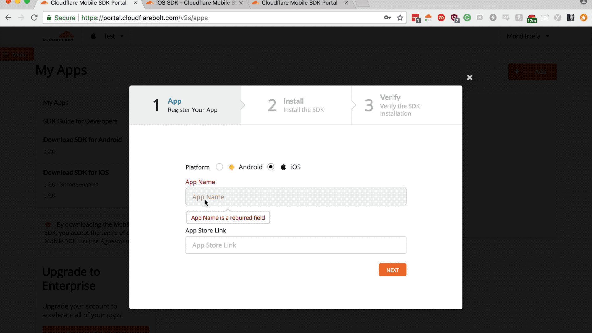

# Getting started

<Aside type='warning' header='Important'>

Cloudflare is deprecating the Mobile SDK. You will no longer be able to log in to the portal or view stats about your mobile app after February 22, 2021.

While your mobile app will continue working with the SDK even after the portal is removed, we encourage you to remove the Mobile SDK as soon as possible.

For more, see [_Deprecation notice: Cloudflare Mobile SDK_](https://support.cloudflare.com/hc/en-us/articles/360054452251-Deprecation-notice-Cloudflare-Mobile-SDK).
</Aside>

You can easily integrate Cloudflare's Mobile SDK by going through the following steps.

## Install SDK

Use the platform specific guides to integrate the SDKs:

- [iOS](getting_started/ios)
- [Android](getting_started/android)
- [React Native](getting_started/react)
