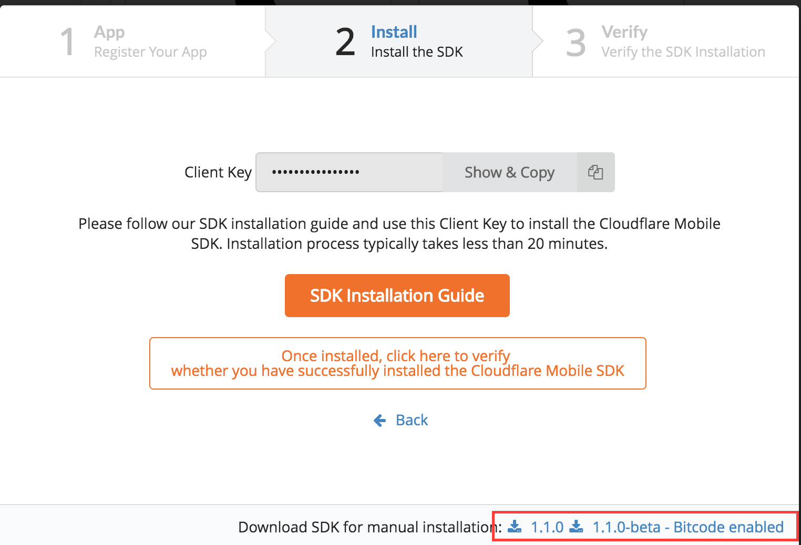
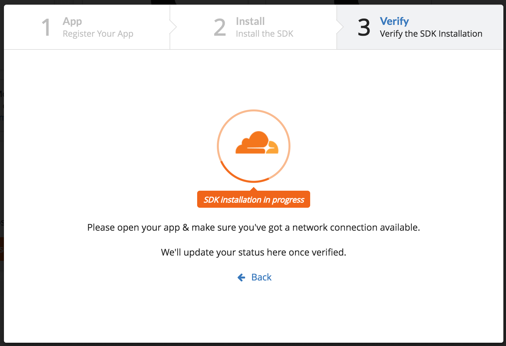
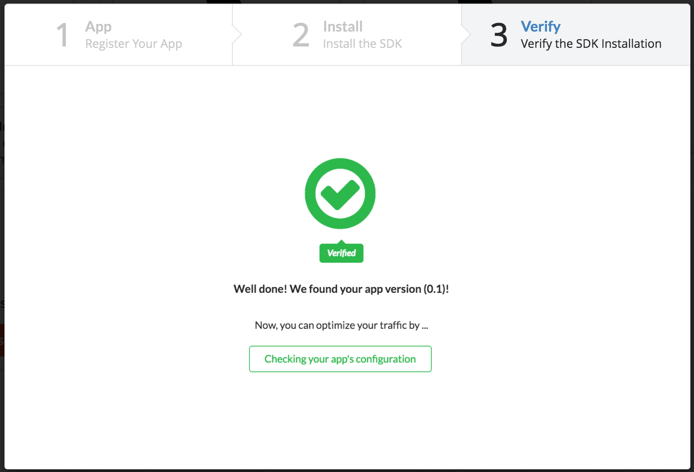

# Portal

You can log in to the portal by visiting https://mobilesdk.cloudflare.com/.

Sign up using an email address. If you already have a Cloudflare account, we still need you to sign up for a separate account.

On the left column, under 'My Apps' you will see the a link to the developer docs. Along with that, you will see the list of device specific Cloudflare Mobile SDKs. On the top right corner you will see a large button saying 'Add'. Click on this button to add an existing app to your Mobile SDK portal.

Once you click on that button, the portal will prompt you to fill out the name of your App. You have a choice of choosing between Android and iOS. The App Store Link here is optional.

Once you fill out your App Name and App Store Link (optional) you can click on next to take you to the next step.

Copy the Client Key for your SDK. You will need this to initialize your mobile app with Cloudflare's Mobile SDK. If you haven't done this already, you can now go ahead and download the SDK.

If you have copied the Client Key and downloaded the SDK, you are now ready to integrate Cloudflare's Mobile SDK with your App.

Before, you can verify that the SDK has installed, you need to integrate the SDK to your app. Use the platform specific guides to integrate the SDK:

* [iOS](/getting_started/ios)
* [Android](/getting_started/android)

Once you have completed the above steps, run your app (simulator is fine). Click on the following button to verify that you have successfully installed the Cloudflare Mobile SDK.

After you have clicked that button, the portal will verify if the SDK has been installed successfully.

Once the portal has verified that you have successfully installed the SDK, it will show the following message:

You can now click on the 'Checking your app's configuration' button to configure your App Settings.
