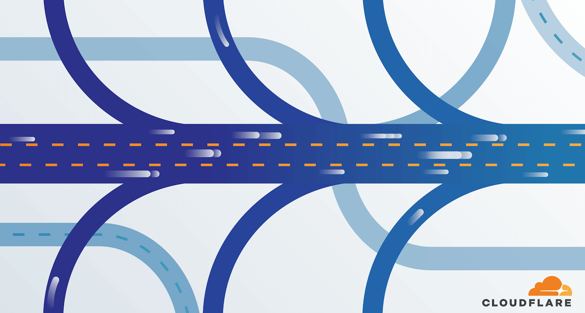

# Cloudflare Network Interconnect

Cloudflare Network Interconnect (CNI) allows you to connect your network infrastructure directly with Cloudflare – rather than using the public Internet – for a more reliable and secure experience.

## CNI benefits 

Use CNI with other products in Cloudflare's suite for additional benefits.

<TableWrap>

<table>
  <thead>
    <tr>
      <th>Product</th>
      <th>Value</th>
      <th>With CNI</th>
    </tr>
  </thead>
  <tbody>
    <tr>
      <td><a href="https://www.cloudflare.com/teams/access/">Access</a></td>
      <td>
Replaces corporate VPNs with the Cloudflare network.
</td>
      <td>
Securely connects your employees to your network no matter where they are when you bring your Multiprotocol Label Switching (MPLS) network to meet Cloudflare's.
</td>
    </tr>
    <tr>
      <td><a href="https://www.cloudflare.com/cdn/">CDN</a></td>
      <td>
Places content closer to visitors, improving site performance.
</td>
      <td>
Improves cache fill performance and reduces cost.
</td>
    </tr>
    <tr>
      <td><a href='https://www.cloudflare.com/magic-transit/'>Magic Transit</a></td>
      <td>
Protects data center and branch networks from unwanted and malicious traffic.
</td>
      <td>
Decreases jitter, drives throughput improvements, and hardens infrastructure to attack.
</td>
    </tr>
    <tr>
      <td><a href='https://workers.cloudflare.com/'>Workers</a></td>
      <td>
Serverless compute platform.
</td>
      <td>
Provides a secure connection to serverless cloud compute that does not traverse the public Internet.
</td>
    </tr>
  </tbody>
</table>

</TableWrap>

For more detail on how CNI delivers these benefits, see [Introducing Cloudflare Network Interconnect](https://blog.cloudflare.com/cloudflare-network-interconnect/#:~:text=Today%20we're%20excited%20to,to%20their%20physical%20network%20edge.).