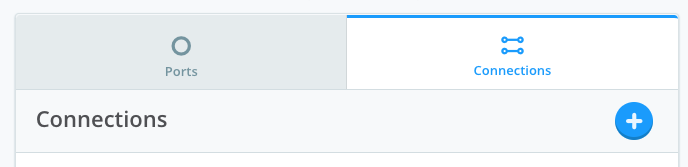
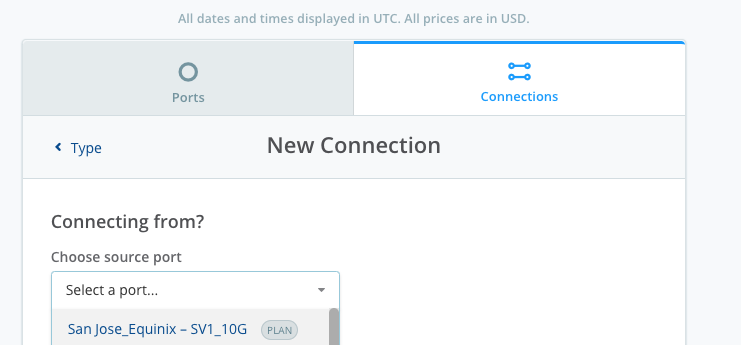
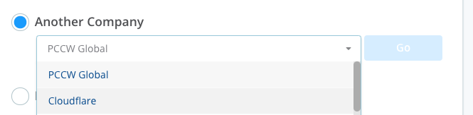
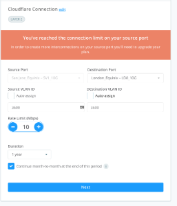
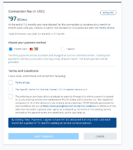

# Console Connect Users

1. Click **+** to create a new connection.

2. Choose your **source port**

3. Search for a company enter **Cloudflare**

4. Choose your **Rate Limit (speed)**

5. Review Console Connect pricing and then submit

6. Cloudflare will accept the connection and your Account Team will get in touch with next steps for BGP session establishment
