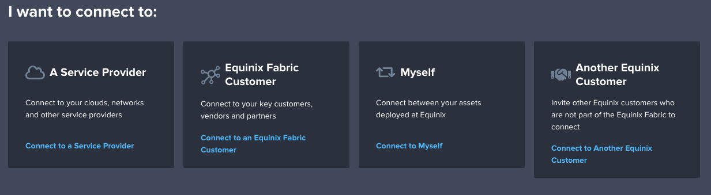
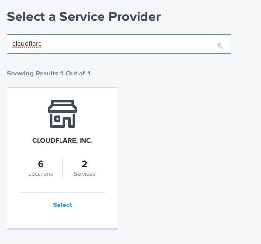
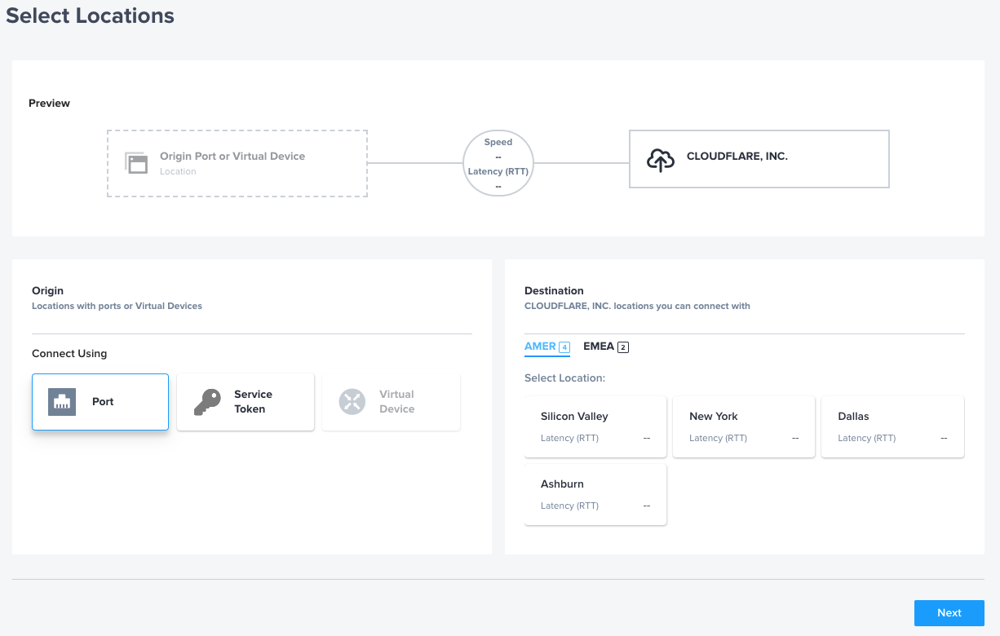
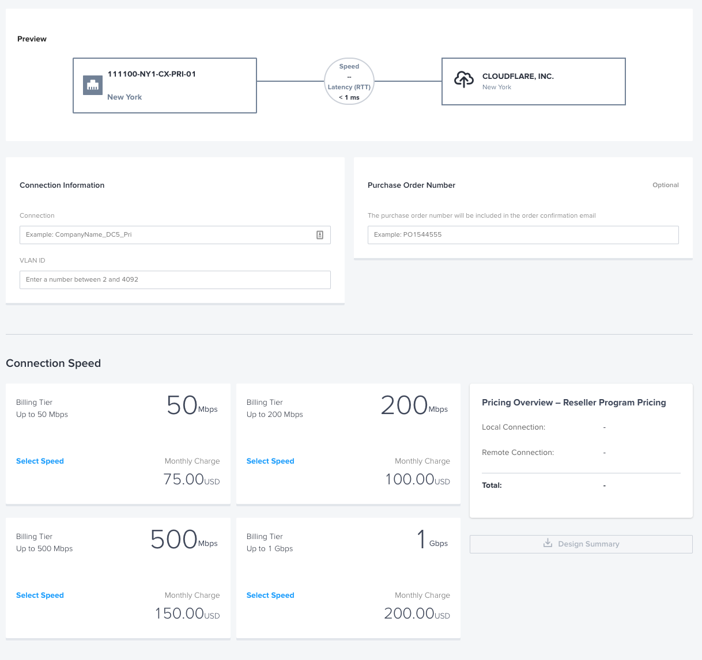

# Equinix Users

## Order an Equinix Fabric Connection

After you confirm the locations and speed with you account team, order the Equinix Fabric connections to Cloudlfare.

1.  Navigate to <https://fabric.equinix.com/>
1.  Choose I want to connect to **A Service Provider**

1. Search for **Cloudflare** and click **Select**

1. Choose **Magic Transit** or **Cloudflare NaaS** (if you are not sure, choose Cloudflare NaaS, we can configure any service using this) and click **Create Connection**
1. Select your **Origin Port** and your desired Cloudflare **Destination Location** (_Note: if the location you want is not listed, contact your Cloudflare Account team to request a new location under the "Interconnect Anywhere" program_)

1. Select **Speed** and **VLAN ID**
You can choose your own VLAN ID. Cloudlare will choose our own and Equinix Fabric will map between the two. If you'd like to use the same us, simply ask your account team for Cloudflare's VLAN ID and we will provide it.

1. Click **Next** and then **Submit Order**
1. Cloudflare will accept the connection and your Account team will provide next steps with respect to BGP session establishment.
