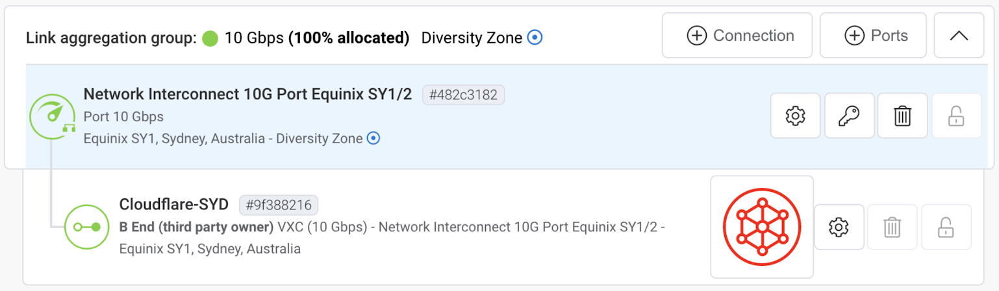
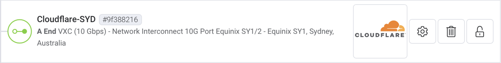

# Configure the network cross-connect

The Cloudflare Infrastructure uses your information to configure the cross-connect, but the configuration process varies slightly for physical and virtual links. This process can take one to two weeks and can take longer depending on the provider. Your Customer Success Manager will remain in contact with you to ensure your cross-connect is on track.

## Physical links

To configure the network cross-connect for physical links, Cloudflare generates a Letter of Authorization (LOA)/service key and sends it to you. After you receive the LOA, you can:

* Order cross-connects at the locations the LOA specifies.
* Verify when the cross-connects are complete.

## Virtual Links

To configure the network cross-connect for virtual links, you must create a request from the partner dashboard. Cloudflare will then review and accept the request.

<Aside type='note'>

When using a virtual partner network interconnect, provision cross-connects using the appropriate partner portals.

For more information, see the [Cloudflare Network Interconnect Partner Program](https://www.cloudflare.com/network-interconnect-partnerships/).

</Aside>

### Equinix Users

Equinix uses a request-based model, which means Equinix users must make a request for a connection to Cloudflare, and Cloudflare will accept and provision the connection. In this scenario, VLAN is not necessary because every user has a specific VLAN that does not require mapping to Cloudflare's VLAN.

1. Open your Equinix dashboard.
1. Select Cloudflare as the service provider.
1. Select your port, Cloudflare port, and port speed.
1. Select your VLANID.
1. Submit the connection for Cloudflare approval.

The image above shows the Equinix network interconnect from Cloudflare's perspective.

The image above shows the Equinix network interconnect from a user's perspective.

### Megaport Users

Cloudflare provides you with a service key to provision the connection. The service key contains all of the necessary information to provision the connection, including the connection size, location, and VLAN.

After you provide verification, Cloudflare assigns IP addresses to use with the cross-connect.
