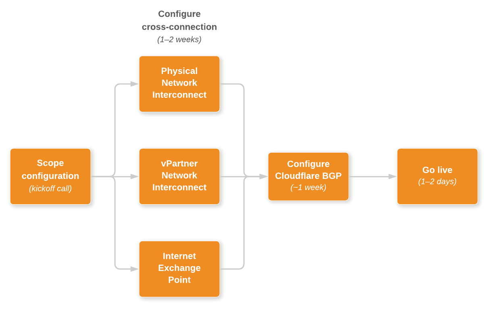

# Onboarding

The Cloudflare Network Interconnect (CNI) onboarding process, from scoping to going live, typically takes 10-15 business days.

Throughout the onboarding process, Cloudflare partners closely with your organization to accomplish the following:

* [Scope your configuration](#scope-your-configuration)
* [Configure the network cross-connect](#configure-the-network-cross-connect)
* [Configure Cloudflare Border Gateway Protocol (BGP) and Generic Route Encapsulation (GRE)](#configure-cloudflare-bgp-and-gre)
* [Go live](#go-live)

## Scope your configuration

Starting with an initial kickoff call, Cloudflare engages your organization to confirm the scope and timeline for setting up CNI.

_Customer requirements:_ At the kickoff call, be prepared to provide the [configuration data](/network-interconnect/set-up-cni/configuration-data/) for the type of network cross-connect you want to use with CNI.

## Configure the network cross-connect

To configure the cross-connect, the Cloudflare Infrastructure uses information provided by you to generate a Letter of Authorization (LOA)/service key.

_Duration:_ 1–2 weeks.

_Customer requirements:_ The resulting LOA/service key is provided to you so that you can accomplish these steps:

* Order cross-connects at the locations the LOA specifies.
* Verify when the cross-connects are complete.

<Aside type='note'>

When using a virtual partner network interconnect, provision cross-connects using the appropriate partner portals.

For more, see the [Cloudflare Network Interconnect Partner Program](https://www.cloudflare.com/network-interconnect-partnerships/#:~:text=Network%20Interconnect%20Partner%20Program&text=Cloudflare%20has%20partnered%20with%20five,over%20high%2Dperformance%20network%20fabrics.).

</Aside>

Once you have provided verification, Cloudflare assigns IP addresses to use with the cross-connect (assuming you are not using an Internet exchange point for the cross-connect).

## Configure Cloudflare BGP

During this phase, Cloudflare validates BGP sessions over the cross-connect.

_Duration:_ Approximately 1 week.

## Go live

Cloudflare engages your team to confirm connectivity.
