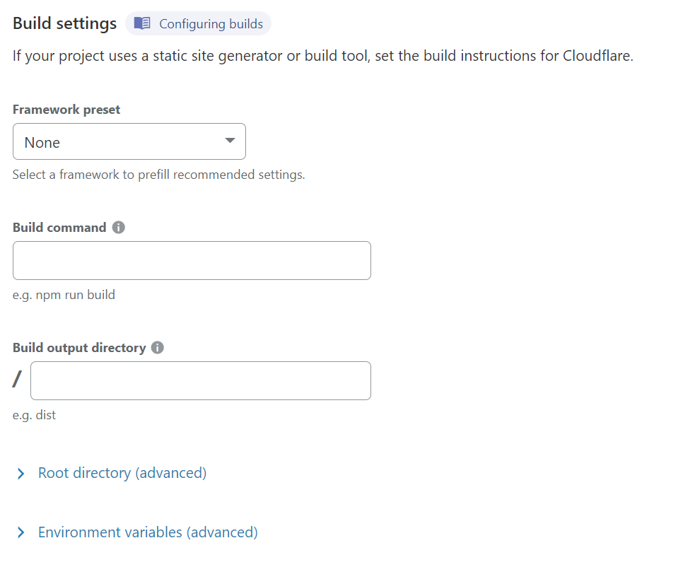
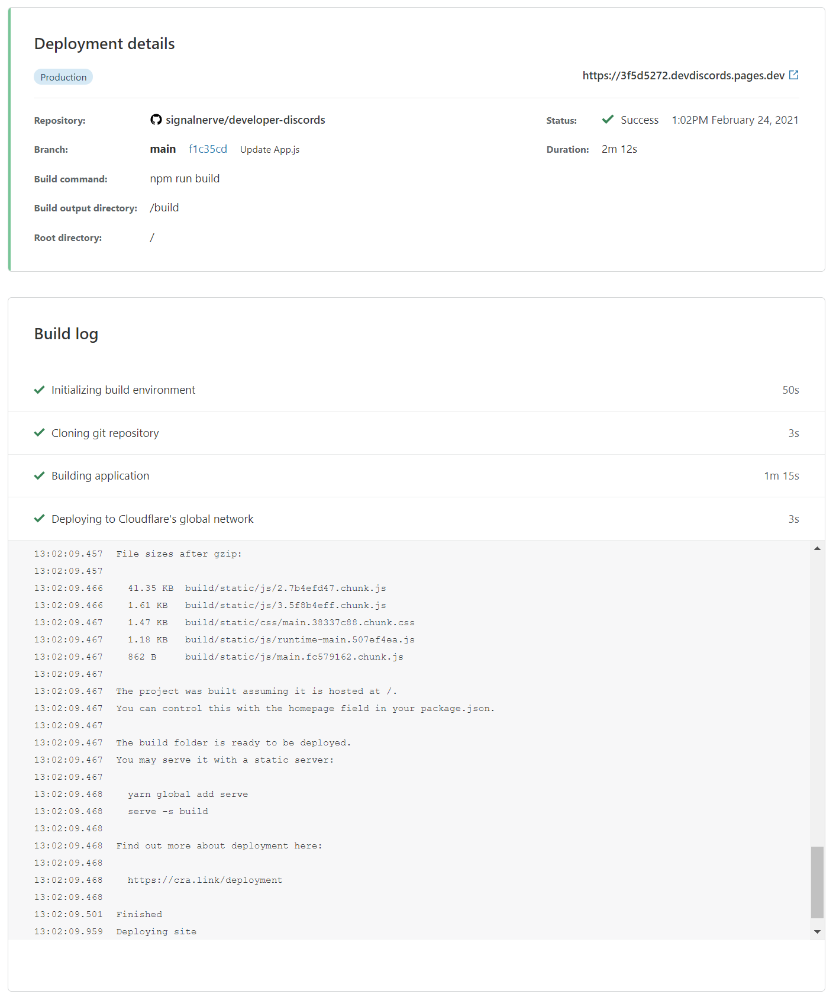
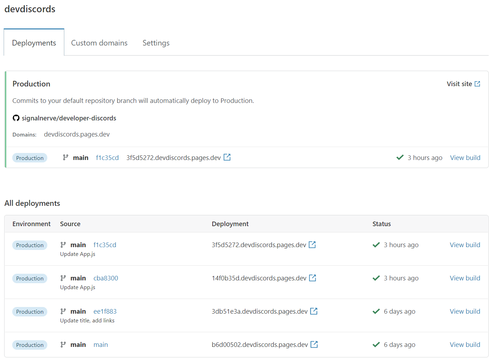
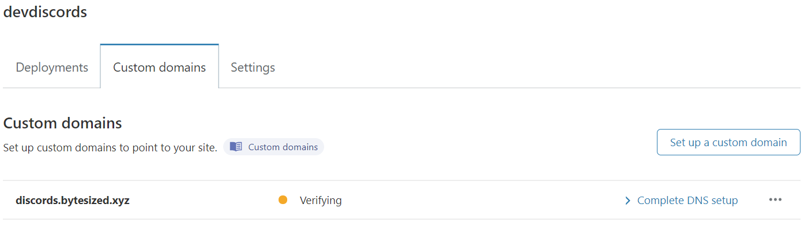

# Getting started

In this guide, you'll get started with Cloudflare Pages, and deploy your first website to the platform.

<Aside>

You'll be signing up for a Cloudflare account. You may also want a custom domain available, but it isn't required.

</Aside>

## Connecting your GitHub account

### Sign in to Cloudflare Pages

To begin, sign in with your Cloudflare account. If you don't have one yet, you can sign up for an account as you get started deploying your new site.

### Connect to GitHub

Signing in with GitHub allows Cloudflare Pages to deploy your projects, update your GitHub PRs with [preview deployments](/platform/preview-deployments), and more. When you sign in, you'll also have the option of specifying any GitHub organizations that you'd like to connect to Cloudflare Pages. This allows you to deploy both public and private repositories for your own account, as well as repositories for your company or organization.

## Configuration and deployment

### Selecting a GitHub repository

You can select a GitHub project from your personal account or an organization you've given Pages access to. This allows you to choose a GitHub repository to deploy using Pages. Both private and public repositories are supported.

<Aside>

Don't have a project? [Check out our extensive How To section](/how-to) to learn how to create and deploy common frameworks and tools to Cloudflare Pages.

</Aside>

### Configuring your deployment

Once you've selected a repository, you can customize your deployment in the "Deployment settings" page.

Your **project name** will be used to generate your deploy's hostname. By default, this matches your GitHub project name.

**Production branch** indicates the branch that Cloudflare Pages should use to deploy the "production" version of your site. For most projects, this is the `main` or `master` branch. All other branches that _aren't_ your production branch will be used for [preview deployments](/platform/preview-deployments).

#### Build settings

Depending on the framework, tool, or project you're deploying to Cloudflare Pages, you'll need to specify the site's **build command** and **publish directory** to tell Cloudflare Pages how to deploy your site.

Our deployment UI provides a number of "presets", pre-filling values for many common deployment scenarios. If you're unsure what the correct values are for this section, check out our documentation for [build configuration](/platform/build-configuration).

#### Environment variables

Environment variables are a common way of providing configuration to your build workflow. While setting up your project, you can specify a number of key-value pairs as environment variables. These can be further customized once your project has finished building for the first time.

## Your first deploy

Once you've finished setting your build configuration, Cloudflare Pages will begin deploying your site! Your project build logs will output as Cloudflare Pages installs your project dependencies, build the project, and deploys it to Cloudflare's global network.

When your project has finished deploying, you'll receive a unique URL to view your deployed site. Congrats! You've deployed your first site with Cloudflare Pages 🚀

## Managing your site

Selecting "Continue to project" after your first deploy, you'll see your project's configuration in the Cloudflare Pages dashboard. Here, you can see your project's current deployment status, the production URL and associated commit, and all past deployments.

### Adding a custom domain

While every Cloudflare Pages site receives a custom subdomain during deployment, you may also wish to point custom domains (or subdomains) to your site. To do this, go to the "Domains" tab in your site dashboard.

Click the "Set up a domain" button, and provide the domain that you'd like to serve your Cloudflare Pages site on. Depending on the domain, you'll need to configure nameservers or add a custom CNAME record to point the domain to your Cloudflare Pages site.

#### Configure nameservers

Configure your nameservers to point to Cloudflare's name servers. If your nameservers are succesfully pointed to Cloudflare, we'll proceed by creating a CNAME record for you!

#### Add a custom CNAME record

If you don't want to point your nameservers to Cloudflare, you can still use a custom CNAME record to use a single domain with Cloudflare Pages.

| Domain       | CNAME              |
| ------------ | ------------------ |
| `domain.com` | `custom.pages.dev` |

## Advanced project settings

In the "Settings" tab, you can configure advanced settings, such as **changing your project name**, **updating your GitHub configuration**, or **updating your build command or build directory**.

### Access policies

You can use [Cloudflare Access](https://www.cloudflare.com/teams-access/) to manage access to your deployment previews. By default, these deployment URLs are public. Enabling the access policy will restrict viewing project deployments to your Cloudflare account.

Once enabled, you can [set up a multi-user account](https://support.cloudflare.com/hc/en-us/articles/205065067-Setting-up-Multi-User-accounts-on-Cloudflare) to allow other members of your team to view preview deployments.
