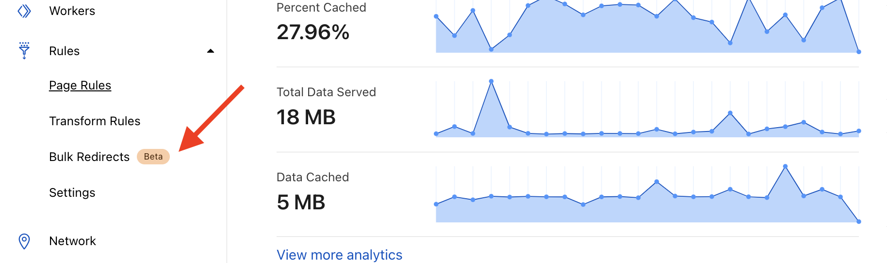
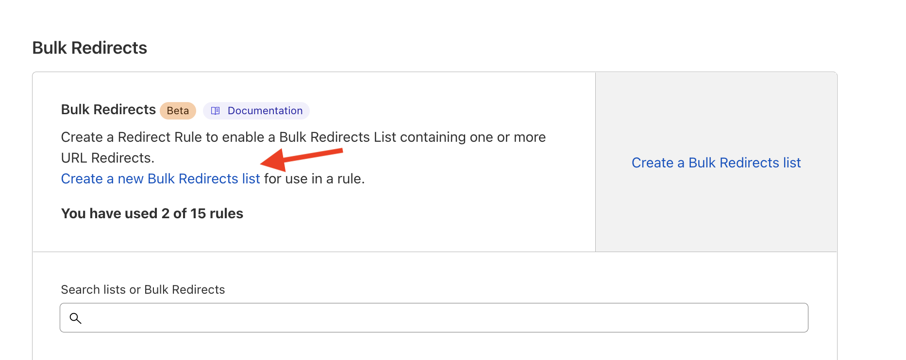
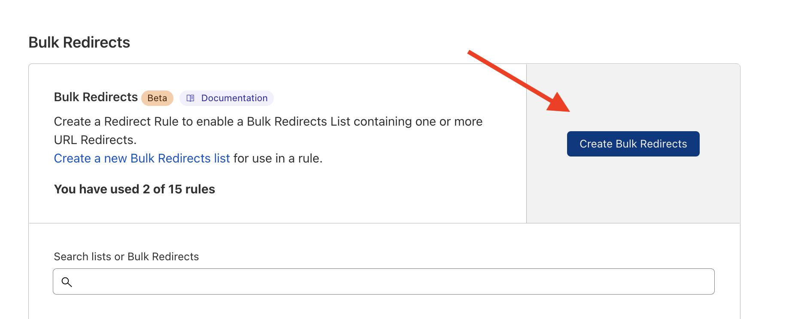

# Handle redirects with Bulk Redirects

In this tutorial, you will learn how to use Bulk redirects to handle redirects if you need more than the 100 supported by the [`_redirects`](https://developers.cloudflare.com/pages/platform/limits#redirects) file. 

To do this, go to the [project overview dashboard](https://dash.cloudflare.com?to=/:account/:zone/rules) and under **Rules** select Bulk Redirects. 

This will take you to the bulk redirects UI where you will create a new Bulk Redirects list. 

Then create a new list, and in the content type select Redirect. This will lead you to add your redirect Source URL and Target URL, you can also specific the status code for each redirect. 

<Aside type="note">

You can also upload a CSV file of all your redirects, however your redirects can not be a relative path.

</Aside>

If for example you set the Source URL to `https://www.example.dev/examples` and the target to `https://www.example.dev/pages/examples` with a status code of `301`, whenever the Source is requested it will be permantly redirected to the Target.

After this, go back to the create Bulk Redirects button and select the list you just created. You would have to set a name for the **Page Rule** you are creating. 

Finally, select **Save and deploy** and wait a few seconds for your rule to propagate. 

