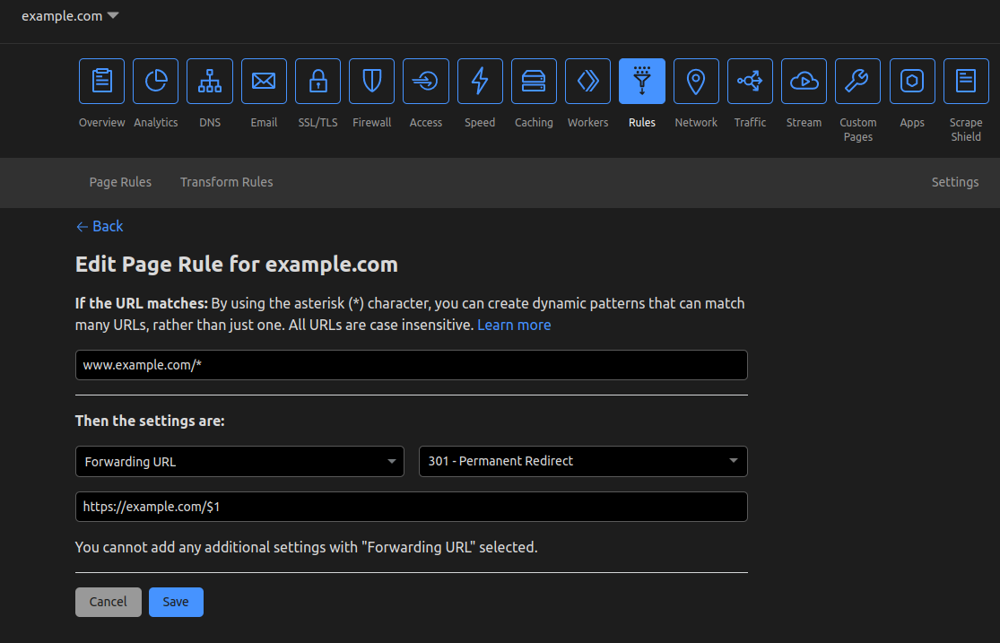

# Redirect www to apex domain (www.example.com -> example.com)

This tutorial will go over how to redirect the `www` subdomain to your apex domain (`example.com`). This is a common question and can be achieved by using [Page Rules](https://support.cloudflare.com/hc/en-us/articles/218411427).

To do this, we will need a **proxied** `www` record. We need to create the record so that DNS can look it up and we will need to be proxied so that Cloudflare can handle the redirect.

Firstly, create a DNS record for your `www` subdomain. It's recommended that this is either an A or AAAA with the value of `192.0.2.1` or `100::` respectively.

Now we can make the Page Rule which will handle the redirect. For this we will make it so all paths get redirected and it's done with a 301 (Permanent Redirect). Matching all paths allows for someone visiting `www.example.com/blog/category/example` to be redirected to `example.com/blog/category/example`.

Finally, click "Save" and wait a few seconds for your rule to propogate!