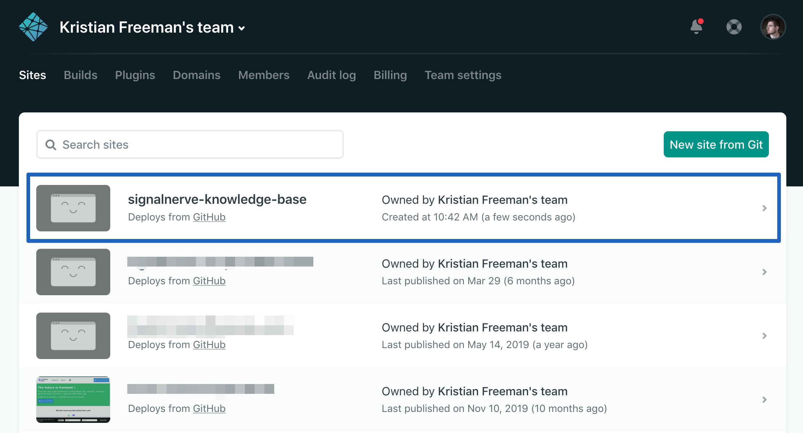
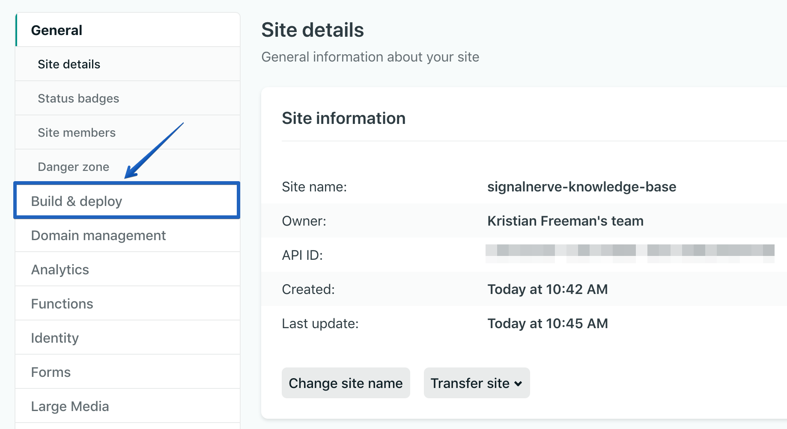

# Migrating from Netlify to Pages

In this tutorial, you will learn how to deploy your Netlify application to Cloudflare Pages.

<Aside>

Features such as Netlify's Forms and Serverless Functions are currently not supported in Cloudflare Pages. Cloudflare Pages does not directly support HTTP header customization, but it can be done through Workers. Refer to the ["Add custom HTTP headers"](/how-to/add-custom-http-headers) guide for more information.

</Aside>

## Finding your build command and build directory

To move your application to Cloudflare Pages, find your build command and build directory. Cloudflare Pages will use this information to build and deploy your application.

In your Netlify Dashboard, find the project that you want to deploy. It should be configured to deploy from a GitHub Repo.

Inside of your site dashboard, select **Site Settings**, and then **Build & Deploy**.

In the **Build & Deploy** tab, find the **Build settings** panel, which will have the **Build command** and **Publish directory** fields. Save these for deploying to Cloudflare Pages. In the below image, **Build command** is `yarn build`, and **Publish directory** is `build/`.

## Creating a new Pages project

Once you have found your build directory and build command, you can move your project to Cloudflare Pages.

The [Getting started guide](/getting-started) will show you how to add your GitHub project to Cloudflare Pages.

If you choose to use a custom domain for your Pages, you can set it to the same custom domain as your currently deployed Netlify application. When Pages finishes the initial deploy of your site, you will need to delete the Workers application to start sending requests to Cloudflare Pages.

## Cleaning up your old application and assigning the domain

In **DNS** on the Cloudflare dashboard, review that you have updated the CNAME record for your domain from Netlify to Cloudflare Pages. With your DNS record updated, requests will go to your Pages application.

With the above steps completed, you have successfully migrated your Netlify project to Cloudflare Pages.
