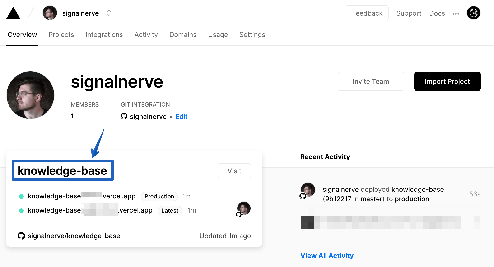
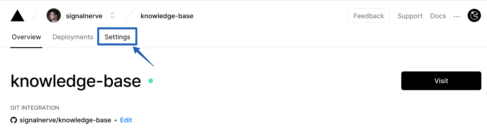
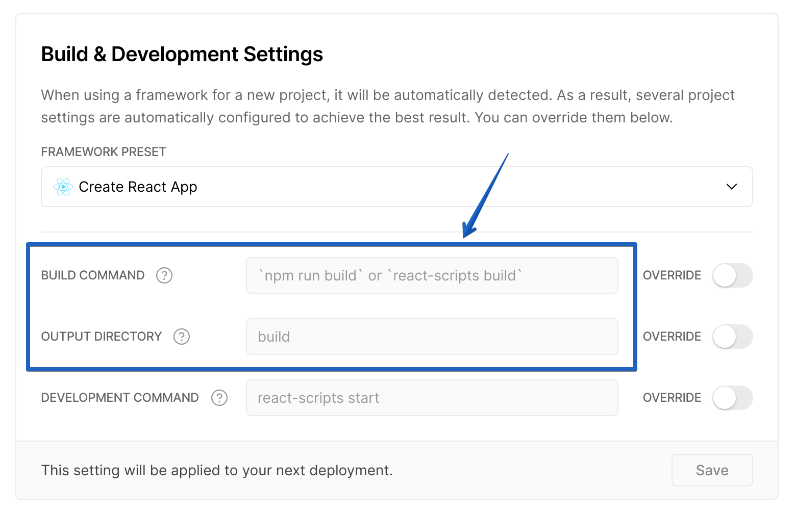

# Migrating from Vercel to Pages

In this tutorial, you'll learn how to deploy your Vercel application to Cloudflare Pages.

<Aside>
You should already have an existing project deployed on Vercel that you'd like to host on Cloudflare Pages. Features such as Vercel's serverless functions are currently not supported in Cloudflare Pages.
</Aside>

## Finding your build command and build directory

To move your application to Cloudflare Pages, you'll need to find your build command and build directory. Cloudflare Pages will use this information to build your application and deploy it.

In your Vercel Dashboard, find the project that you want to deploy. It should be configured to deploy from a GitHub Repo.

Inside of your site dashboard, select "Settings".

Find the "Build & Development settings" panel, which will have the **Build Command** and **Output Directory** fields. If you're using a framework, these values may not be filled in, but will show the defaults used by the framework. Save these for deploying to Cloudflare Pages! In the below image, my **Build Command** is `npm run build`, and my **Output Directory** is `build`.

## Creating a new Pages project

Once you've found your build directory and build command, you can move your project to Cloudflare Pages.

The [Getting started guide](/getting-started) will show you how to add your GitHub project to Cloudflare Pages.

If you choose to use a custom domain for your Pages, you can set it to the same custom domain as your currently deployed Vercel application. When Pages finishes the initial deploy of your site, you will need to delete the Workers application to start sending requests to Cloudflare Pages.

## Cleaning up your old application and assigning the domain

In your DNS settings for your domain, make sure that you've updated the CNAME record for your domain from Vercel to Cloudflare Pages. With your DNS record updated, requests will go to your Pages application.

Congrats! You've migrated your Vercel project to Cloudflare Pages.
