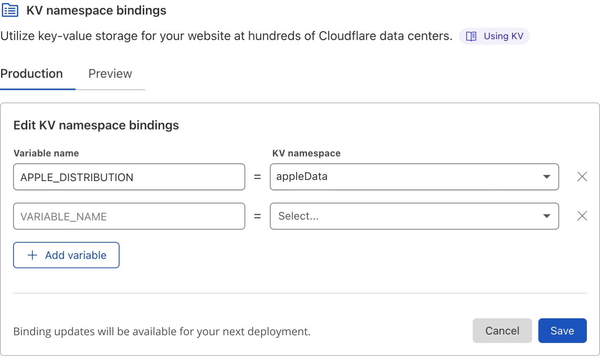
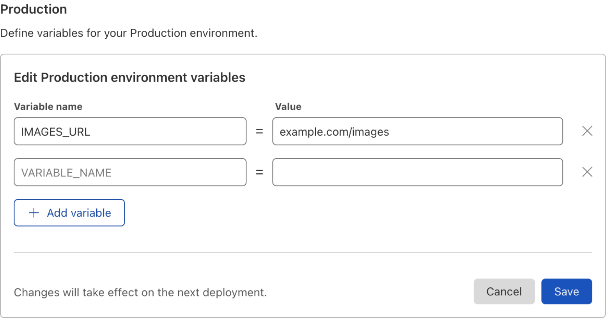

# Functions

With Pages, you can now build full-stack applications by executing code on the Cloudflare network with help from [Cloudflare Workers](https://workers.cloudflare.com/). Functions enable you to run server-side code to enable dynamic functionality without running a dedicated server. With Functions, you can introduce application aspects such as authenticating, querying databases, handling form submissions, or working with middleware.

## Built with Cloudflare Workers

Cloudflare Workers provides a serverless [execution environment](https://www.cloudflare.com/en-gb/learning/serverless/what-is-serverless/) that allows you to create entirely new applications or augment existing ones without configuring or maintaining infrastructure.

Previously, you could only add dynamic functionality to your Pages site by manually deploying a Worker using Wrangler, which meant that your application is written across both Pages and Workers. Functions allow you to leverage the Workers platform directly from within a Pages project by utilizing a project's filesystem convention. This enables you to deploy your entire site – both its static and dynamic content – when you `git push`.

## Setup

To get started, create a `/functions` directory at the root of your project. Writing your Functions files in this directory will automatically generate a Worker with custom functionality at the predesignated routes.

## Functions routing

Using a `/functions` directory will generate a routing table based on the files present in the directory. You may use JavaScript (`*.js`) or TypeScript (`*.ts`) to write your Functions. A `PagesFunction` type is declared in the [@cloudflare/workers-types](https://github.com/cloudflare/workers-types) library which you can use to type-check your Functions.

For example, assume this directory structure:

```
├── ...
├── functions
|   └── api
│       ├── [[path]].ts
│       ├── [username]
│       │   └── profile.ts
│       ├── time.ts
│       └── todos
│           ├── [[path]].ts
│           ├── [id].ts
│           └── index.ts
└── ...
```

The following routes will be generated based on the file structure, mapping the URL pattern to the `/functions` file that will be invoked:

```
/api/time => ./functions/api/time.ts
/api/todos => ./functions/api/todos/index.ts
/api/todos/* => ./functions/api/todos/[id].ts
/api/todos/*/** => ./functions/api/todos/[[path]].ts
/*/profile => ./functions/api/[username]/profile.ts
/** => ./functions/api/[[path]].ts
```

### Path segments

In the [example above](/platform/functions#functions-routing):
* A `*` denotes a placeholder for a single path segment (for example, `/todos/123`).
* A `**` matches one or more path segments (for example, `/todos/123/dates/confirm`).

When naming your files:
* `[name]` is a placeholder for a single path segment.
* `[[name]]` matches any depth of route below this point.

<Aside type="note" header="Route specificity">

More specific routes (that is, those with fewer wildcards) take precedence over less specific routes.

</Aside>

When a filename includes a placeholder, the `name` must be alphanumeric and cannot contain spaces. In turn, the URL segment(s) that match the placeholder will be available under the `context.params` object using the filename placeholder as the key.

## Writing your first function

When writing request handlers within your Pages application, each `/functions` file must `export` a function to handle the incoming request. Each function will receive a singular `context` object, which contains all the information for the request:

```js
export async function onRequest(context) {
  // Contents of context object
  const {
    request, // same as existing Worker API
    env, // same as existing Worker API
    params, // if filename includes [id] or [[path]]
    waitUntil, // same as ctx.waitUntil in existing Worker API
    next, // used for middleware or to fetch assets
    data, // arbitrary space for passing data between middlewares
  } = context;

  return new Response("Hello, world!");
}
```

When migrating from a [Module Worker](https://developers.cloudflare.com/workers/runtime-apis/fetch-event#syntax-module-worker), this signature combines the traditional `fetch` handler's arguments into a single object along with additional, Pages-specific keys.

In the previous example, an `onRequest` function was exported. This is a generic name because it generically handles all HTTP requests. However, to react to specific HTTP request methods, you may use the method name as a suffix to the exported function. For example, a handler that should only receive `GET` requests should be named `onRequestGet`. The following other handlers are supported:

* `onRequestPost`
* `onRequestPut`
* `onRequestPatch`
* `onRequestDelete`
* `onRequestHead`
* `onRequestOptions`


These are the requests you export to write your first function. For example, you can write a function to output "Hello World" when it hits a `/functions/hello-world.js` file:

```js
---
filename: functions/hello-world.js
---
// Reacts to POST /hello-world
export async function onRequestPost(request) {
  // ...
  return new Response(`Hello world`);
}
```

### Handling multiple requests in a single function

You can define multiple HTTP handlers in a single file by defining multiple exports within the same file. For example, this file will handle `POST` and `PUT` requests with the same handler code:

```js
export async function onRequestPost(context) {
  // ...
}

export const onRequestPut = onRequestPost;
```

Additionally, an exported handler may be an array of function handlers. This allows you to easily compose Functions as a group, which may include a mix of shared and/or one-off behaviors:

```js
import { extraLogging } from 'middlewares.ts'

export const onRequest = [
  extraLogging,

  async ({ request }) => {
    // ...
  }
]
```

## Adding middleware

Middleware are reusable chunks of logic that can be executed before and/or after route handlers. These are typically utility Functions that should be applied for chunks of an application’s routes. For example, error handling, user authentication, and logging are typical candidates for middleware within an application.

### Exporting middleware

Middleware files are similar to standard Function files. You may export an `onRequest`  handler or any of its method-specific variants. Additionally, like Functions files, you may export an array of Functions as your middleware handler.

In your `_middleware.{js|ts}` files, you can define a middleware function that handles errors for all your Functions and export it to all the `onRequest` methods. This means the Functions defined within this file will be called on each function request declared in the directory that the middleware lives in. For example:

```js
---
filename: functions/_middleware.js
---
const errorHandler = async ({ next }) => {
  try {
    return await next()
  } catch (err) {
    return new Response(`${err.message}\n${err.stack}`, { status: 500 })
  }
}

const hello = async ({ next }) => {
  const response = await next()
  response.headers.set('X-Hello', 'Hello from functions Middleware!')
  return response
}

export const onRequest = [
  errorHandler,
  hello
]
```

In the function above, you can see that the `errorHandler` and `hello` Functions are exported to all requests so that if this middleware is in the base of the `/functions` directory it will run on all Functions defined in that directory. And if the middleware is defined in a subdirectory such as `/functions/todos/_middleware.ts` it will only run on all requests in that directory.

### Method-specific middleware

Much like Function handlers, you may export a method-specific handler instead of the generic `onRequest` name. For example, you may want to define an `errorHandler` for all requests and then an additional `hello` function for `GET` requests:

```js
---
filename: functions/hello/_middleware.js
---
import { errorHandler } from '../shared';
import { hello } from '../custom';

export const onRequest = [
  errorHandler
]

export const onRequestGet = [
  errorHandler,
  hello
]
```

### Middleware routing

A middleware will handle some checks, changes, or add information to a request before it reaches an endpoint. For logic that needs to be shared across multiple endpoints, define a `_middleware.{js|ts}` file in the `/functions` directory or subdirectory at whatever point you want it to apply. These `_middleware` files still apply in accordance with the URL pattern. For example:

```txt
├── functions
│   ├── _middleware.ts        # Applies to all routes
│   ├── ...
│   └── todos
│       ├── _middleware.ts    # Adds extra middleware to /todos/**
│       ├── ...
└── ...

```

This directory structure has two types of middleware: one that acts on every file in the folder (`functions/_middleware.ts`) and the other that is invoked only for a matching URL prefix (`functions/todos/_middleware.ts`). These middleware files will be applied to the the following URL paths:

```txt
/todos/** => [
 ./functions/_middleware.ts,
 ./functions/todos/_middleware.ts
]
<all other routes> => [
 ./functions/_middleware.ts
]
```

### Middleware chaining

Within Pages, middleware functions have access to a `context.next` function which, when invoked, will await the next function's execution before the current middleware resumes. The ability to wait for other middleware and/or the final route handler(s) to finish is what allows for use cases like error handling, for example.

```js
async function errorHandler(context) {
  try {
    // wait for the next function to finish
    return await context.next()
  } catch (err) {
    // catch and report and errors when running the next function
    return new Response(`${err.message}\n${err.stack}`, { status: 500 })
  }
}

// Attach `errorHandler` to all HTTP requests
export const onRequest = errorHandler;
```

### Middleware data

Handler functions have the ability to pass data between one another. This is done through the `context.data` property, which is accessible and mutable by all handlers throughout a request's execution.

More often than not, `context.data` is only relevant from a middleware's perspective, but it is available to all functions regardless.

```js
---
filename: functions/_middleware.js
---
export async function onRequest(context) {
  let res;

  try {
    context.data.timestamp = Date.now()
    res = await context.next();
  } catch (err) {
    res = new Response('Oops!', { status: 500 })
  } finally {
    let delta = Date.now() - context.data.timestamp
    res.headers.set('x-response-timing', delta)
    return res
  }
}
```

## Adding bindings

While bringing your Workers to Pages, bindings are a big part of what makes your application truly full-stack. You can add KV, Durable Object, and plain-text bindings to your project.

### KV namespace

Workers KV is Cloudflare's globally replicated key-value storage solution. Within Pages, you can choose from the list of KV namespaces that you created from **Account Home** > **Pages** > **your Pages project** > **Settings** > **Functions** > **KV namespace bindings**. Select **Add binding** and input a **Variable name** and select a *KV namespace* from the list of your existing Workers KV namespaces. You will need to repeat this for both the **Production** and **Preview** environments.



### Durable Object namespace

Durable Objects are Cloudflare's strongly consistent coordination primitive that power capabilities such as connecting WebSockets, handling state, and building applications. As with Workers KV, you first have to [create the Durable Object](https://developers.cloudflare.com/workers/learning/using-durable-objects#uploading-a-durable-object-worker). You can then configure it as a binding to your Pages project.

Go to **Account Home** > **Pages** > **your Pages project** > **Settings** > **Functions** > **Durable Object bindings**. Select **Add binding** and input a **Variable name** and select a *Durable Object namespace* from the list of your existing Durable Objects. You will need to repeat this for both the **Production** and **Preview** environments.


### Environment variable

An [environment variable](https://developers.cloudflare.com/workers/platform/environment-variables) is an injected value that can be accessed by your Functions. It is stored as plain-text. You can set your environment variables directly within the Pages interface for both your production and preview environments at run-time and build-time.

To add environment variables, go to **Account Home** > **Pages** > **your Pages project** > **Settings** > **Environment variables**.



## Advanced mode

In some cases, the built-in routing and middleware system is not desirable for existing applications. You may already have a Worker that is fairly complex and/or would be tedious to splice it up into Pages' file-based routing system. For these cases, Pages offers developers the ability to define a `_worker.js` file in the output directory of your Pages project.

When using a `_worker.js` file, the entire `/functions` directory is ignored – this includes its routing and middleware characteristics. Instead, the `_worker.js` file is deployed **as is** and **must be** written using the [Module Worker syntax](https://developers.cloudflare.com/workers/runtime-apis/fetch-event#syntax-module-worker).

If you have never used module syntax, refer to the [JavaScript modules blog post to learn more](https://blog.cloudflare.com/workers-javascript-modules/). Using Module Workers enables JavaScript frameworks to generate a Worker as part of the Pages output directory contents.

Your custom Module Worker will assume full control of all incoming HTTP requests to your domain. Because of this, your custom Worker is required to make and/or forward requests to your project's static assets.

```js
---
filename: _worker.js
---
export default {
  async fetch(request, env) {
    const url = new URL(request.url);
    if (url.pathname.startsWith('/api/')) {
      // TODO: Add your custom /api/* logic here.
      return new Response('Ok');
    }
    // Otherwise, serve the static assets.
    // Without this, the Worker will error and no assets will be served.
    return env.ASSETS.fetch(request);
  }
}
```

<Aside type="warning">

Your custom Module Worker is required to forward requests to static assets. Failure to do so will result in broken and/or unwanted behavior because your website's contents will not be served if you do not serve it.

</Aside>

Then after placing your `_worker.js` file in your output directory, deploy your project normally through your git integration.

## Migrating from Workers

When migrating a Worker into the Pages platform, the simplest path is to target the [advanced mode](#advanced-mode) of Functions. To do this, ensure your Worker is in the [Module Worker format](https://developers.cloudflare.com/workers/runtime-apis/fetch-event#syntax-module-worker). Then call `env.ASSETS` when you want to serve static assets. Failure to do so will result in broken and/or unwanted behavior.

## Develop and preview locally

You can run your entire application locally with [Wrangler](https://github.com/cloudflare/wrangler2), which supports secrets, environment variables, KV and Durable Objects. Point Wrangler at a directory of static assets, or seamlessly connect to your existing tools:

```sh
# Install wrangler v2 beta
$ npm install wrangler@beta

# Show help message
$ npx wrangler pages dev --help

# Serve a folder of static assets
$ npx wrangler pages dev ./dist

# Or automatically proxy your existing tools
$ npx wrangler pages dev -- npx react-scripts start
```

Developing locally does not deploy your changes. It is only a means to preview and test. To deploy your changes to your Pages site, you will need to `git commit` and `git push` as normal.

## Pricing and limits

While still in open beta, there is no additional cost to deploy Functions within a Pages project. However, during beta, there is a total limit of 100,000 invocation requests per day. If you reach your daily limit, Pages will stop executing your Functions and fallback to serving only static assets.

If you reach this limit or need it increased in order to migrate your existing Workers applications into a Pages project, [complete this form](https://forms.gle/fK65trEL67cTvGQG6) to request an increase. You may track this limit by going to **Account Home** > **Pages** > and reviewing **Functions requests today**.

In the future, you can expect billing to reflect that of the Workers Bundled plan.

## Demo

To get started with your first Pages project with Functions, refer to the [demo blog post on how to build an image sharing application](http://blog.cloudflare.com/building-full-stack-with-pages). In this demo, you will build a JSON API with Functions (storing data on KV and Durable Objects), integrate with [Cloudflare Images](https://developers.cloudflare.com/images/) and [Cloudflare Access](https://developers.cloudflare.com/cloudflare-one/), and use React for your front end.
