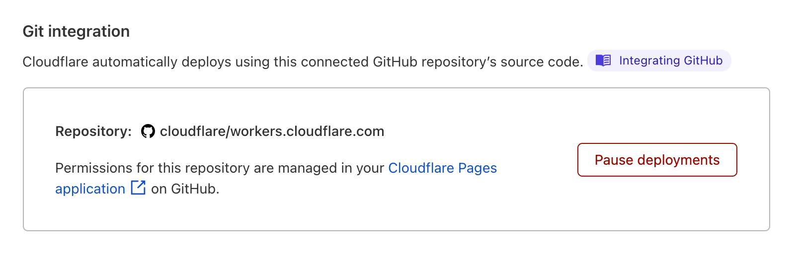

# GitHub integration

Cloudflare supports connecting Cloudflare Pages to your GitHub repositories to look for new changes to your project.

## Custom branches

If you have a custom Git workflow that makes use of specific branches for representing your production build of your project, you can specify a custom branch when creating (or managing an existing) Cloudflare Pages project.

For example, imagine that you merge new code into the `main` branch. When it is time to deploy your project, you merge a set of commits into the `production` branch. In the Cloudflare Pages dashboard, you can set the default branch to `production`.

You can also use [preview deployments](/platform/preview-deployments) to preview how the new version of your project looks before merging to `production`. To do this, make sure that preview deployments are enabled. You can check this by going to the Pages project's **Settings** > **Builds & deployments** > and verifying that automatic deployments are enabled and **Pause deployments** is unselected. With preview deployments, you will be able to access a deployed version of your `main` branch, or other branches that exist, whether created manually or through pull requests.

## Organizational access

When authorizing Cloudflare Pages to access your GitHub account, you can also specify access to organizations that you belong to on GitHub. This means that you can deploy projects to Cloudflare Pages from your open-source team, company, or side project.

## Removing access to your GitHub account

You can remove Cloudflare Pages' access to your GitHub account by viewing the [**Applications** page](https://github.com/settings/installations) on GitHub. Note that removing access to GitHub will also disable new builds, though the last build of your site will continue to be hosted via Cloudflare Pages.

## Pausing Automatic Builds

By default, Cloudflare Pages automatically builds and deploys a project whenever its repository receives new commits. You can pause this behavior to keep your website at a particular version and manually deploy new versions when desired.

To pause automatic deployments, go to the Pages project's **Settings** > **Builds & deployments** > select **Pause deployments** at the end of the page.

Selecting **Pause deployments** will present a confirmation and, once confirmed, the **Pause deployments** button will be replaced with a **Resume deployments** button. While paused, your **Deployments** list will present a banner message, reminding you that automatic deployments are not enabled.
