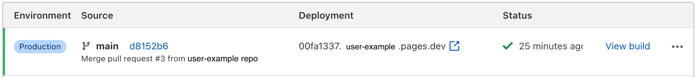
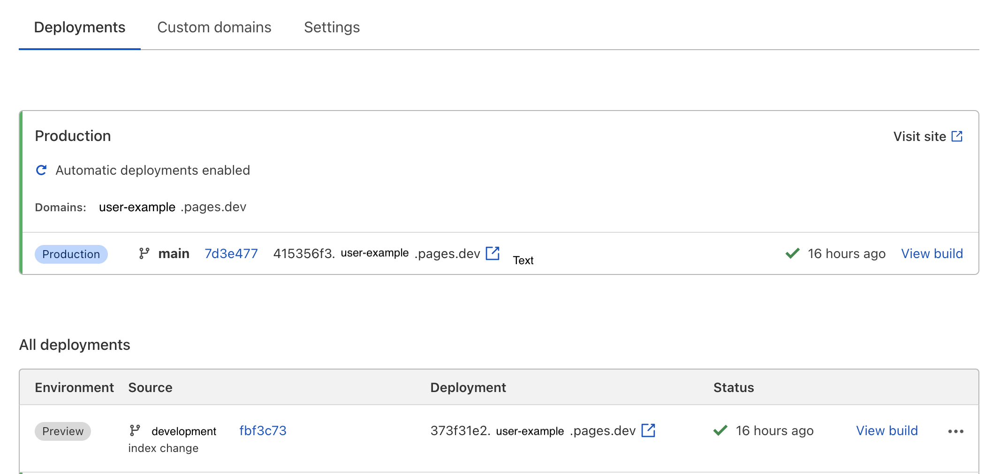

# Preview deployments

Preview deployments allow you to preview new versions of your project without deploying it to production. To view preview deployments, navigate from the Account Home > **Pages** dashboard and select your project.

Every time you open a new pull request on your GitHub repository, Cloudflare Pages will create a unique preview URL, which will stay updated as you continue to push new commits to the branch.

For example, if you have a repo called `user-example` connected to Pages, this will give you a `user-example.pages.dev` subdomain. If `main` is your default branch, then any commits to the `main` branch will update your `user-example.pages.dev` content, as well as any [custom domains](/getting-started#adding-a-custom-domain) attached to the project. 

While developing `user-example`, you may push new changes to a `development` branch, for example. 

In this example, after you create the new `development` branch, Pages will automatically generate a preview deployment for these changes available at `373f31e2.user-example.pages.dev` - where `373f31e2` is a randomly generated hash. 

Each new branch you create will receive a new, randomly-generated hash in front of your `pages.dev` subdomain.

Any additional changes to the `development` branch will continue to update this `373f31e2.user-example.pages.dev` preview address until the `development` branch is merged with the `main` production branch. 

Any custom domains, as well as your `user-example.pages.dev` site, will not be affected by preview deployments. 

## Customizing preview deployments access

By default, preview deployments are enabled and available publicly. In your project's settings, you can require visitors to authenticate using [Cloudflare Access](https://www.cloudflare.com/teams-access/) to be able to view preview deployment. This allows you to lock down access to these preview deployments to your teammates, organization, or anyone else you specify via [Access policies](https://developers.cloudflare.com/access/setting-up-access/configuring-access-policies/).
