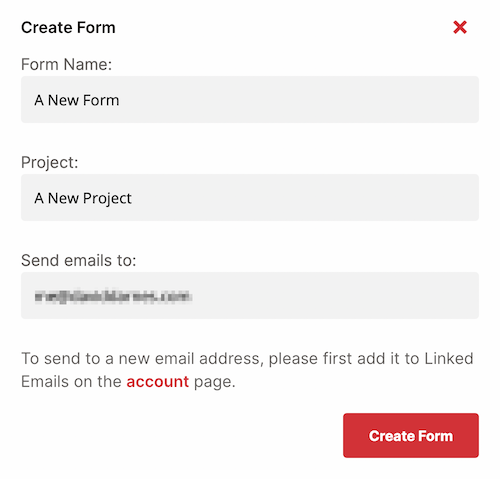
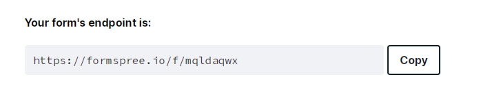

# Add a React Form with Formspree

Almost every React website needs a form to collect user data. [Formspree](https://formspree.io/) is a backend service that handles form processing and storage, allowing developers to include forms on their website without writing server-side code or functions.

In this tutorial, you will create a `<form>` component using React and add it to a “single page app” built with `create-react-app`. Though we’re using CRA, the concepts will apply to any React framework including Next.js, Gatsby, and more. You'll use Formspree to collect the submitted data, and send out email notifications when new submissions arrive, without requiring any server-side coding.

We’ll deploy our site to Cloudflare Pages. Refer to the [Get started guide](/get-started) guide to familiarize yourself with the platform. 

## Setup

To begin, create a new React project on your local machine with `create-react-app`. Then create a [new GitHub repository](https://repo.new/), and attach the GitHub location as a remote destination:

```sh
# create new project with create-react-app
$ npx create-react-app new-app
# enter new directory
$ cd new-app
# attach git remote
$ git remote add origin git@github.com:<username>/<repo>.git
# change default branch name
$ git branch -M main
```

You may now begin modifying the React app in the `new-app` directory you created.

## The Front-end Code

The starting point for `create-react-app` includes a simple “hello world” website. You’ll be adding a “contact us” form that accepts a name, email address and message. The form code is adapted from the [HTML Forms tutorial](/tutorials/forms). For a more in-depth explanation of how HTML forms work, and additional learning resources, please refer to that tutorial.

First create a new react component called `ContactForm.js` and place it in the `src` folder alongside `App.js`.

```
project-root/
├─ package.json
└─ src/
   ├─ ContactForm.js
   ├─ App.js
   └─ ...
```

Next we’ll build the form component using a helper library from Formspree, [`@formspree/react`](https://github.com/formspree/formspree-react). This library contains a `useForm` hook to simplify the process of handling form submission events and managing form state. 

Install it with:

```bash
npm install --save @formspree/react
```

Then paste the following code snippet into the `ContactForm.js` file:

```jsx
import { useForm, ValidationError } from "@formspree/react";

export default function ContactForm() {
  const [state, handleSubmit] = useForm("YOUR_FORM_ID");

  if (state.succeeded) {
    return <p>Thanks for your submission!</p>;
  }

  return (
    <form method="POST" onSubmit={handleSubmit}>
      <label htmlFor="name">Full Name</label>
      <input id="name" type="text" name="name" required />
      <ValidationError prefix="Name" field="name" errors={state.errors} />
      
      <label htmlFor="email">Email Address</label>
      <input id="email" type="email" name="email" required />
      <ValidationError prefix="Email" field="email" errors={state.errors} />

      <label for="message">Message</label>
      <textarea id="message" name="message" required></textarea>
      <ValidationError prefix="Message" field="message" errors={state.errors} />
      
      <button type="submit" disabled={state.submitting}>
        Submit
      </button>
      <ValidationError errors={state.errors} />
    </form>
  );
}
```

<Aside type="note">

A few notes:

- Currently the form contains a placeholder **`YOUR_FORM_ID`**. We’ll replace this with our own form endpoint in a bit.
- The **`useForm`** hook returns a **`state`** object and a **`handleSubmit`** function which we pass to the **`onSubmit`** form attribute. Combined, these provide a way to submit the form data via AJAX and update form state depending on the response received.
- **`ValidationError`** components are helpers that display error messages for field errors, or general form errors (if no **`field`** attribute is provided).
- For the sake of clarity, this form doesn’t include any styling, but in the github project (**[https://github.com/formspree/formspree-example-cloudflare-react](https://github.com/formspree/formspree-example-cloudflare-react)**) you can see an example of how to apply styles to the form.

</Aside>

To add this form to your website, first import the component like so:

```jsx
import ContactForm from "./ContactForm";
```

Then insert the form into the page as a react component:

```jsx
<ContactForm />
```

For example, you can update your `src/App.js` file to add the form like this:

```jsx
import ContactForm from "./ContactForm"; // <-- import the form component
import logo from "./logo.svg";
import "./App.css";

function App() {
  return (
    <div className="App">
      <header className="App-header">
        
        <p>
          Edit <code>src/App.js</code> and save to reload.
        </p>
        <a
          className="App-link"
          href="https://reactjs.org"
          target="_blank"
          rel="noopener noreferrer"
        >
          Learn React
        </a>

        {/* your contact form component goes here */}
        <ContactForm />
 
      </header>
    </div>
  );
}

export default App;
```

Now you have an single page app containing a "Contact-Us" form with a few fields for the user to fill out. However you haven't set up the form to submit to a valid form endpoint yet. You'll do that in the next section.

<Aside type="info" header="GitHub Repository">

The source code for this example is [available on GitHub](https://github.com/formspree/formspree-example-cloudflare-react). It is a live Pages application with a [live demo](https://formspree-example-cloudflare-react.pages.dev/) available, too. 

</Aside>


## The Formspree Backend

The React form is complete, however, when the user submits this form, you’ll get a “Form not found” error. To fix that, create a new Formspree form, and copy its unique ID into the form's `useForm` invocation.

To create a Formspree form, first [sign up for an account on Formspree](https://formspree.io/register). Then create a new form with the `+ New form` button, call it "Contact-us form" and update the recipient email to an email where you wish to receive your form submissions. Finally, click `Create Form`.




You’ll then be presented with instructions on how to integrate your new form. Copy the form’s `hashid` (the last 6 alphanumeric characters from the URL) and paste it into the `useForm` function in the ContactForm component you created above.



Your component should now have a line like this:

```jsx
const [state, handleSubmit] = useForm("mqldaqwx");

/* replace the random-like string above with your own form's ID */
```

Now when you submit your form, you should be shown a thank-you message. The form data will be submitted to your account on Formspree.io.

From here you can adjust your form processing logic to update the [notification email address](https://help.formspree.io/hc/en-us/articles/115008379348-Changing-a-form-email-address), or add plugins like [Google Sheets](https://help.formspree.io/hc/en-us/articles/360036563573-Use-Google-Sheets-to-send-your-submissions-to-a-spreadsheet), [Slack](https://help.formspree.io/hc/en-us/articles/360045648933-Send-Slack-notifications), and more.

For more help setting up Formspree you can check out the following resources:

- For general help with formspree check out the [Formspree help site](https://help.formspree.io/hc/en-us) 
- For more help creating forms in React, see the [formspree-react docs](https://help.formspree.io/hc/en-us/articles/360055613373-The-Formspree-React-library)
- For tips on integrating Formspree with popular platforms like Next.js, Gatsby and Eleventy, check out the [Formspree guides](https://formspree.io/guides).

## Deployment

You are now ready to deploy your project.

If you have not already done so, save your progress within `git` and then push the commit(s) to the GitHub repository:

```sh
# Add all files
$ git add -A
# Commit w/ message
$ git commit -m "working example"
# Push commit(s) to remote
$ git push -u origin main
```

Your work now resides within the GitHub repository, which means that Pages is able to access it too.

If this is your first Cloudflare Pages project, refer to the [Get started guide](/get-started) for a complete walkthrough. After selecting the appropriate GitHub repository, you must configure your project with the following build settings:

* **Project name** – Your choice
* **Production branch** – `main`
* **Framework preset** – Create React App
* **Build command** – `npm run build`
* **Build output directory** – `build`

After clicking the **Save and Deploy** button, your Pages project will begin its first deployment. When successful, you will be presented with a unique `*.pages.dev` subdomain and a link to your live demo.

In this tutorial, you built and deployed a website using Cloudflare Pages and Formspree to handle form submissions. You created a React app with a form that communicates with Formspree to process and store submission requests and send notifications.

If you would like to review the full source code for this application, you can find it on [GitHub](https://github.com/formspree/formspree-example-cloudflare-react).

## Related resources

- [Add an HTML form with Formspree](/tutorials/add-an-html-form-with-formspree)
- [HTML Forms](/tutorials/forms)


