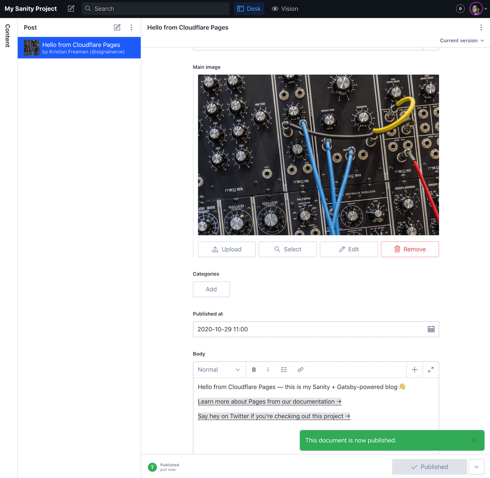
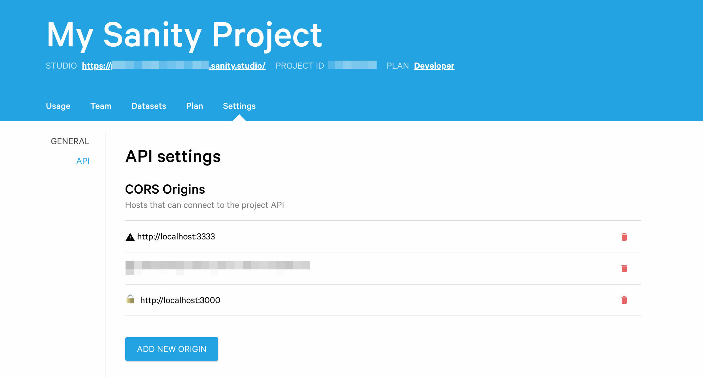

# Build a blog using Nuxt.js and Sanity.io on Cloudflare Pages

## Introduction

In this tutorial, we'll build a blog application using Nuxt.js and Sanity.io, and deploy it on Cloudflare Pages. Nuxt.js is a powerful static site generator built on the frontend framework Vue.js, and Sanity.io is a headless CMS tool built for managing your application's data without needing to maintain a database.

## Prerequisites

- A recent version of [NPM](https://www.npmjs.com/get-npm) on your computer
- A [Sanity.io](https://www.sanity.io) account

## Creating a new Sanity project

To begin, we'll create a new Sanity project, and create our first Sanity project. We'll use one of Sanity's templates, the _blog_ template, but if you'd like to do something differently, you can modify the schema or pick a custom template.

### Installing Sanity and configuring your dataset

To do this, we'll install the `@sanity/cli` client from NPM, and create a new project using `sanity init`:

```sh
---
header: Installing the Sanity client and creating a new project
---
$ npm install -g @sanity/cli && sanity init
```

When you create a Sanity project, you can choose to use one of their pre-defined schemas. Schemas describe the shape of your data in your Sanity dataset -- if you were to starting a brand new project, you may choose to initialize the schema from scratch, but for now, select the "Blog" schema.

### Inspecting your schema

With your project created, you can navigate into the folder and start up the _studio_ locally:

```sh
---
header: Starting the Sanity studio
---
$ cd my-sanity-project
$ sanity start
```

The Sanity studio is where you can create new records for your dataset. By default, running the studio locally makes it available at `localhost:3333` -- go there now and create your author record, as well as a blog post or two!



### Deploying your dataset

When you're ready to deploy your studio, you can run `sanity deploy` to choose a unique URL for your studio. This means that you (or anyone else you invite to manage your blog) can access the studio at a `yoururl.sanity.studio` domain.

```sh
---
header: Deploying the studio
---
$ sanity deploy
```

Once you've deployed your Sanity studio, you'll need to go into Sanity's management panel ([manage.sanity.io](https://manage.sanity.io)), find your project, select "API", and add `http://localhost:3000` as an allowed CORS origin for your project. This means that requests that come to your Sanity dataset from your Nuxt application will be whitelisted.



## Creating a new Nuxt.js project

Next, we'll create a Nuxt.js project. In a new terminal, use `create-nuxt-app` to set up a new Nuxt project:

```sh
---
header: Creating a new Nuxt.js project
---
$ npx create-nuxt-app blog
```

Importantly, you should ensure that you select a rendering mode of "Universal (SSR / SSG)" and a deployment target of "Static (Static/JAMStack hosting)", while going through the setup process.

Once you've completed your project, `cd` into your new project, and start a local development server by running `yarn dev` (or, if you chose NPM as your package manager, `npm run dev`):

```sh
---
header: Starting a Nuxt.js development server
---
$ cd blog
$ yarn dev
```

### Integrating Sanity.io

With your Nuxt.js application spun up, it's time to add Sanity's `@sanity/nuxt` plugin to your Nuxt project:

```sh
---
header: Adding @nuxt/sanity
---
$ yarn add @nuxtjs/sanity @sanity/client
```

To configure the plugin in your Nuxt.js application, you'll need to provide some configuration details. The easiest way to do this it to copy the `sanity.json` folder from your studio into your application directory (though there are other methods, too: [check out the docs!](https://sanity.nuxtjs.org/quick-start)).

```sh
---
header: Adding sanity.json
---
$ cp ../my-sanity-project/sanity.json .
```

Finally, you'll need to add `@nuxtjs/sanity` as a "build module" in your Nuxt configuration:

```js
---
filename: nuxt.config.js
---
{
  buildModules: [
    "@nuxtjs/sanity"
  ]
}
```

### Setting up components

With Sanity configured in your application, you can begin using it to render your blog. We'll set up a few pages to pull data from your Sanity API, and render it. Note that if you aren't familiar with Nuxt, it's recommended that you check out the [Nuxt guide](https://nuxtjs.org/guide), which will teach you some fundamentals concepts around building applications with Nuxt.

### Setting up the index page

To begin, we'll update the `index` page, which will be rendered when we visit the root route (`/`). In `pages/index.vue`:

```vue
---
filename: pages/index.vue
---
<template>
  <div class="container">
    <div>
      <h1 class="title">
        My Blog
      </h1>
    </div>
    <div class="posts">
      <div v-for="post in posts" :key="post._id">
        <h2><a v-bind:href="post.slug.current" v-text="post.title" /></h2>
      </div>
    </div>
  </div>
</template>

<script>
import { groq } from '@nuxtjs/sanity'

export default {
  async asyncData({ $sanity }) {
    const query = groq`*[_type == "post"]`
    const posts = await $sanity.fetch(query)
    return { posts }
  },
}
</script>

<style>
.container {
  margin: 2rem;
  min-height: 100vh;
}
.posts {
  margin: 2rem 0;
}
</style>
```

Vue SFCs, or _single file components_, are a unique Vue feature that allow you to combine JavaScript, HTML and CSS into a single file. In `pages/index.vue`, we provide a `template` tag, which represents our Vue component.

Importantly, we use the `v-for` directive to tell Vue to render HTML for each `post` in an array of `posts`:

```html
---
header: Inspecting the v-for directive
---
<div v-for="post in posts" :key="post._id">
  <h2><a v-bind:href="post.slug.current" v-text="post.title" /></h2>
</div>
```

To populate that `posts` array, we use the `asyncData` function, which is provided by Nuxt to make asynchronous calls (e.g. network requests) to populate the page's data.

The `$sanity` object is provided by the Nuxt + Sanity.js integration as a way to make requests to your Sanity dataset. By calling `$sanity.fetch`, and passing a query, we can retrieve specific data from our Sanity dataset, and return it as our page's data.

If you haven't used Sanity before, you'll probably be unfamiliar with _GROQ_, the _GRaph Oriented Query language_ provided by Sanity for interfacing with your dataset. GROQ is a powerful language that allows you to tell the Sanity API _what_ data you want out of your dataset. For our first query, we'll simply tell Sanity to retrieve every object in the dataset with a `_type` value of `post`:

```js
---
header: A basic GROQ query
---
const query = groq`*[_type == "post"]`
const posts = await $sanity.fetch(query)
```

### Setting up the blog post page

Our `index` page renders a link for each blog post in our dataset, using the `slug` value to set the URL for a blog post. For instance, if I create a blog post called "Hello World" and set the slug to `hello-world`, my Nuxt application should be able to handle a request to the page `/hello-world`, and retrieve the corresponding blog post from Sanity.

Nuxt has built-in support for these kind of pages, by creating a new file in `pages` in the format `_slug.vue`. In the `asyncData` function of your page, you can then use the `params` argument to reference the slug:

```vue
---
filename: pages/_slug.vue
---
<script>
export default {
  async asyncData({ params, $sanity }) {
    console.log(params) // { slug: "hello-world" }
  }
}
</script>
```

With that in mind, we can build `pages/_slug.vue` to take the incoming `slug` value, make a query to Sanity to find the matching blog post, and render the `post` title for the blog post:

```vue
---
filename: pages/_slug.vue
---
<template>
  <div class="container">
    <div v-if="post">
      <h1 class="title" v-text="post.title" />
      <div class="content">
      </div>
    </div>
    <h4><a href="/">← Go back</a></h4>
  </div>
</template>

<script>
import { groq } from '@nuxtjs/sanity'

export default {
  async asyncData({ params, $sanity }) {
    const query = groq`*[_type == "post" && slug.current == "/${params.slug}"][0]`
    const post = await $sanity.fetch(query)
    return { post }
  }
}
</script>

<style>
.container {
  margin: 2rem;
  min-height: 100vh;
}

.content {
  margin: 2rem 0;
  max-width: 38rem;
}

p { margin: 1rem 0; }
</style>
```

When visiting, for instance, `/hello-world`, Nuxt will take the incoming slug `hello-world`, and make a GROQ query to Sanity for any objects with a `_type` of `post`, as well as a slug that matches the value `/hello-world`. From that set, we can get the first object in the array (using the array index operator you'd find in JavaScript -- `[0]`) and set it as `post` in our page data.

### Rendering content for a blog post

We've rendered the `post` title for our blog, but we're still missing the content of the blog post itself. To render this, we'll need to import the [`sanity-blocks-vue-component`](https://github.com/rdunk/sanity-blocks-vue-component) package, which takes Sanity's [Portable Text](https://www.sanity.io/docs/presenting-block-text) format and renders it as a Vue component.

First, install the NPM package:

```sh
---
header: Add sanity-blocks-vue-component package
---
$ yarn add sanity-blocks-vue-component
```

Once the package is installed, create `plugins/sanity-blocks.js`, which will import the component and register it as the Vue component `block-content`:

```js
---
filename: plugins/sanity-blocks.js
---
import Vue from "vue";
import BlockContent from "sanity-blocks-vue-component";
Vue.component("block-content", BlockContent);
```

In your Nuxt config, `nuxt.config.js`, import that file as part of the `plugins` directive:

```js
---
filename: nuxt.config.js
---
{
  plugins: ["@/plugins/sanity-blocks.js"]
}
```

In `pages/_slug.vue`, you can now use the `<block-content>` component to render your content! This takes the format of a custom HTML component, and takes three arguments: `:blocks`, which indicates _what_ to render (in our case, `child`), `v-for`, which accepts an _iterator_ of where to get `child` from (in our case, `post.body`), and `:key`, which helps Vue [keep track of state rendering](https://vuejs.org/v2/guide/list.html#Maintaining-State) by providing a unique value for each post: that is, the `_id` value.

```vue
---
filename: pages/_slug.vue
highlight: [6]
---
<template>
  <div class="container">
    <div v-if="post">
      <h1 class="title" v-text="post.title" />
      <div class="content">
        <block-content :blocks="child" v-for="child in post.body" :key="child._id" />
      </div>
    </div>
    <h4><a href="/">← Go back</a></h4>
  </div>
</template>

<script>
import { groq } from '@nuxtjs/sanity'

export default {
  async asyncData({ params, $sanity }) {
    const query = groq`*[_type == "post" && slug.current == "/${params.slug}"][0]`
    const post = await $sanity.fetch(query)
    return { post }
  }
}
</script>

<style>
.container {
  margin: 2rem;
  min-height: 100vh;
}

.content {
  margin: 2rem 0;
  max-width: 38rem;
}

p { margin: 1rem 0; }
</style>
```

In `pages/index.vue`, we can also use the `block-content` component to render a _summary_ of the content, by taking the first block in your blog post content and rendering it:

```vue
---
filename: pages/index.vue
highlight: [11, 12, 13, 39]
---
<template>
  <div class="container">
    <div>
      <h1 class="title">
        My Blog
      </h1>
    </div>
    <div class="posts">
      <div v-for="post in posts" :key="post._id">
        <h2><a v-bind:href="post.slug.current" v-text="post.title" /></h2>
        <div class="summary">
          <block-content :blocks="post.body[0]" v-bind:key="post.body[0]._id" v-if="post.body.length" />
        </div>
      </div>
    </div>
  </div>
</template>

<script>
import { groq } from '@nuxtjs/sanity'

export default {
  async asyncData({ $sanity }) {
    const query = groq`*[_type == "post"]`
    const posts = await $sanity.fetch(query)
    return { posts }
  },
}
</script>

<style>
.container {
  margin: 2rem;
  min-height: 100vh;
}
.posts {
  margin: 2rem 0;
}
.summary { margin-top: 0.5rem; }
</style>
```

<StreamVideo id="cdf12588663302139f022c26c4e5cede" />

There's many other things inside of your blog schema that you can add to your project. As an exercise, consider one of the following to dig in and continue to develop your understanding of how to build with a headless CMS:

- Create `pages/authors.vue`, and render a list of authors (similar to `pages/index.vue`, but for objects with `_type == "author"`)
- Read the Sanity docs on [using references in GROQ](https://www.sanity.io/docs/how-queries-work#references-and-joins-db43dfd18d7d), and use it to render author information in a blog post page

## Publishing with Cloudflare Pages

Publishing your project with Cloudflare Pages is an easy, two-step process: first, push your project to GitHub, and then in the Cloudflare Pages UI, set up a new project based on that GitHub repository. Pages will deploy a new version of your site each time you publish, and will even set up preview deployments whenever you open a new pull request.

To push your project to GitHub, [create a new repo](https://repo.new), and follow the instructions to push your local Git repository to GitHub.

Once you've pushed your project to GitHub, go to the Pages UI, and create a new project. When asked for your project's build configuration, just choose "Nuxt" -- Pages will set the correct fields for you automatically.

When your site has been deployed, you'll receive a unique URL to view it in production.

_A note about automatic deployments:_ at launch, Cloudflare Pages does not have support for webhooks. This means that you'll need to trigger a deploy manually from the Cloudflare Pages UI when you make a change to your Sanity dataset. Support for this feature will be available in the future, and this tutorial will be updated accordingly!

## Conclusion

Congrats, you've deployed your own blog, powered by Nuxt, Sanity.io, and Cloudflare Pages. You can find the source code for both codebases on GitHub:

- Blog frontend: https://github.com/signalnerve/nuxt-sanity-blog
- Sanity dataset: https://github.com/signalnerve/sanity-blog-schema

If you enjoyed this tutorial, you may be interested in learning how you can use Cloudflare Workers, our powerful serverless function platform, to augment your existing site. [Check out the tutorial to learn more!](/tutorials/build-an-api-with-workers)