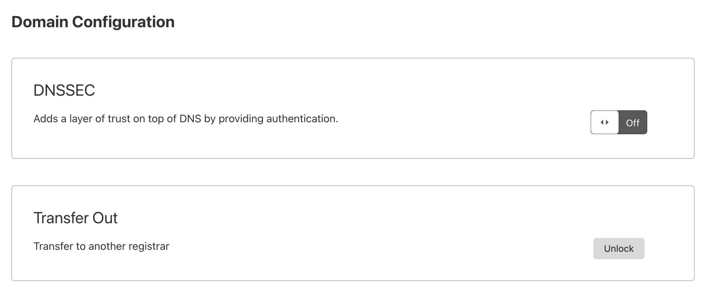
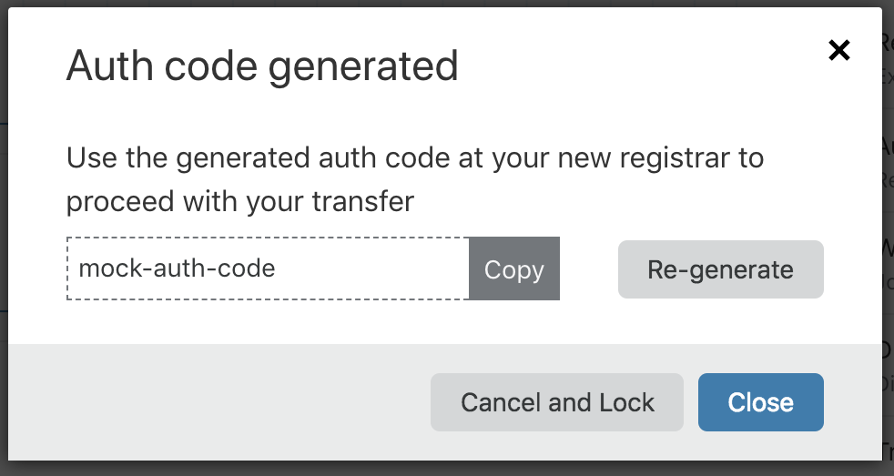

# Transfer out from Cloudflare

Cloudflare Registrar makes it easy to transfer your domain to another registrar. Follow the instructions below to transfer your domain out from Cloudflare.

<Aside type="warning">

ICANN rules prohibit a domain from being transferred if: 
* It has been transferred within the last 60 days;
* It was registered within the last 60 days;
* Or if the WHOIS registrant information has been modified in the last 60 days (even if redacted).

</Aside>

## Unlocking your domain at Cloudflare

1. Log in to the [Cloudflare dashboard](https://dash.cloudflare.com/login) and select the account and domain you want to transfer.
1. In **Overview**, scroll down to **Domain Registration** and select **Manage domain**. 
1. Select **Configuration** > in the **Transfer Out** card under **Domain Management** > select **Unlock**.

  

1. Select **Confirm and Unlock** to confirm that you want to unlock your domain.
1. Copy the auth code (also referred to as authentication code and authorization code) generated by Cloudflare, and use at your new registrar.

  

  

  

If you lose your auth code, return to **Overview** > **Manage domain** > **Configuration**. Select **Continue** next to the **Transfer Out** option to display your auth code again.

## Transfer to a new registrar

1. Go to your new registrar.
1. You will be asked for the authorization code from Cloudflare (it might be called EPP in some systems). Input the code created for you from the Cloudflare dashboard.
1. Your new registrar will send the transfer request to the registry for your domain. The registry will then send it to Cloudflare. After Cloudflare receives the message, you can manually approve the transfer to initiate it immediately.
1. You will need to confirm the approval. You can also reject it at this stage. If you reject it, Cloudflare will reapply the registrar lock.
1. If you do not manually approve the transfer, the transfer will auto-approve on the fifth day after receiving the request. In either case, when your transfer out completes Cloudflare will remove the domain from your account and you will not be charged for future renewals.