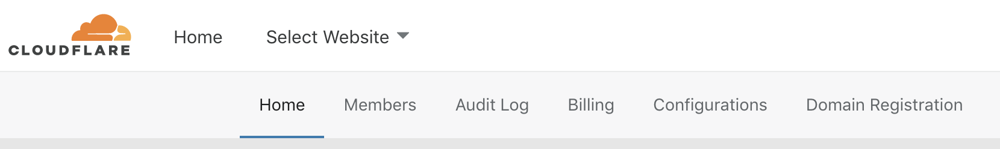
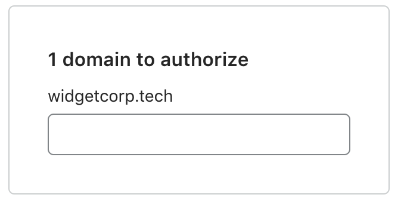

# Transfer to Cloudflare

Domain transfers tell your registry that a different registrar can now set those authoritative records for you. The relationship is based on trust. Registries only trust one registrar, at any given time, to make changes on your behalf.

Transferring a domain to a new registrar informs the registry that they should instead trust that new registrar to modify information. The process requires some steps at both your new registrar and the one you are leaving. Each registrar handles transfers a bit differently, but in general they follow a pattern based on rules set by ICANN, the organization responsible for regulating domain registration.

--------

## Unlock your domain
Registrars include a lightweight safeguard to prevent unauthorized users from starting domain transfers: registrar lock. You might also see it written as domain lock. When enabled, the lock prevents any other registrar from attempting to initiate a transfer.

Only the registrant can enable or disable this lock, typically through the administration interface of the registrar. To proceed with a transfer, you will need to remove this lock if it is enabled.

--------

## Remove WHOIS privacy
Certain registrars, including larger ones like GoDaddy, prohibit transfers while you have WHOIS privacy services enabled.

### GoDaddy
Customers must remove “Private Registration” prior to the transfer or GoDaddy can cancel the transfer.

### NameCheap
Customers must remove “WhoisGuard” from NameCheap prior to transferring the domain.

Once your transfer to Cloudflare completes, we will redact your WHOIS information immediately.

--------

## Initiate your transfer
When you log in to your Cloudflare account, the first screen will display all sites you have on Cloudflare. You can start transfers to Cloudflare from this page. Select `Start Transferring Now` or click `Domain Registration` in the top navigation bar and Cloudflare will review your domains to determine which are eligible for transfer.

On the next page, Cloudflare will display the zones available for transfer, those with transfers in progress, and sites unavailable for transfer.

You’ll also be presented with the price for each transfer. When you transfer a domain, you are also required by ICANN to pay to extend its registration by one year from the expiration date. You can remove domains from your transfer by selecting the “x”.

If you do not have a payment method on file, you will need to add one at this step before proceeding.

Sites can be unavailable for a few reasons, including:

* The site was registered in the last 60 days
* Cloudflare does not yet support the TLD

You will not be billed at this step. Cloudflare will only bill your card when you input the auth code and confirm the contact information at the conclusion of your transfer request.

--------

## Input your authorization code
In the next page, you’ll need to input the authorization code for each domain you are transferring. You will also need to unlock each domain so that Cloudflare can process your request. For more information about transfering out from your current registrar, see the Transfer Instructions section.

--------

## Confirm or input your contact information
In the final stage, you will need to input the contact information for your registration. Cloudflare Registrar will redact this information by default, but we are required to collect the authentic contact information for this registration.

You can modify the contact information, if needed, in the Overview tab for that specific account. Once you have entered the contact information, you will need to agree to the domain registration terms of service by selecting the “Confirm transfer” button.

--------

## Approve the transfer with your previous registrar
Once you have requested your transfer, Cloudflare will begin processing your transfer. Your previous registrar will email you to confirm your request to transfer away. Most registrars will include a link to confirm the transfer request. If you click that link, you can accelerate the transfer operation. If you do not act on the email, the registrar can wait up to five days to process the transfer to Cloudflare.

--------

## Transfer statuses
You can check on the status of your transfer from the Overview page for that domain in the Cloudflare dashboard.

### Transfer in progress
Your request has been submitted by Cloudflare to your previous registrar. We are now waiting on them to confirm they have received the request.

If this status persists more than one day, please ensure that the domain has been unlocked at your current registrar and any WHOIS privacy services have been removed.

### Pending approval
Your current registrar has received the transfer request. They can now wait up to five days to release the domain. If you want to move faster, you can manually approve the transfer for immediate release in the UI of most registrars.

### Transfer rejected
Your transfer has been rejected. This can occur if you cancelled the request, instead of approving it, at your current registrar. If you still wish to transfer, you can select “Retry” and initiate a new transfer request.