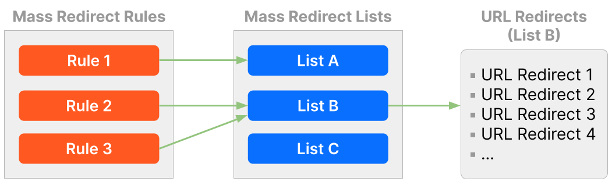

# Mass Redirect concepts

Mass Redirects involve the following elements:

* **Mass Redirect Rule**: A rule powered by the Ruleset Engine, similar to a Transform Rule. A Mass Redirect Rule has an associated Mass Redirect List.

* **Mass Redirect List**: A list, similar to IP Lists, containing one or more URL Redirects. Reference a Mass Redirect List in a Mass Redirect Rule to enable all the URL Redirects in the list. Different Mass Redirect Rules can reference the same Mass Redirect List.

* **URL Redirect**: A simple object with a source URL, a target URL, a status code, and redirect parameters. URL Redirects are the list items of Mass Redirect Lists.

A Mass Redirect Rule enables a Mass Redirect List, which contains one or more URL Redirects.

## Mass Redirect Rules

Mass Redirect Rules are rules powered by the Ruleset Engine that enable one or more URL Redirects through a Mass Redirect List.

When you configure a Mass Redirect Rule, you associate a Mass Redirect List to it, which enables all the URL Redirects in that list. You can create a rule for each list, or have many Mass Redirect rules referencing the same Mass Redirect List.

A Mass Redirect Rule, like all rules powered by the Ruleset Engine, has an action and an expression. Besides these two properties, it also has a name, an optional description, an associated Mass Redirect List, and a key.

### Expression

The rule expression specifies the conditions that must be met for the rule to run. By default, all URL redirects of the specified list will apply.

The default expression of a Mass Redirect Rule is `http.request.full_uri in $<LIST_NAME>`, which means that the full request URL (after some basic normalization) should match the source URL of a URL redirect in the list `<LIST_NAME>` for the redirect to be applied.

You can use an expression different from the default one to increase the specificity of URL redirect matches. For example, if you set the expression of a Mass Redirect Rule to `ip.src.country == "GB" and http.request.full_uri in $redirect_list`, there will only be a match for clients from the United Kingdom.

<Aside type="note" header="Note">

At the left of the `in` operator you can only use fields directly and not values returned by a function. In most situations, you will want to use one of the following fields with the `in` operator:

* `http.request.full_uri`
* `raw.http.request.full_uri`

Refer to [Fields](https://developers.cloudflare.com/firewall/cf-firewall-language/fields) for more information.

</Aside>

### Key

The rule key is used in combination with the rule list to select the URL redirect to apply. The field used for the key should always be the same as the field used in the expression.

For example, if the request field used in the rule expression is `http.request.full_uri`, you should set the key to `http.request.full_uri`. Conversely, if the field used in the expression is `raw.http.request.full_uri`, you should set the key to `raw.http.request.full_uri`.

## Mass Redirect Lists

URL Redirect Lists allow you to create distinct groups of URL redirects for different purposes. You can use a URL Redirect List in one or more Mass Redirect Rules.

A Mass Redirect List does not perform any redirects on its own — you must reference the list in a Mass Redirect Rule to enable the redirects in the list.

<Aside type="note">

You can only reference Mass Redirect Lists in Mass Redirect Rules. Other types of rules powered by the Ruleset Engine do not support Mass Redirect Lists.

</Aside>
