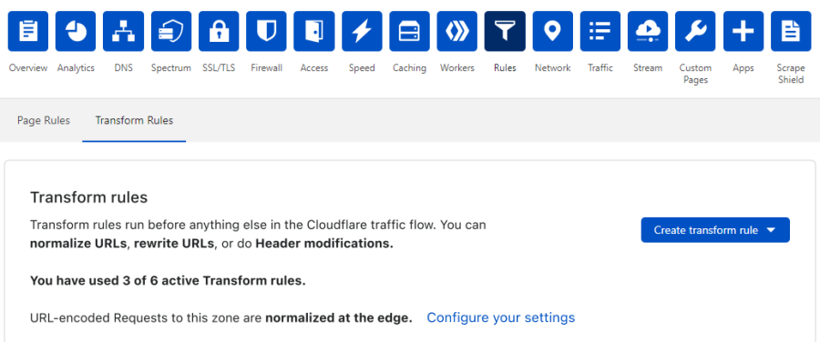
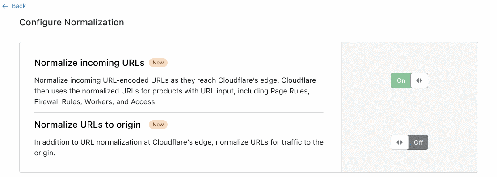

# Manage URL Normalization on the Cloudflare dashboard

Use the **Rules** app in the Cloudflare dashboard to control URL Normalization settings.

To navigate to the URL Normalization settings:

1. Log in to the Cloudflare dashboard.

1. Select the **Websites** tab and choose the site for which you want to create a new Transform Rule.

1. To open Transform Rules from the dashboard, click the **Rules** tile in the app bar, and then click the **Transform Rules** tab.

1. Click the **Configure your settings** link in the **Transform rules** card.

1. Enable or disable the [available settings](#available-settings) and click **Back**.

    

## Available settings

The Cloudflare dashboard provides two components to manage URL Normalization:

* **Normalize incoming URLs** - Configures the URLs of all incoming traffic to Cloudflare:
    * When set to _On_ (default), all incoming URLs are normalized before they pass to subsequent Cloudflare features that can receive a URL as input, such as Page Rules, Firewall Rules, Workers and Access.
    * When set to _Off_, incoming URLs are not normalized before passing to subsequent Cloudflare features.

* **Normalize URLs to origin** - Configures URLs that are sent to the origin:
    * When set to _On_, requests sent to the origin are normalized.
    * When set to _Off_ (default), requests sent to the origin are not modified.
   
    <Aside type="note" header="Note">

    You can only view and enable this option when **Normalize incoming URLs** is also enabled.

    </Aside>

The table below shows how URL Normalization settings affect incoming URLs before they pass to other Cloudflare features and to origin.

<TableWrap>

Incoming URL | Normalize incoming URLs | Normalize URLs to origin | URL passed to Cloudflare edge | URL passed to Origin
---|---|---|---|---
`www.example.com/hello`   | _On_  | _Off_ | `www.example.com/hello`   | `www.example.com/hello`
`www.example.com/hello`   | _On_  | _On_  | `www.example.com/hello`   | `www.example.com/hello`
`www.example.com/hello`   | _Off_ | _Off_ | `www.example.com/hello`   | `www.example.com/hello`
`www.example.com/%68ello` | _On_  | _Off_ | `www.example.com/hello`   | `www.example.com/%68ello`
`www.example.com/%68ello` | _On_  | _On_  | `www.example.com/hello`   | `www.example.com/hello`
`www.example.com/%68ello` | _Off_ | _Off_ | `www.example.com/%68ello` | `www.example.com/%68ello`

</TableWrap>
