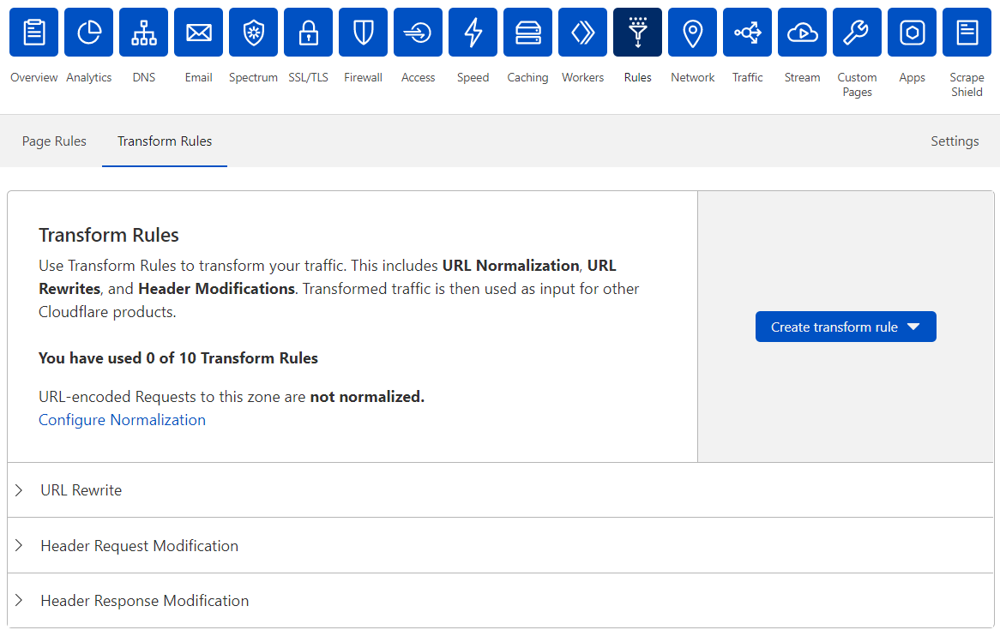
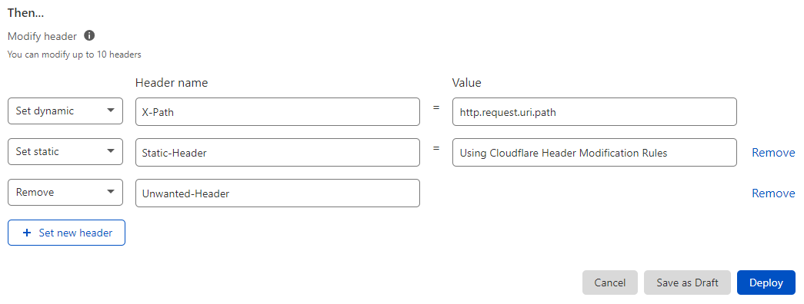

# Create an HTTP Request Header Modification Rule in the dashboard

<Aside type="note">

This feature is available in Beta.

</Aside>

Create HTTP Request Header Modification Rules in the **Transform Rules** tab under Rules. See [Common use cases](/transform/use-cases#http-request-header-modification-examples) for example rule definitions.

Do the following:

1. Log in to the Cloudflare dashboard.

1. Select the **Websites** tab and choose the site for which you want to create a new HTTP Request Header Modification Rule.

1. Select **Rules** > **Transform Rules**.

    

1. Click **Create transform rule** > **Modify Header**.

    

1. In the page that displays, enter a descriptive name for the URL Rewrite Rule in **Rule name**.

1. Under **When incoming requests match**, define the [rule expression](https://developers.cloudflare.com/firewall/cf-dashboard/create-edit-delete-rules#expression-builder-and-editor).

    <Aside type='note'>

    Check the [available fields and functions](#available-fields-and-functions-for-setting-http-request-header-values) during Beta.

    </Aside>

1. For **Modify header**, select one of the following options:

    * _Set static_ — Sets the value of an HTTP request header to a static string value. Overrides the value of an existing header with the same name or adds a new header if it does not exist.
    * _Set dynamic_ — Sets the value of an HTTP request header according to the provided expression. Overrides the value of an existing header with the same name or adds a new header if it does not exist.
    * _Remove_ — Removes the HTTP request header with the provided name, if it exists.

1. Enter the name of the HTTP request header to modify in **Header name** and the static value or expression in **Value**, if you are setting the header value.

1. To modify another HTTP request header in the same rule, click **+ Set new header**.

    The following example includes the modification of three headers using the available actions:

    

    <Aside type='note'>

    You can modify up to 10 HTTP request headers in a single rule.

    </Aside>

1. To save and deploy your rule, click **Deploy**. If you are not ready to deploy your rule, click **Save as Draft**.

After creating a rule, you return to the **Transform Rules** dashboard interface.

If you choose to deploy your new HTTP Request Header Modification Rule, the toggle switch associated with the rule will be _On_. If you save the rule as a draft, the toggle will be _Off_.

---

## Additional information on Request Header Modification Rules

This section contains reference information on HTTP Request Header Modification Rules.

### Format of HTTP request header names and values

The name of the HTTP request header you want to set or remove can only contain alphanumeric characters (`a`-`z` and `A`-`Z`) and the following special characters: `-` and `_`.

The value of the HTTP request header you want to set can only contain alphanumeric characters and the following special characters: `_ :;.,\/"'?!(){}[]@<>=-`.

### Available fields and functions for setting HTTP request header values

During the Beta, the available fields when setting an HTTP request header value using an expression are the following:

* `cf.bot_detection.js_check_score`
* `cf.bot_management.*`
* `cf.client.bot`
* `cf.client_trust_score`
* `cf.threat_score`
* `cf.colo.id`
* `cf.edge.server_port`
* `cf.zone.name`
* `cf.metal.id`
* `cf.tls_client_auth.*`
* `http.cookie`
* `http.host`
* `http.referer`
* `http.request.headers`
* `http.request.method`
* `http.request.timestamp.sec`
* `http.request.timestamp.msec`
* `http.request.full_uri`
* `http.request.uri`
* `http.request.uri.*`
* `http.request.version`
* `raw.http.request.full_uri`
* `raw.http.request.uri`
* `http.user_agent`
* `http.x_forwarded_for`
* `ip.src`
* `ip.geoip.*`
* `ssl`

Expressions that define HTTP request header values can include functions. For more information, check [Functions](https://developers.cloudflare.com/firewall/cf-firewall-language/functions) in the Firewall documentation.
